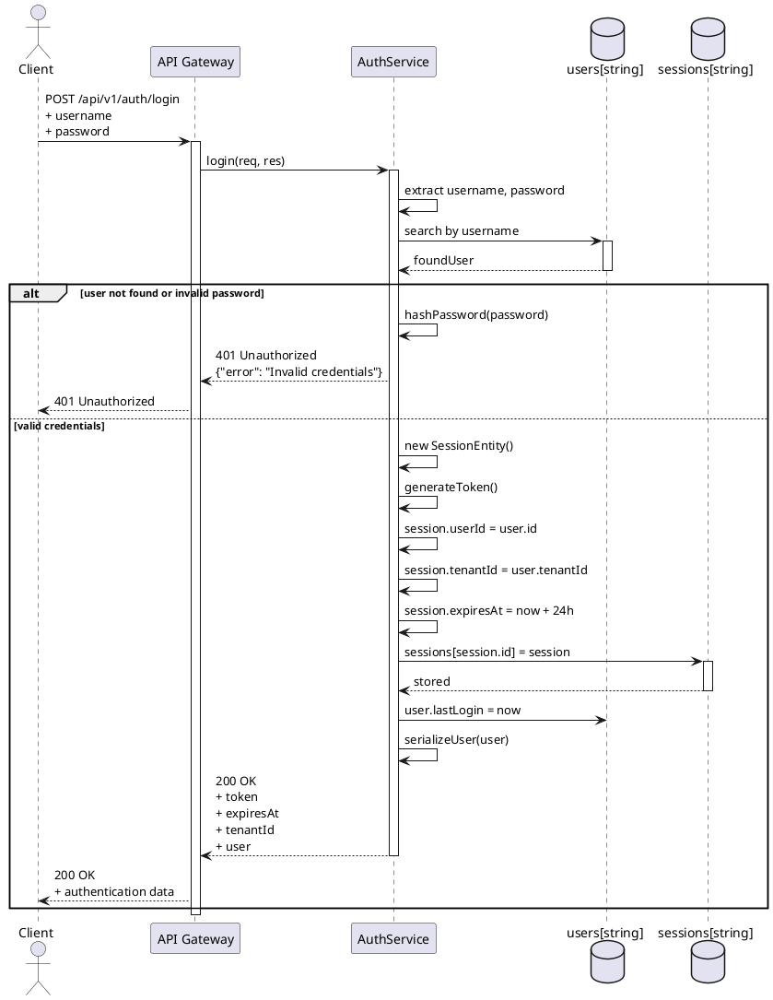
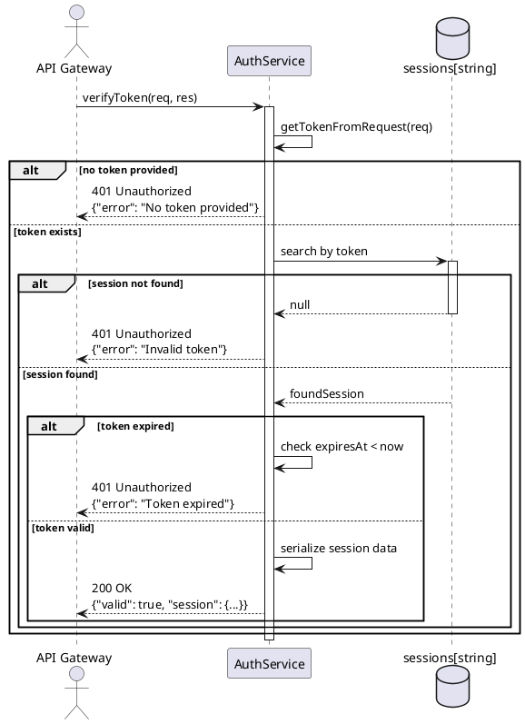
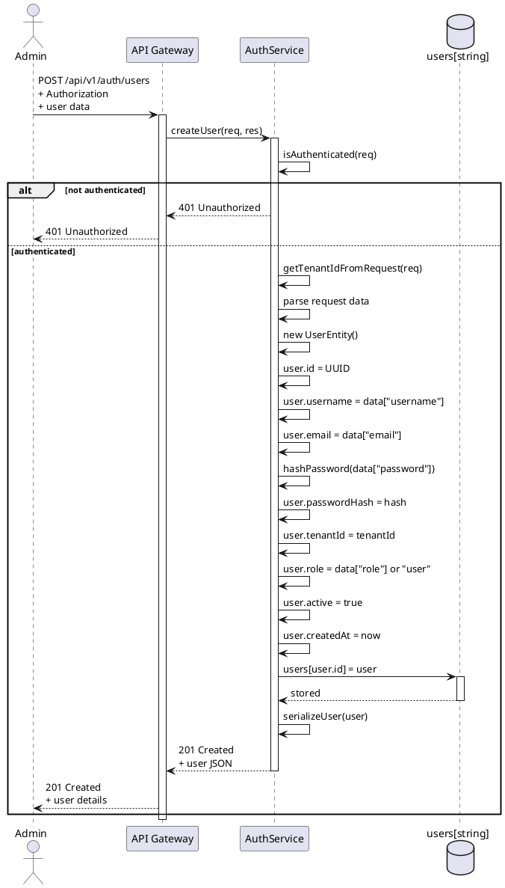
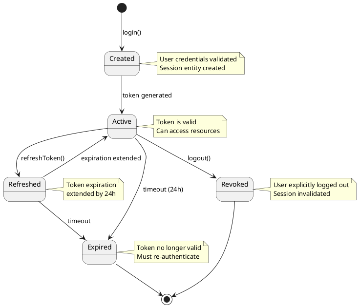
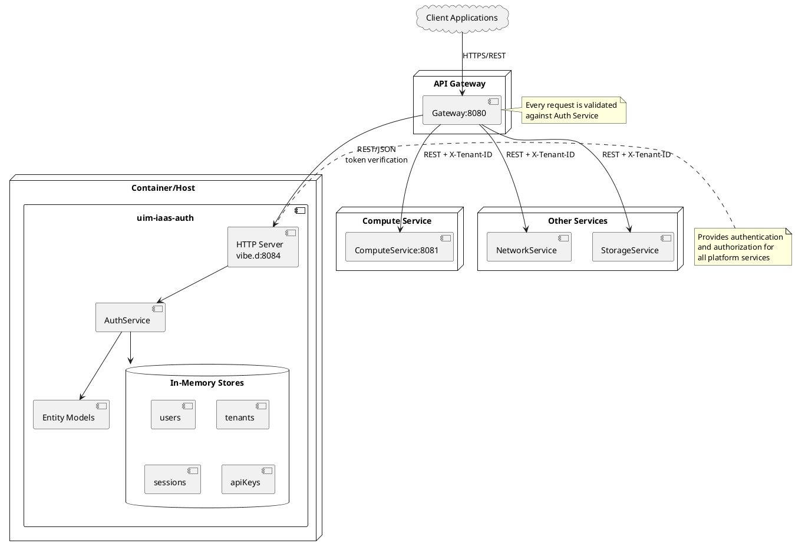
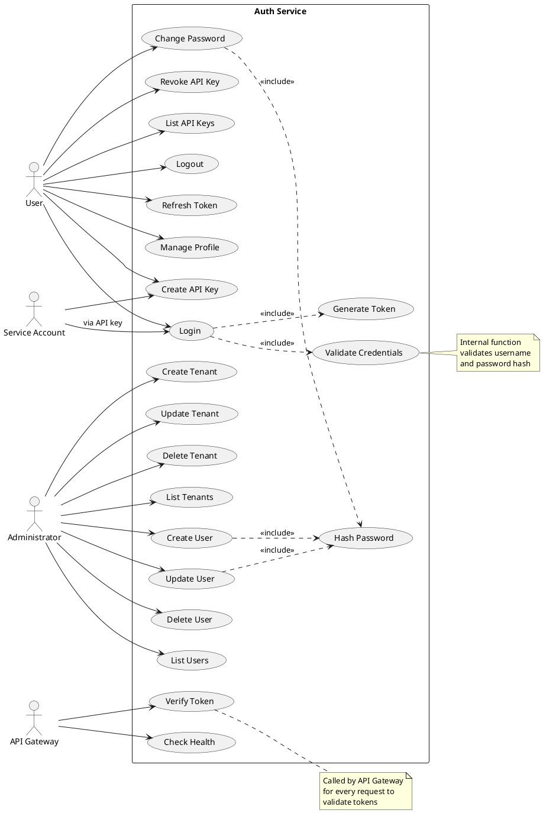
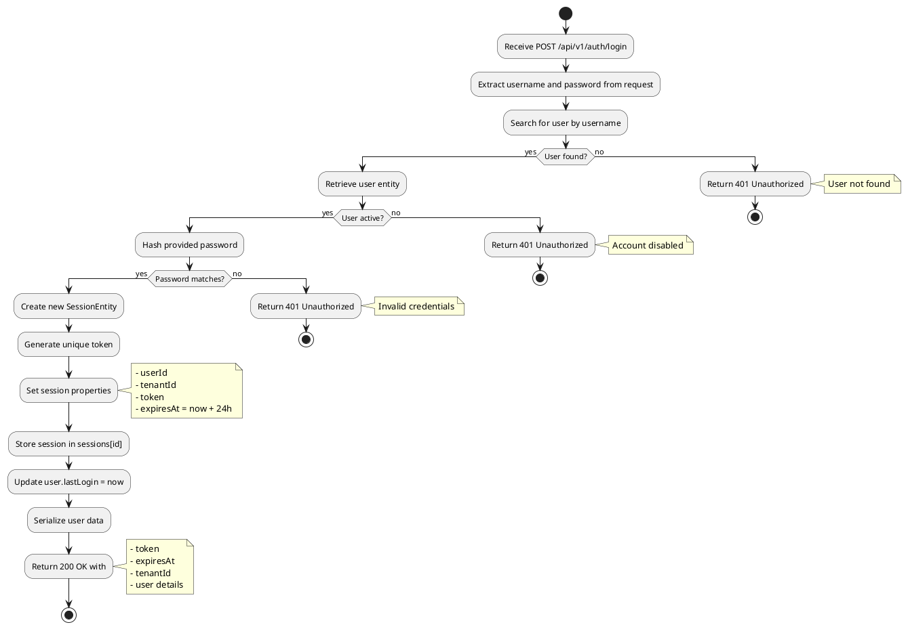
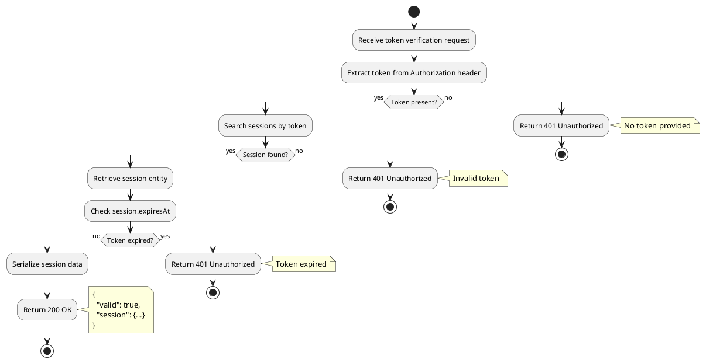

# Auth Service

The Auth Service handles authentication, authorization, and multi-tenant management for the UIM IaaS platform.

## Overview

This service provides centralized authentication and authorization capabilities for the UIM IaaS platform. It manages users, tenants, API keys, and sessions with secure token-based authentication.

**Service Name:** `uim-iaas-auth`  
**Default Port:** 8084  
**Version:** 26.1.2 compatible

## Features

- ✅ User authentication with username/password
- ✅ Session-based token management
- ✅ Multi-tenant management and isolation
- ✅ API key management for service authentication
- ✅ User management with role-based access control (RBAC)
- ✅ Tenant CRUD operations
- ✅ Token refresh and verification
- ✅ Secure password hashing
- ✅ RESTful API with JSON responses
- ✅ Health check endpoint for monitoring

## NAF v4 Architecture Description

### A1 - Meta Data Definitions

**Architecture Product Information:**
- **Name:** Auth Service Architecture
- **Version:** 1.0
- **Date:** January 2026
- **Classification:** Unclassified
- **Framework:** NATO Architecture Framework v4
- **Purpose:** Define the architecture of the authentication and authorization service

### C1 - Capability Taxonomy

**Primary Capabilities:**
- **User Authentication**: Verify user identity with credentials
- **Session Management**: Create, validate, refresh, and revoke access tokens
- **Multi-Tenant Management**: Manage tenant organizations and isolation
- **User Management**: CRUD operations for user accounts
- **API Key Management**: Generate and manage service authentication keys
- **Authorization**: Role-based access control (RBAC)
- **Password Security**: Secure password hashing and validation
- **Token Verification**: Validate tokens for API Gateway integration

### C2 - Enterprise Vision

**Operational Concept:**
The Auth Service provides centralized identity and access management (IAM) for the UIM IaaS platform. It enables secure multi-tenant authentication, ensuring proper isolation between tenant resources while supporting both user-based and API key-based authentication methods.

**Strategic Goals:**
- Provide secure, centralized authentication
- Enable multi-tenant isolation at the identity level
- Support both human users and service accounts
- Integrate seamlessly with API Gateway for request validation
- Maintain audit trails of authentication events
- Scale to support enterprise workloads

### L2 - Logical Scenario

**Service Interactions:**
1. **Client → API Gateway → Auth Service**: Login request authentication
2. **API Gateway → Auth Service**: Token verification for every request
3. **Admin → Auth Service**: Tenant and user management operations
4. **Service → Auth Service**: API key validation
5. **Auth Service → All Services**: Provides tenant context via tokens

### L4 - Logical Activities

**Key Activities:**
- **User Login**: Validate credentials → Create session → Generate token → Return auth data
- **Token Validation**: Extract token → Verify validity → Check expiration → Return session info
- **Token Refresh**: Validate existing token → Extend expiration → Return updated token
- **User Creation**: Validate admin rights → Hash password → Create user → Assign to tenant
- **Tenant Creation**: Validate admin rights → Create tenant → Initialize default resources
- **API Key Generation**: Validate permissions → Generate unique key → Store with expiration
- **Logout**: Locate session by token → Invalidate session → Confirm logout

### Lr - Logical Resources

**Resource Types:**
- **UserEntity**: User account with credentials
  - Attributes: id, username, email, passwordHash, tenantId, role, active, createdAt, lastLogin
  - Roles: admin, user, service
- **TenantEntity**: Organizational unit for multi-tenancy
  - Attributes: id, name, description, active, createdAt, updatedAt, metadata
- **SessionEntity**: Active authentication session
  - Attributes: id, userId, tenantId, token, createdAt, expiresAt
- **ApiKeyEntity**: Service authentication key
  - Attributes: id, tenantId, name, description, key, active, createdAt, expiresAt

### P1 - Resource Types

**Service Component:**
- **Type:** Application Service (Identity Provider)
- **Runtime:** D Language (vibe.d framework)
- **Deployment:** Container/Executable
- **Interfaces:** REST/HTTP
- **Data Format:** JSON
- **Security:** Password hashing, token generation

**Resource Classes:**
- **Authentication Resource**: User credentials and sessions
- **Authorization Resource**: Roles and permissions
- **Tenant Resource**: Multi-tenant organizational units
- **API Key Resource**: Service authentication credentials

### P2 - Resource Structure

**Service Architecture:**
```
┌─────────────────────────────────────────────────────────────┐
│                    Auth Service                             │
│                  (uim-iaas-auth)                           │
├─────────────────────────────────────────────────────────────┤
│                                                             │
│  ┌──────────────────────────────────────────────────────┐  │
│  │           HTTP Server (vibe.d)                       │  │
│  │              Port: 8084                              │  │
│  └───────────────────┬──────────────────────────────────┘  │
│                      │                                      │
│  ┌───────────────────▼──────────────────────────────────┐  │
│  │         AuthService                                  │  │
│  │  ┌────────────────────────────────────────────────┐  │  │
│  │  │  Authentication Methods                        │  │  │
│  │  │  - login()                                     │  │  │
│  │  │  - logout()                                    │  │  │
│  │  │  - refreshToken()                              │  │  │
│  │  │  - verifyToken()                               │  │  │
│  │  │                                                │  │  │
│  │  │  User Management                               │  │  │
│  │  │  - createUser()                                │  │  │
│  │  │  - updateUser()                                │  │  │
│  │  │  - deleteUser()                                │  │  │
│  │  │  - listUsers()                                 │  │  │
│  │  │  - getUser()                                   │  │  │
│  │  │                                                │  │  │
│  │  │  Tenant Management                             │  │  │
│  │  │  - createTenant()                              │  │  │
│  │  │  - updateTenant()                              │  │  │
│  │  │  - deleteTenant()                              │  │  │
│  │  │  - listTenants()                               │  │  │
│  │  │  - getTenant()                                 │  │  │
│  │  │                                                │  │  │
│  │  │  API Key Management                            │  │  │
│  │  │  - createApiKey()                              │  │  │
│  │  │  - deleteApiKey()                              │  │  │
│  │  │  - listApiKeys()                               │  │  │
│  │  │                                                │  │  │
│  │  │  Utility Methods                               │  │  │
│  │  │  - hashPassword()                              │  │  │
│  │  │  - generateToken()                             │  │  │
│  │  │  - isAuthenticated()                           │  │  │
│  │  │  - getTenantIdFromRequest()                    │  │  │
│  │  └────────────────────────────────────────────────┘  │  │
│  │                      │                                │  │
│  │                      │ manages                        │  │
│  │                      ▼                                │  │
│  │  ┌────────────────────────────────────────────────┐  │  │
│  │  │  Data Stores (In-Memory)                       │  │  │
│  │  │  - users: UserEntity[string]                   │  │  │
│  │  │  - tenants: TenantEntity[string]               │  │  │
│  │  │  - sessions: SessionEntity[string]             │  │  │
│  │  │  - apiKeys: ApiKeyEntity[string]               │  │  │
│  │  └────────────────────────────────────────────────┘  │  │
│  └──────────────────────────────────────────────────────┘  │
│                      │                                      │
│                      │ uses                                 │
│                      ▼                                      │
│  ┌───────────────────────────────────────────────────────┐ │
│  │         Entity Models                                 │ │
│  │  ┌─────────────────────────────────────────────────┐ │ │
│  │  │  UserEntity                                     │ │ │
│  │  │  TenantEntity                                   │ │ │
│  │  │  SessionEntity                                  │ │ │
│  │  │  ApiKeyEntity                                   │ │ │
│  │  └─────────────────────────────────────────────────┘ │ │
│  └───────────────────────────────────────────────────────┘ │
│                                                             │
└─────────────────────────────────────────────────────────────┘
```

### P4 - Resource Functions

**Functional Capabilities:**

**Authentication Functions:**
- **login()**: Authenticate user credentials and create session
- **logout()**: Invalidate session token
- **refreshToken()**: Extend token expiration
- **verifyToken()**: Validate token and return session information

**User Management Functions:**
- **createUser()**: Create new user account in tenant
- **getUser()**: Retrieve user details
- **listUsers()**: Enumerate users in tenant
- **updateUser()**: Modify user attributes
- **deleteUser()**: Remove user account

**Tenant Management Functions:**
- **createTenant()**: Create new tenant organization
- **getTenant()**: Retrieve tenant details
- **listTenants()**: Enumerate all tenants (admin only)
- **updateTenant()**: Modify tenant attributes
- **deleteTenant()**: Remove tenant organization

**API Key Management Functions:**
- **createApiKey()**: Generate service authentication key
- **listApiKeys()**: Enumerate tenant API keys
- **deleteApiKey()**: Revoke API key

**Utility Functions:**
- **hashPassword()**: Secure password hashing
- **generateToken()**: Create unique session token
- **isAuthenticated()**: Check request authentication
- **getTenantIdFromRequest()**: Extract tenant context
- **getTokenFromRequest()**: Extract bearer token

### P8 - Resource Interactions

**Interface Specifications:**

**Provided Interface:**
- **Protocol:** HTTP/REST
- **Port:** 8084
- **Encoding:** JSON
- **Authentication:** Bearer Token / API Key
- **API Version:** v1

**Authentication Headers:**
- `Authorization: Bearer <token>` - Session-based authentication
- `X-API-Key: <key>` - API key authentication

**Required Interfaces:**
- **None** (Auth Service is self-contained)

**Integration Points:**
- **API Gateway**: Primary consumer for token validation
- **All Services**: Indirect dependency via API Gateway

### S4 - Service Functions

**Service Characteristics:**
- **Service Type:** Stateful (manages sessions and users)
- **Availability:** Critical (all services depend on it)
- **Data Persistence:** In-memory (production should use database)
- **Security Level:** High (manages authentication credentials)
- **Session Duration:** 24 hours (configurable)

**Service Operations:**
- **Authentication Operations**: Login, logout, token management
- **Authorization Operations**: Role verification, permission checks
- **Identity Management**: User and tenant CRUD
- **Credential Management**: Password and API key handling

### Sv - Service Interfaces

**REST API Interface:**
```
Service: auth-service
Base Path: /api/v1/auth
Methods: GET, POST, PUT, DELETE
Content-Type: application/json
Authentication:
  - Bearer Token
  - API Key
```

**Endpoints:**
- `GET /health` - Health check (no auth)
- `POST /api/v1/auth/login` - User login
- `POST /api/v1/auth/logout` - User logout
- `POST /api/v1/auth/refresh` - Refresh token
- `GET /api/v1/auth/verify` - Verify token
- `GET /api/v1/auth/tenants` - List tenants
- `POST /api/v1/auth/tenants` - Create tenant
- `GET /api/v1/auth/tenants/:id` - Get tenant
- `PUT /api/v1/auth/tenants/:id` - Update tenant
- `DELETE /api/v1/auth/tenants/:id` - Delete tenant
- `GET /api/v1/auth/users` - List users
- `POST /api/v1/auth/users` - Create user
- `GET /api/v1/auth/users/:id` - Get user
- `PUT /api/v1/auth/users/:id` - Update user
- `DELETE /api/v1/auth/users/:id` - Delete user
- `GET /api/v1/auth/api-keys` - List API keys
- `POST /api/v1/auth/api-keys` - Create API key
- `DELETE /api/v1/auth/api-keys/:id` - Delete API key

### SOV-1 - Service Orchestration

**Service Dependencies:**
- **None** (Auth Service is foundation/core service)

**Dependent Services:**
- **API Gateway** (primary): Validates every incoming request
- **All Backend Services** (indirect): Rely on tenant context from Auth Service

**Orchestration Patterns:**
- **Synchronous**: All authentication operations return immediately
- **Request-Response**: Standard REST pattern
- **Stateful Sessions**: Token-based session management

**Security Flow:**
1. Client → Auth Service: Login with credentials
2. Auth Service → Client: Return token + tenant ID
3. Client → API Gateway: Request + token
4. API Gateway → Auth Service: Verify token
5. Auth Service → API Gateway: Valid + tenant ID
6. API Gateway → Backend Service: Forward with X-Tenant-ID header

### Capability to Services Mapping

| Capability | Service Function | NAF View |
|------------|-----------------|----------|
| User Authentication | login(), verifyToken() | S4, P4 |
| Session Management | login(), logout(), refreshToken() | S4, P4, Lr |
| Multi-Tenant Management | create/update/deleteTenant() | S4, P4, Lr |
| User Management | create/update/deleteUser() | S4, P4 |
| API Key Management | create/deleteApiKey() | S4, P4, Lr |
| Authorization | isAuthenticated(), role checks | P4, Sv |
| Password Security | hashPassword() | P4 |
| Token Verification | verifyToken(), getTokenFromRequest() | P4, Sv |

## UML Diagrams

### Component Diagram

```
┌─────────────────────────────────────────────────────────────┐
│                    Auth Service                             │
│                  (uim-iaas-auth)                           │
├─────────────────────────────────────────────────────────────┤
│                                                             │
│  ┌──────────────────────────────────────────────────────┐  │
│  │           HTTP Server (vibe.d)                       │  │
│  │              Port: 8084                              │  │
│  └───────────────────┬──────────────────────────────────┘  │
│                      │                                      │
│  ┌───────────────────▼──────────────────────────────────┐  │
│  │         AuthService                                  │  │
│  │  ┌────────────────────────────────────────────────┐  │  │
│  │  │  Authentication API                            │  │  │
│  │  │    login()                                     │  │  │
│  │  │    logout()                                    │  │  │
│  │  │    refreshToken()                              │  │  │
│  │  │    verifyToken()                               │  │  │
│  │  │                                                │  │  │
│  │  │  User Management API                           │  │  │
│  │  │    createUser()                                │  │  │
│  │  │    updateUser()                                │  │  │
│  │  │    deleteUser()                                │  │  │
│  │  │    listUsers()                                 │  │  │
│  │  │    getUser()                                   │  │  │
│  │  │                                                │  │  │
│  │  │  Tenant Management API                         │  │  │
│  │  │    createTenant()                              │  │  │
│  │  │    updateTenant()                              │  │  │
│  │  │    deleteTenant()                              │  │  │
│  │  │    listTenants()                               │  │  │
│  │  │    getTenant()                                 │  │  │
│  │  │                                                │  │  │
│  │  │  API Key Management API                        │  │  │
│  │  │    createApiKey()                              │  │  │
│  │  │    deleteApiKey()                              │  │  │
│  │  │    listApiKeys()                               │  │  │
│  │  │                                                │  │  │
│  │  │  Security Functions                            │  │  │
│  │  │    hashPassword()                              │  │  │
│  │  │    generateToken()                             │  │  │
│  │  │    isAuthenticated()                           │  │  │
│  │  └────────────────────────────────────────────────┘  │  │
│  │                      │                                │  │
│  │                      │ manages                        │  │
│  │                      ▼                                │  │
│  │  ┌────────────────────────────────────────────────┐  │  │
│  │  │  In-Memory Data Stores                         │  │  │
│  │  │    users: UserEntity[string]                   │  │  │
│  │  │    tenants: TenantEntity[string]               │  │  │
│  │  │    sessions: SessionEntity[string]             │  │  │
│  │  │    apiKeys: ApiKeyEntity[string]               │  │  │
│  │  └────────────────────────────────────────────────┘  │  │
│  └──────────────────────────────────────────────────────┘  │
│                      │                                      │
│                      │ uses                                 │
│                      ▼                                      │
│  ┌───────────────────────────────────────────────────────┐ │
│  │         Entity Models                                 │ │
│  │    UserEntity                                         │ │
│  │    TenantEntity                                       │ │
│  │    SessionEntity                                      │ │
│  │    ApiKeyEntity                                       │ │
│  └───────────────────────────────────────────────────────┘ │
│                                                             │
└─────────────────────────────────────────────────────────────┘
```

### Class Diagram

```plantuml
@startuml
!define ENTITY class

abstract class UIMEntity {
  - _id: string
  - _createdAt: long
  - _updatedAt: long
  --
  + id(): string
  + id(string): void
  + createdAt(): long
  + createdAt(long): void
  + updatedAt(): long
  + updatedAt(long): void
}

class AuthService {
  - users: UserEntity[string]
  - apiKeys: ApiKeyEntity[string]
  - sessions: SessionEntity[string]
  - tenants: TenantEntity[string]
  --
  + setupRoutes(URLRouter)
  + healthCheck(HTTPServerRequest, HTTPServerResponse)
  .. Authentication ..
  + login(HTTPServerRequest, HTTPServerResponse)
  + logout(HTTPServerRequest, HTTPServerResponse)
  + refreshToken(HTTPServerRequest, HTTPServerResponse)
  + verifyToken(HTTPServerRequest, HTTPServerResponse)
  .. User Management ..
  + listUsers(HTTPServerRequest, HTTPServerResponse)
  + getUser(HTTPServerRequest, HTTPServerResponse)
  + createUser(HTTPServerRequest, HTTPServerResponse)
  + updateUser(HTTPServerRequest, HTTPServerResponse)
  + deleteUser(HTTPServerRequest, HTTPServerResponse)
  .. Tenant Management ..
  + listTenants(HTTPServerRequest, HTTPServerResponse)
  + getTenant(HTTPServerRequest, HTTPServerResponse)
  + createTenant(HTTPServerRequest, HTTPServerResponse)
  + updateTenant(HTTPServerRequest, HTTPServerResponse)
  + deleteTenant(HTTPServerRequest, HTTPServerResponse)
  .. API Key Management ..
  + listApiKeys(HTTPServerRequest, HTTPServerResponse)
  + createApiKey(HTTPServerRequest, HTTPServerResponse)
  + deleteApiKey(HTTPServerRequest, HTTPServerResponse)
  .. Security Functions ..
  - hashPassword(string): string
  - generateToken(): string
  - isAuthenticated(HTTPServerRequest): bool
  - getTokenFromRequest(HTTPServerRequest): string
  - getTenantIdFromRequest(HTTPServerRequest): string
  - serializeUser(UserEntity): Json
  - serializeTenant(TenantEntity): Json
  - serializeApiKey(ApiKeyEntity): Json
}

class UserEntity extends UIMEntity {
  - _username: string
  - _email: string
  - _passwordHash: string
  - _tenantId: string
  - _role: string
  - _active: bool
  - _lastLogin: long
  --
  + username(): string
  + username(string): void
  + email(): string
  + email(string): void
  + passwordHash(): string
  + passwordHash(string): void
  + tenantId(): string
  + tenantId(string): void
  + role(): string
  + role(string): void
  + active(): bool
  + active(bool): void
  + lastLogin(): long
  + lastLogin(long): void
}

class TenantEntity extends UIMEntity {
  - _name: string
  - _description: string
  - _active: bool
  - _metadata: string[string]
  --
  + name(): string
  + name(string): void
  + description(): string
  + description(string): void
  + active(): bool
  + active(bool): void
  + metadata(): string[string]
  + metadata(string[string]): void
}

class SessionEntity extends UIMEntity {
  - _userId: string
  - _tenantId: string
  - _token: string
  - _expiresAt: long
  --
  + userId(): string
  + userId(string): void
  + tenantId(): string
  + tenantId(string): void
  + token(): string
  + token(string): void
  + expiresAt(): long
  + expiresAt(long): void
}

class ApiKeyEntity extends UIMEntity {
  - _tenantId: string
  - _name: string
  - _description: string
  - _key: string
  - _active: bool
  - _expiresAt: long
  --
  + tenantId(): string
  + tenantId(string): void
  + name(): string
  + name(string): void
  + description(): string
  + description(string): void
  + key(): string
  + key(string): void
  + active(): bool
  + active(bool): void
  + expiresAt(): long
  + expiresAt(long): void
}

AuthService "1" *-- "0..*" UserEntity : manages
AuthService "1" *-- "0..*" TenantEntity : manages
AuthService "1" *-- "0..*" SessionEntity : manages
AuthService "1" *-- "0..*" ApiKeyEntity : manages
UserEntity "0..*" --> "1" TenantEntity : belongs to
SessionEntity "0..*" --> "1" UserEntity : authenticates
ApiKeyEntity "0..*" --> "1" TenantEntity : scoped to
@enduml
```



### Sequence Diagram - Login



### Sequence Diagram - Verify Token



### Sequence Diagram - Create User



### State Diagram - Session Lifecycle



### Deployment Diagram



### Use Case Diagram



### Activity Diagram - Login Flow



### Activity Diagram - Token Verification Flow



## Default Credentials

The service creates a default tenant and admin user on startup:

- **Username:** `admin`
- **Password:** `admin123`
- **Email:** `admin@uim-iaas.local`
- **Role:** `admin`
- **Tenant:** Default Tenant (auto-created)

**⚠️ Important:** Change the default admin password in production!

## API Endpoints

### Health Check
```
GET /health
```
Returns the service health status.

**Response:**
```json
{
  "status": "healthy",
  "service": "auth-service"
}
```

### Authentication Endpoints

#### Login
```
POST /api/v1/auth/login
```
Authenticates a user and returns a session token.

**Request Body:**
```json
{
  "username": "admin",
  "password": "admin123"
}
```

**Response:** 200 OK
```json
{
  "token": "abc123...",
  "expiresAt": 1706745600,
  "tenantId": "tenant-uuid",
  "user": {
    "id": "user-uuid",
    "username": "admin",
    "email": "admin@uim-iaas.local",
    "role": "admin",
    "tenantId": "tenant-uuid",
    "active": true
  }
}
```

#### Logout
```
POST /api/v1/auth/logout
```
Invalidates the current session token.

**Headers:**
- `Authorization: Bearer <token>`

**Response:** 200 OK
```json
{
  "message": "Logged out successfully"
}
```

#### Refresh Token
```
POST /api/v1/auth/refresh
```
Extends the expiration time of a valid token.

**Headers:**
- `Authorization: Bearer <token>`

**Response:** 200 OK
```json
{
  "token": "abc123...",
  "expiresAt": 1706831999
}
```

#### Verify Token
```
GET /api/v1/auth/verify
```
Verifies if a token is valid and returns session information.

**Headers:**
- `Authorization: Bearer <token>`

**Response:** 200 OK
```json
{
  "valid": true,
  "session": {
    "id": "session-uuid",
    "userId": "user-uuid",
    "tenantId": "tenant-uuid",
    "expiresAt": 1706745600
  }
}
```

### Tenant Management

#### List Tenants
```
GET /api/v1/auth/tenants
```
Returns all tenants (admin only).

**Headers:**
- `Authorization: Bearer <token>`

#### Get Tenant
```
GET /api/v1/auth/tenants/:id
```
Returns details of a specific tenant.

**Headers:**
- `Authorization: Bearer <token>`

#### Create Tenant
```
POST /api/v1/auth/tenants
```
Creates a new tenant (admin only).

**Request Body:**
```json
{
  "name": "Acme Corp",
  "description": "Acme Corporation tenant",
  "metadata": {
    "industry": "technology",
    "size": "enterprise"
  }
}
```

**Response:** 201 Created

#### Update Tenant
```
PUT /api/v1/auth/tenants/:id
```
Updates tenant information.

**Headers:**
- `Authorization: Bearer <token>`

#### Delete Tenant
```
DELETE /api/v1/auth/tenants/:id
```
Deletes a tenant (admin only).

**Response:** 204 No Content

### User Management

#### List Users
```
GET /api/v1/auth/users
```
Returns all users in the authenticated user's tenant.

**Headers:**
- `Authorization: Bearer <token>`

#### Get User
```
GET /api/v1/auth/users/:id
```
Returns details of a specific user.

**Headers:**
- `Authorization: Bearer <token>`

#### Create User
```
POST /api/v1/auth/users
```
Creates a new user in the tenant.

**Request Body:**
```json
{
  "username": "john.doe",
  "email": "john.doe@example.com",
  "password": "secure-password",
  "role": "user"
}
```

**Response:** 201 Created

#### Update User
```
PUT /api/v1/auth/users/:id
```
Updates user information.

**Headers:**
- `Authorization: Bearer <token>`

#### Delete User
```
DELETE /api/v1/auth/users/:id
```
Deletes a user.

**Response:** 204 No Content

### API Key Management

#### List API Keys
```
GET /api/v1/auth/api-keys
```
Returns all API keys for the authenticated tenant.

**Headers:**
- `Authorization: Bearer <token>`

#### Create API Key
```
POST /api/v1/auth/api-keys
```
Creates a new API key for programmatic access.

**Request Body:**
```json
{
  "name": "CI/CD Pipeline",
  "description": "API key for automated deployments",
  "expiresAt": 1738195200
}
```

**Response:** 201 Created
```json
{
  "id": "key-uuid",
  "name": "CI/CD Pipeline",
  "key": "api_key_abc123...",
  "tenantId": "tenant-uuid",
  "active": true,
  "createdAt": 1706745600
}
```

**⚠️ Note:** The API key is only shown once during creation. Store it securely!

#### Delete API Key
```
DELETE /api/v1/auth/api-keys/:id
```
Revokes an API key.

**Response:** 204 No Content

## User Roles

- **admin**: Full system access, can manage tenants and all users
- **user**: Standard user with access to their tenant's resources
- **service**: Service account for inter-service communication

## Authentication Methods

### Bearer Token Authentication
Add the token to the `Authorization` header:
```
Authorization: Bearer <token>
```

### API Key Authentication
Add the API key to the `X-API-Key` header:
```
X-API-Key: api_key_abc123...
```

## Building

Build the service using DUB:
```bash
dub build
```

For release build:
```bash
dub build --build=release
```

## Running

Start the service:
```bash
dub run
```

The service will start on port **8084** by default.

## Testing

Run tests:
```bash
dub test
```

## Docker

Build the Docker image:
```bash
docker build -t uim-iaas-auth:latest .
```

Run the container:
```bash
docker run -p 8084:8084 uim-iaas-auth:latest
```

With environment variables:
```bash
docker run -p 8084:8084 \
  -e SERVICE_PORT=8084 \
  -e LOG_LEVEL=info \
  -e JWT_SECRET=your-secret-key \
  uim-iaas-auth:latest
```

## Configuration

### Port Configuration
- Default port: **8084**
- Bind address: `0.0.0.0` (all interfaces)

### Environment Variables
- `SERVICE_PORT`: Port to listen on (default: 8084)
- `LOG_LEVEL`: Logging level (debug, info, warn, error)
- `JWT_SECRET`: Secret key for token generation
- `SESSION_TIMEOUT`: Session timeout in seconds (default: 86400)

## Security Considerations

### Password Security
- Passwords are hashed using SHA256 (production should use bcrypt or Argon2)
- Minimum password length: 8 characters (should be enforced)
- Password history and complexity rules (to be implemented)

### Token Security
- Tokens expire after 24 hours
- Tokens can be refreshed before expiration
- Logout invalidates the token immediately

### API Key Security
- API keys are generated using UUID + random token
- API keys can have expiration dates
- API keys can be revoked at any time
- Store API keys securely (never commit to version control)

### Multi-Tenancy
- Users belong to a single tenant
- Tenant isolation is enforced at the API level
- Cross-tenant access is prevented

## Dependencies

This service requires the following dependencies (managed by DUB):

- **vibe-d** ~>0.10.3: Web framework and HTTP server
- **uim-iaas:core**: Shared utilities and base classes (local path dependency)
- **uim-framework:oop** ~>26.1.2: UIM OOP framework

All dependencies are automatically resolved during build.

## Development

### Project Structure
```
auth/
├── source/
│   ├── app.d                    # Main application entry point
│   └── uim/
│       └── iaas/
│           └── auth/
│               ├── package.d    # Module exports
│               ├── entities/    # Data models
│               │   ├── apikey.d
│               │   ├── session.d
│               │   ├── tenant.d
│               │   ├── user.d
│               │   └── package.d
│               └── services/    # Business logic
│                   ├── auth.d
│                   └── package.d
├── Dockerfile
├── dub.sdl                      # DUB package configuration
├── LICENSE
└── README.md
```

### Data Models

#### UserEntity
- id, username, email, passwordHash
- tenantId, role, active
- createdAt, lastLogin

#### TenantEntity
- id, name, description
- active, createdAt, updatedAt
- metadata (key-value pairs)

#### SessionEntity
- id, userId, tenantId
- token, createdAt, expiresAt

#### ApiKeyEntity
- id, tenantId, name, description
- key, active
- createdAt, expiresAt

## Example Usage

### Login and get token
```bash
curl -X POST http://localhost:8084/api/v1/auth/login \
  -H "Content-Type: application/json" \
  -d '{
    "username": "admin",
    "password": "admin123"
  }'
```

### Create a new user
```bash
curl -X POST http://localhost:8084/api/v1/auth/users \
  -H "Content-Type: application/json" \
  -H "Authorization: Bearer <token>" \
  -d '{
    "username": "jane.doe",
    "email": "jane.doe@example.com",
    "password": "SecurePass123",
    "role": "user"
  }'
```

### Create a new tenant (admin only)
```bash
curl -X POST http://localhost:8084/api/v1/auth/tenants \
  -H "Content-Type: application/json" \
  -H "Authorization: Bearer <admin-token>" \
  -d '{
    "name": "New Company",
    "description": "New company tenant",
    "metadata": {
      "plan": "enterprise"
    }
  }'
```

### Create an API key
```bash
curl -X POST http://localhost:8084/api/v1/auth/api-keys \
  -H "Content-Type: application/json" \
  -H "Authorization: Bearer <token>" \
  -d '{
    "name": "Deployment Key",
    "description": "For CI/CD pipeline"
  }'
```

### Verify token
```bash
curl http://localhost:8084/api/v1/auth/verify \
  -H "Authorization: Bearer <token>"
```

### Logout
```bash
curl -X POST http://localhost:8084/api/v1/auth/logout \
  -H "Authorization: Bearer <token>"
```

### Check service health
```bash
curl http://localhost:8084/health
```

## Integration with Other Services

The Auth Service is designed to work with the API Gateway:

1. **Client** → **API Gateway**: Client sends request with credentials
2. **API Gateway** → **Auth Service**: Gateway validates token/credentials
3. **Auth Service** → **API Gateway**: Returns validation result + tenant ID
4. **API Gateway** → **Backend Service**: Forwards request with `X-Tenant-ID` header

## Troubleshooting

### Cannot login
- Verify username and password
- Check if user is active
- Ensure service is running on correct port

### Token expired
- Use the refresh token endpoint to extend session
- Re-login if refresh fails

### Access denied
- Verify user has correct role
- Check tenant ownership
- Ensure token is valid and not expired

## License

Copyright © 2026, UI Manufaktur  
Licensed under the Apache License 2.0

See the LICENSE file in the project root for details.

## Author

Ozan Nurettin Süel

## Related Services

This service is part of the UIM IaaS platform:
- **API Gateway**: Routes and authenticates requests (uses this service)
- **Compute Service**: Manages compute instances
- **Network Service**: Manages virtual networks
- **Storage Service**: Manages volumes and storage
- **Monitoring Service**: Collects metrics and logs
