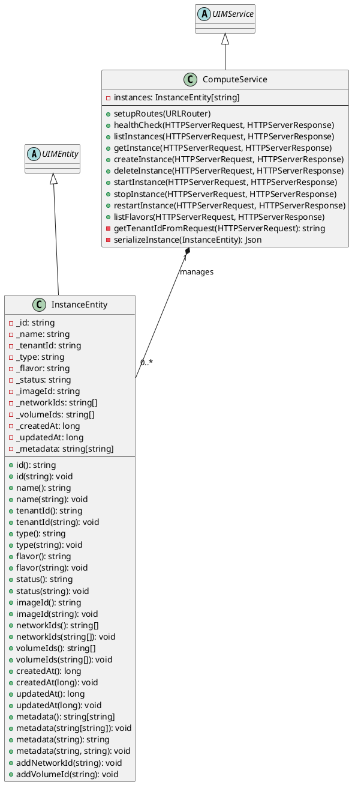
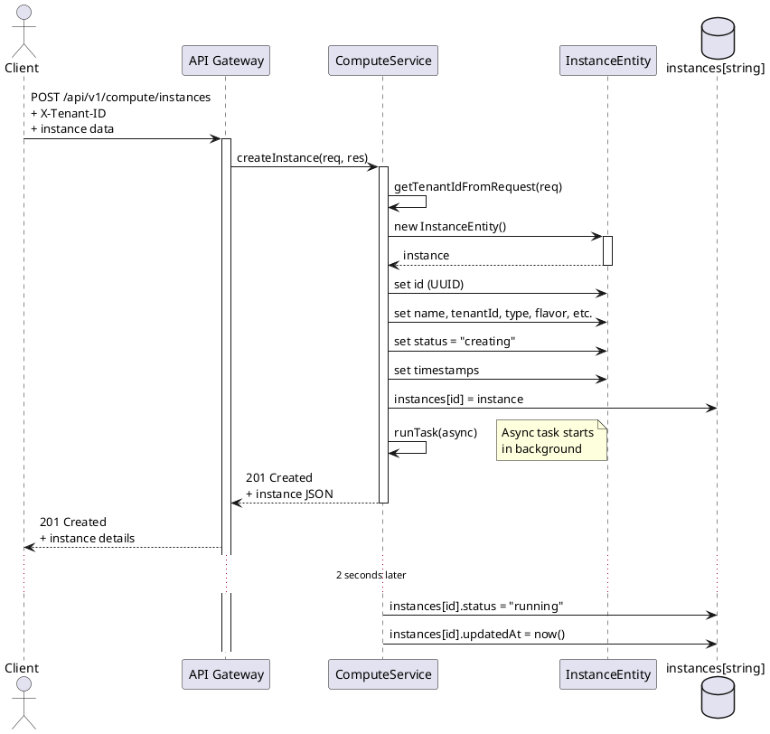
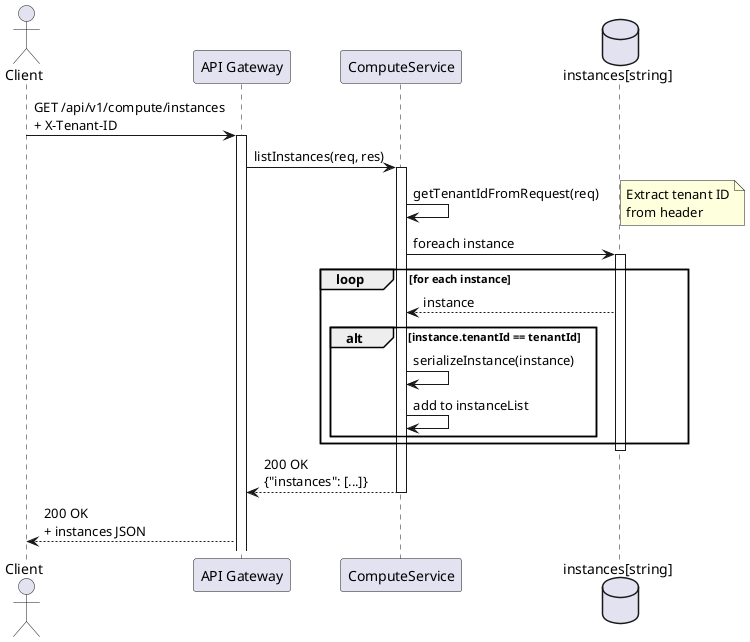
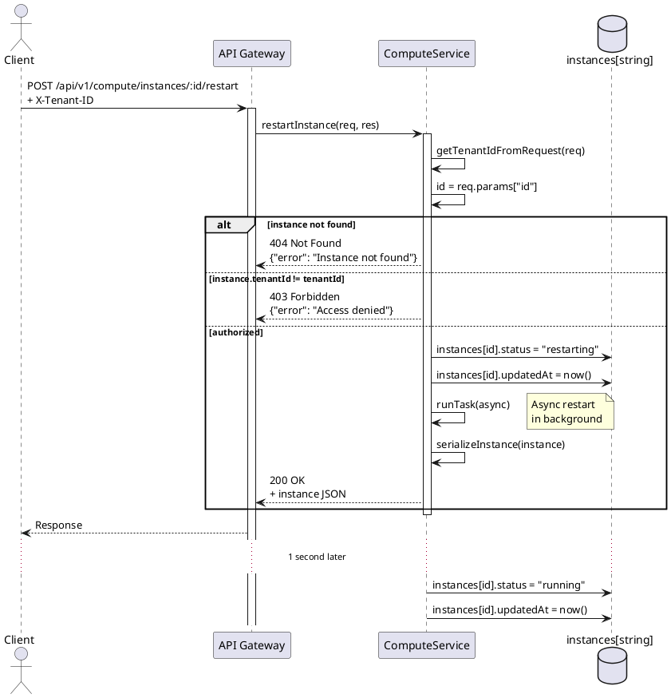
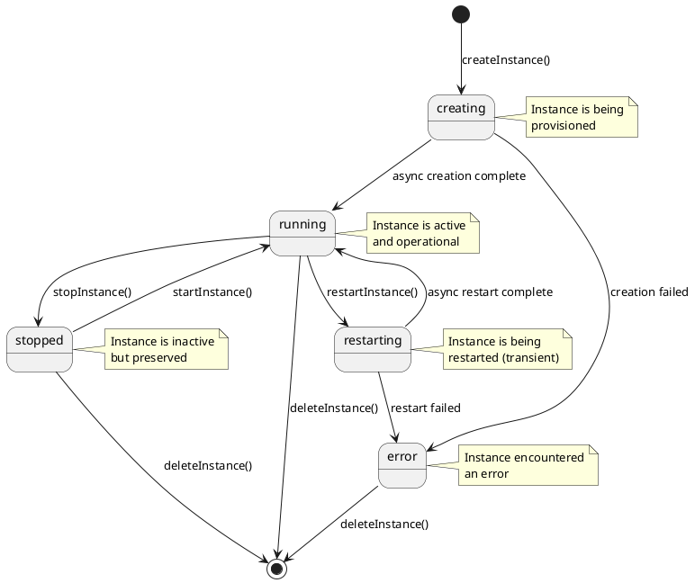
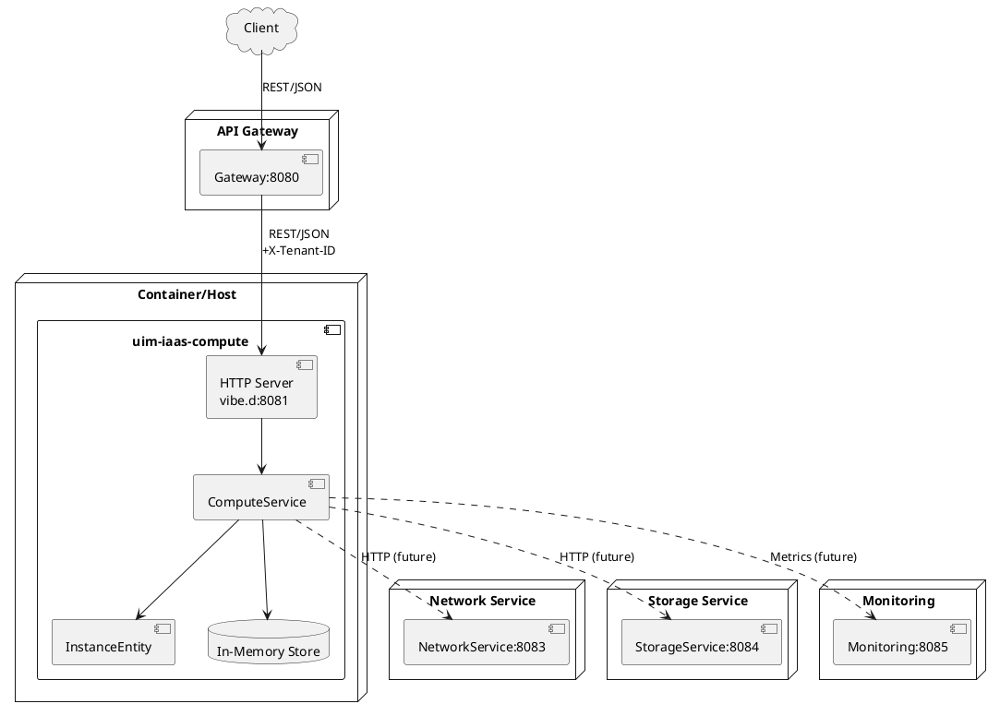
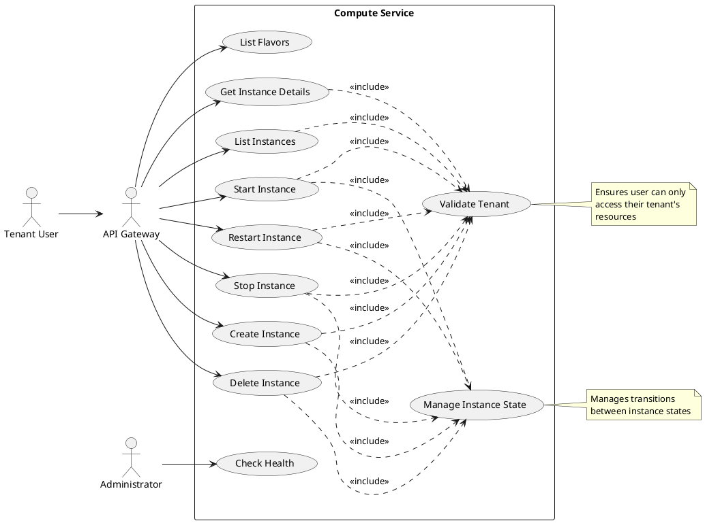
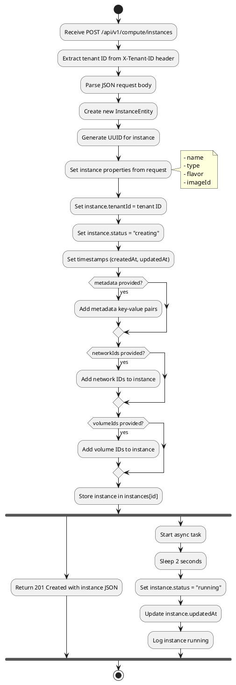

# Compute Service

The Compute Service manages virtual machines and container instances with multi-tenancy support in the UIM IaaS platform.

## Overview

This service is part of the UIM IaaS platform and provides compute resource management capabilities. It handles the lifecycle of compute instances (VMs and containers) with full multi-tenant isolation and REST API access.

**Service Name:** `uim-iaas-compute`  
**Default Port:** 8081  
**Version:** 26.1.2 compatible

## NAF v4 Architecture Description

### A1 - Meta Data Definitions

**Architecture Product Information:**
- **Name:** Compute Service Architecture
- **Version:** 1.0
- **Date:** January 2026
- **Classification:** Unclassified
- **Framework:** NATO Architecture Framework v4
- **Purpose:** Define the architecture of the compute resource management service

### C1 - Capability Taxonomy

**Primary Capabilities:**
- **Compute Resource Management**: Provide virtualized compute resources (VMs/Containers)
- **Instance Lifecycle Management**: Create, start, stop, restart, delete compute instances
- **Multi-Tenancy**: Isolate and manage resources per tenant
- **Resource Allocation**: Assign compute resources based on predefined flavors
- **State Management**: Track and transition instance states
- **Network Integration**: Attach instances to virtual networks
- **Storage Integration**: Attach volumes to compute instances
- **Metadata Management**: Store and retrieve instance-specific metadata

### C2 - Enterprise Vision

**Operational Concept:**
The Compute Service enables cloud tenants to provision and manage virtualized compute resources on-demand within a multi-tenant infrastructure-as-a-service platform. It provides REST API access for automated and programmatic resource management.

**Strategic Goals:**
- Enable self-service compute resource provisioning
- Ensure tenant isolation and data security
- Provide scalable and flexible compute options
- Support both VM and container workloads
- Integrate with network and storage services

### L2 - Logical Scenario

**Service Interactions:**
1. **Client → API Gateway → Compute Service**: Authenticated requests for compute operations
2. **Compute Service → Network Service**: Network attachment operations
3. **Compute Service → Storage Service**: Volume attachment operations
4. **Compute Service → Monitoring Service**: Metrics and health data
5. **Compute Service → Auth Service**: Tenant validation (via Gateway)

### L4 - Logical Activities

**Key Activities:**
- **Instance Provisioning**: Validate request → Allocate resources → Initialize instance → Return instance ID
- **Instance State Transition**: Validate ownership → Check current state → Execute transition → Update state
- **Instance Deprovisioning**: Validate ownership → Detach resources → Delete instance → Cleanup
- **Resource Enumeration**: Validate tenant → Query instances → Filter by tenant → Return list
- **Flavor Selection**: Retrieve flavor catalog → Present options → Validate selection

### Lr - Logical Resources

**Resource Types:**
- **InstanceEntity**: Virtual machine or container instance
  - Attributes: id, name, tenantId, type, flavor, status, imageId, createdAt, updatedAt
  - States: creating, running, stopped, restarting, error
- **Flavor**: Compute resource template
  - Attributes: name, vcpus, ram (MB), disk (GB)
- **Network Attachment**: Link between instance and virtual network
- **Volume Attachment**: Link between instance and storage volume

### P1 - Resource Types

**Service Component:**
- **Type:** Application Service
- **Runtime:** D Language (vibe.d framework)
- **Deployment:** Container/Executable
- **Interfaces:** REST/HTTP
- **Data Format:** JSON

**Resource Classes:**
- **Compute Instance**: Virtualized compute resource (VM/Container)
- **Flavor**: Resource allocation template
- **Instance Metadata**: Key-value configuration store

### P2 - Resource Structure

**Service Architecture:**
```
┌─────────────────────────────────────┐
│      Compute Service                │
│  (uim-iaas-compute:8081)            │
├─────────────────────────────────────┤
│  HTTP Server Layer (vibe.d)         │
├─────────────────────────────────────┤
│  Service Layer                      │
│  ├─ ComputeService                  │
│  │  ├─ Route Management             │
│  │  ├─ Tenant Validation            │
│  │  ├─ Instance Lifecycle           │
│  │  └─ Async Operations             │
├─────────────────────────────────────┤
│  Entity Layer                       │
│  └─ InstanceEntity                  │
│     ├─ Properties (via getters)     │
│     └─ Helper Methods               │
├─────────────────────────────────────┤
│  Data Store (In-Memory)             │
│  └─ instances[id] → InstanceEntity  │
└─────────────────────────────────────┘
```

### P4 - Resource Functions

**Functional Capabilities:**
- **healthCheck()**: Service health monitoring
- **createInstance()**: Provision new compute instance
- **getInstance()**: Retrieve instance details
- **listInstances()**: Enumerate tenant instances
- **deleteInstance()**: Deprovision instance
- **startInstance()**: Transition instance to running state
- **stopInstance()**: Transition instance to stopped state
- **restartInstance()**: Restart running instance
- **listFlavors()**: Retrieve available resource templates
- **getTenantIdFromRequest()**: Extract tenant context

### P8 - Resource Interactions

**Interface Specifications:**

**Provided Interface:**
- **Protocol:** HTTP/REST
- **Port:** 8081
- **Encoding:** JSON
- **Authentication:** X-Tenant-ID header (from API Gateway)
- **API Version:** v1

**Required Interfaces:**
- **Network Service**: For network attachment operations
- **Storage Service**: For volume attachment operations
- **Monitoring Service**: For health metrics collection

### S4 - Service Functions

**Service Characteristics:**
- **Service Type:** Stateful (manages instance state)
- **Availability:** Single instance (can be scaled)
- **Data Persistence:** In-memory (production would use database)
- **Concurrency:** Async operations via vibe.d tasks
- **Tenant Isolation:** Header-based tenant identification

**Service Operations:**
- **CRUD Operations**: Full create, read, update, delete for instances
- **State Transitions**: Lifecycle management with state validation
- **Resource Discovery**: Flavor enumeration and instance listing
- **Health Reporting**: Status endpoint for monitoring

### Sv - Service Interfaces

**REST API Interface:**
```
Service: compute-service
Base Path: /api/v1/compute
Methods: GET, POST, DELETE
Content-Type: application/json
Headers:
  - X-Tenant-ID (required for tenant operations)
  - Content-Type: application/json
```

**Endpoints:**
- `GET /health` - Health check (no auth required)
- `GET /api/v1/compute/instances` - List instances
- `POST /api/v1/compute/instances` - Create instance
- `GET /api/v1/compute/instances/:id` - Get instance
- `DELETE /api/v1/compute/instances/:id` - Delete instance
- `POST /api/v1/compute/instances/:id/start` - Start instance
- `POST /api/v1/compute/instances/:id/stop` - Stop instance
- `POST /api/v1/compute/instances/:id/restart` - Restart instance
- `GET /api/v1/compute/flavors` - List flavors

### SOV-1 - Service Orchestration

**Service Dependencies:**
1. **Auth Service** (indirect via API Gateway): Tenant authentication
2. **Network Service** (future): Network resource management
3. **Storage Service** (future): Volume management
4. **Monitoring Service** (future): Metrics collection

**Orchestration Patterns:**
- **Synchronous**: Instance CRUD operations return immediately
- **Asynchronous**: Instance creation and restart use background tasks
- **Event-Driven**: State transitions trigger async workflows

### Capability to Services Mapping

| Capability | Service Function | NAF View |
|------------|-----------------|----------|
| Compute Resource Provisioning | createInstance() | S4, P4 |
| Instance Lifecycle Management | start/stop/restart/deleteInstance() | S4, P4 |
| Resource Discovery | listInstances(), listFlavors() | S4, P4 |
| Multi-Tenant Isolation | getTenantIdFromRequest() | P4, Sv |
| State Management | InstanceEntity.status | Lr, P2 |
| Health Monitoring | healthCheck() | S4, Sv |

## UML Diagrams

### Component Diagram

```
┌─────────────────────────────────────────────────────────────┐
│                    Compute Service                          │
│                  (uim-iaas-compute)                         │
├─────────────────────────────────────────────────────────────┤
│                                                             │
│  ┌──────────────────────────────────────────────────────┐  │
│  │           HTTP Server (vibe.d)                       │  │
│  │              Port: 8081                              │  │
│  └───────────────────┬──────────────────────────────────┘  │
│                      │                                      │
│  ┌───────────────────▼──────────────────────────────────┐  │
│  │         ComputeService                               │  │
│  │  ┌────────────────────────────────────────────────┐  │  │
│  │  │  setupRoutes()                                 │  │  │
│  │  │  healthCheck()                                 │  │  │
│  │  │  listInstances()                               │  │  │
│  │  │  getInstance()                                 │  │  │
│  │  │  createInstance()                              │  │  │
│  │  │  deleteInstance()                              │  │  │
│  │  │  startInstance()                               │  │  │
│  │  │  stopInstance()                                │  │  │
│  │  │  restartInstance()                             │  │  │
│  │  │  listFlavors()                                 │  │  │
│  │  │  getTenantIdFromRequest()                      │  │  │
│  │  │  serializeInstance()                           │  │  │
│  │  └────────────────────────────────────────────────┘  │  │
│  │                      │                                │  │
│  │                      │ uses                           │  │
│  │                      ▼                                │  │
│  │  ┌────────────────────────────────────────────────┐  │  │
│  │  │  instances: InstanceEntity[string]             │  │  │
│  │  └────────────────────────────────────────────────┘  │  │
│  └──────────────────────────────────────────────────────┘  │
│                      │                                      │
│                      │ manages                              │
│                      ▼                                      │
│  ┌───────────────────────────────────────────────────────┐ │
│  │         InstanceEntity                                │ │
│  │  ┌─────────────────────────────────────────────────┐ │ │
│  │  │  Properties:                                    │ │ │
│  │  │   - _id: string                                 │ │ │
│  │  │   - _name: string                               │ │ │
│  │  │   - _tenantId: string                           │ │ │
│  │  │   - _type: string                               │ │ │
│  │  │   - _flavor: string                             │ │ │
│  │  │   - _status: string                             │ │ │
│  │  │   - _imageId: string                            │ │ │
│  │  │   - _networkIds: string[]                       │ │ │
│  │  │   - _volumeIds: string[]                        │ │ │
│  │  │   - _createdAt: long                            │ │ │
│  │  │   - _updatedAt: long                            │ │ │
│  │  │   - _metadata: string[string]                   │ │ │
│  │  │                                                 │ │ │
│  │  │  Methods:                                       │ │ │
│  │  │   + getters/setters for all properties         │ │ │
│  │  │   + addNetworkId(string)                        │ │ │
│  │  │   + addVolumeId(string)                         │ │ │
│  │  │   + metadata(string, string)                    │ │ │
│  │  └─────────────────────────────────────────────────┘ │ │
│  └───────────────────────────────────────────────────────┘ │
│                                                             │
└─────────────────────────────────────────────────────────────┘
```

### Class Diagram



### Sequence Diagram - Create Instance



### Sequence Diagram - List Instances



### Sequence Diagram - Restart Instance



### State Diagram - Instance Lifecycle



### Deployment Diagram



### Use Case Diagram



### Activity Diagram - Create Instance Flow



## Features

- ✅ Create, start, stop, restart, and delete compute instances
- ✅ Multi-tenant isolation with tenant-based access control
- ✅ Support for both VM and container instance types
- ✅ Instance flavors (small, medium, large, xlarge) with defined resources
- ✅ Network and volume attachment support
- ✅ Metadata key-value storage for instances
- ✅ Asynchronous instance creation and restart operations
- ✅ RESTful API with JSON responses
- ✅ Health check endpoint for monitoring

## API Endpoints

### Health Check
```
GET /health
```
Returns the service health status.

### List Instances
```
GET /api/v1/compute/instances
```
Returns all instances for the authenticated tenant.

**Headers:**
- `X-Tenant-ID`: Tenant identifier (set by API Gateway)

### Get Instance
```
GET /api/v1/compute/instances/:id
```
Returns details of a specific instance.

**Parameters:**
- `id`: Instance ID

### Create Instance
```
POST /api/v1/compute/instances
```
Creates a new compute instance.

**Request Body:**
```json
{
  "name": "my-instance",
  "type": "vm",
  "flavor": "small",
  "imageId": "ubuntu-22.04",
  "networkIds": ["net-123"],
  "volumeIds": ["vol-456"],
  "metadata": {
    "environment": "production",
    "owner": "team-a"
  }
}
```

**Response:** 201 Created with instance details.

### Delete Instance
```
DELETE /api/v1/compute/instances/:id
```
Deletes a compute instance.

**Parameters:**
- `id`: Instance ID

**Response:** 204 No Content

### Start Instance
```
POST /api/v1/compute/instances/:id/start
```
Starts a stopped instance.

### Stop Instance
```
POST /api/v1/compute/instances/:id/stop
```
Stops a running instance.

### Restart Instance
```
POST /api/v1/compute/instances/:id/restart
```
Restarts an instance.

### List Flavors
```
GET /api/v1/compute/flavors
```
Returns available instance flavors.

**Response:**
```json
{
  "flavors": [
    {"name": "small", "vcpus": 1, "ram": 1024, "disk": 10},
    {"name": "medium", "vcpus": 2, "ram": 4096, "disk": 40},
    {"name": "large", "vcpus": 4, "ram": 8192, "disk": 80},
    {"name": "xlarge", "vcpus": 8, "ram": 16384, "disk": 160}
  ]
}
```

## Instance Types

- **vm**: Virtual machine instance
- **container**: Container-based instance

## Instance Status

- `creating`: Instance is being created
- `running`: Instance is running
- `stopped`: Instance is stopped
- `restarting`: Instance is restarting
- `error`: Instance encountered an error

## Building

Build the service using DUB:
```bash
dub build
```

For release build:
```bash
dub build --build=release
```

## Running

Start the service:
```bash
dub run
```

The service will start on port **8081** by default.

## Testing

```bash
dub test
```

## Docker

Build the Docker image:
```bash
docker build -t uim-iaas-compute:latest .
```

Run the container:
```bash
docker run -p 8081:8081 uim-iaas-compute:latest
```

With environment variables:
```bash
docker run -p 8081:8081 \
  -e SERVICE_PORT=8081 \
  -e LOG_LEVEL=info \
  uim-iaas-compute:latest
```

## Configuration

The service uses the following configuration:

### Port Configuration
- Default port: **8081**
- Bind address: `0.0.0.0` (all interfaces)

### Environment Variables
- `SERVICE_PORT`: Port to listen on (default: 8081)
- `LOG_LEVEL`: Logging level (debug, info, warn, error)

## Multi-Tenancy

The service enforces tenant isolation:
- All requests must include the `X-Tenant-ID` header (typically set by the API Gateway)
- Users can only access instances belonging to their tenant
- Unauthorized access attempts return 403 Forbidden

## Dependencies

This service requires the following dependencies (managed by DUB):

- **vibe-d** ~>0.10.3: Web framework and HTTP server
- **uim-iaas:core**: Shared utilities and base classes (local path dependency)
- **uim-framework:oop** ~>26.1.2: UIM OOP framework

All dependencies are automatically resolved during build.

## Development

### Project Structure
```
compute/
├── source/
│   ├── app.d                    # Main application entry point
│   └── uim/
│       └── iaas/
│           └── compute/
│               ├── package.d    # Module exports
│               ├── entities/    # Data models
│               │   ├── instance.d
│               │   └── package.d
│               └── services/    # Business logic
│                   ├── compute.d
│                   └── package.d
├── Dockerfile
├── dub.sdl                      # DUB package configuration
└── README.md
```

## Example Usage

### Create an instance
```bash
curl -X POST http://localhost:8081/api/v1/compute/instances \
  -H "Content-Type: application/json" \
  -H "X-Tenant-ID: tenant-123" \
  -d '{
    "name": "web-server-01",
    "type": "vm",
    "flavor": "medium",
    "imageId": "ubuntu-22.04",
    "metadata": {
      "app": "nginx"
    }
  }'
```

### List instances
```bash
curl http://localhost:8081/api/v1/compute/instances \
  -H "X-Tenant-ID: tenant-123"
```

### Get instance details
```bash
curl http://localhost:8081/api/v1/compute/instances/{id} \
  -H "X-Tenant-ID: tenant-123"
```

### Start an instance
```bash
curl -X POST http://localhost:8081/api/v1/compute/instances/{id}/start \
  -H "X-Tenant-ID: tenant-123"
```

### Stop an instance
```bash
curl -X POST http://localhost:8081/api/v1/compute/instances/{id}/stop \
  -H "X-Tenant-ID: tenant-123"
```

### Restart an instance
```bash
curl -X POST http://localhost:8081/api/v1/compute/instances/{id}/restart \
  -H "X-Tenant-ID: tenant-123"
```

### Delete an instance
```bash
curl -X DELETE http://localhost:8081/api/v1/compute/instances/{id} \
  -H "X-Tenant-ID: tenant-123"
```

### List available flavors
```bash
curl http://localhost:8081/api/v1/compute/flavors
```

### Check service health
```bash
curl http://localhost:8081/health
```

## License

Copyright © 2026, UI Manufaktur  
Licensed under the Apache License 2.0

See the LICENSE file in the project root for details.

## Author

Ozan Nurettin Süel

## Related Services

This service is part of the UIM IaaS platform:
- **API Gateway**: Routes and authenticates requests
- **Auth Service**: Manages authentication and tenant data
- **Network Service**: Manages virtual networks
- **Storage Service**: Manages volumes and storage
- **Monitoring Service**: Collects metrics and logs
