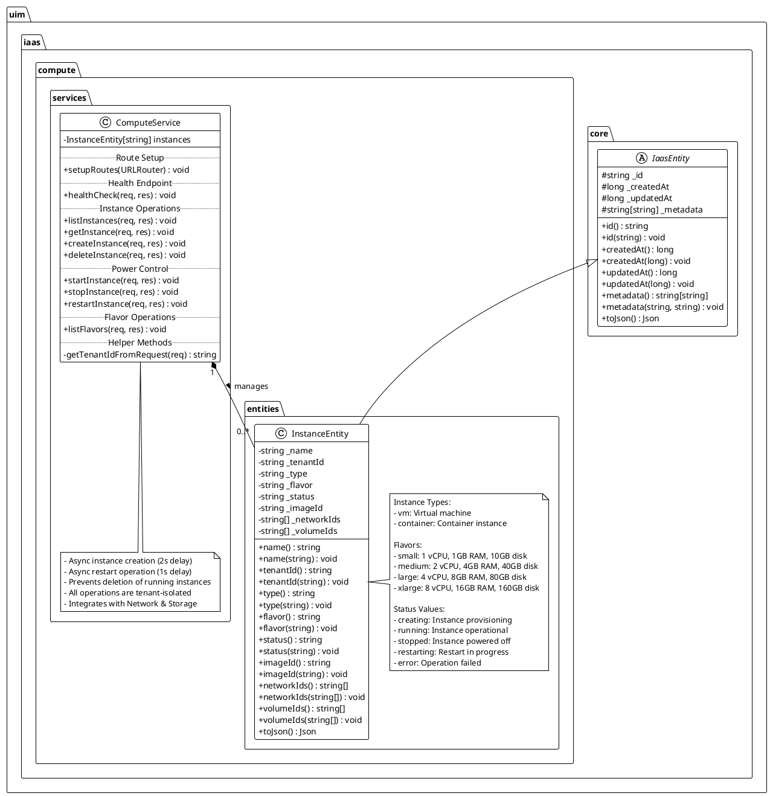
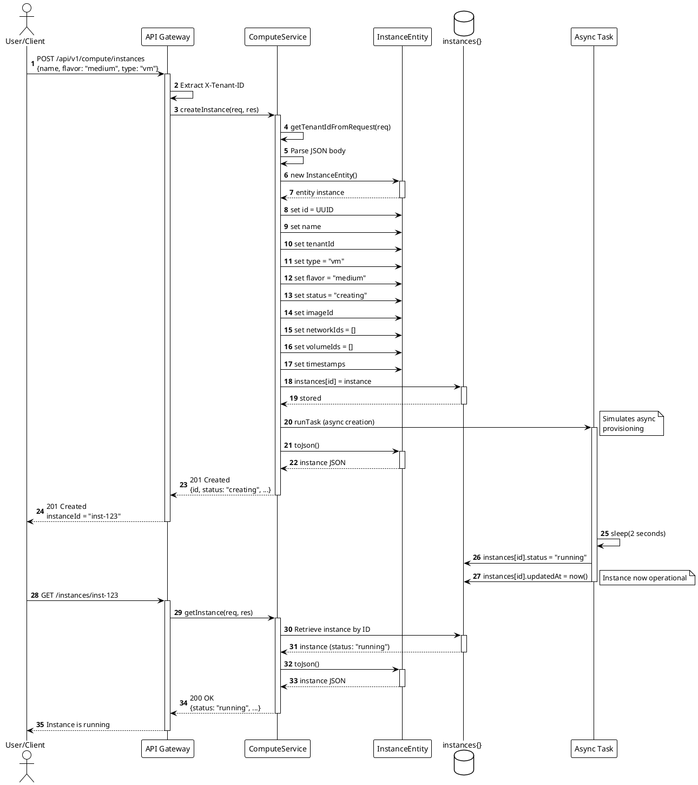
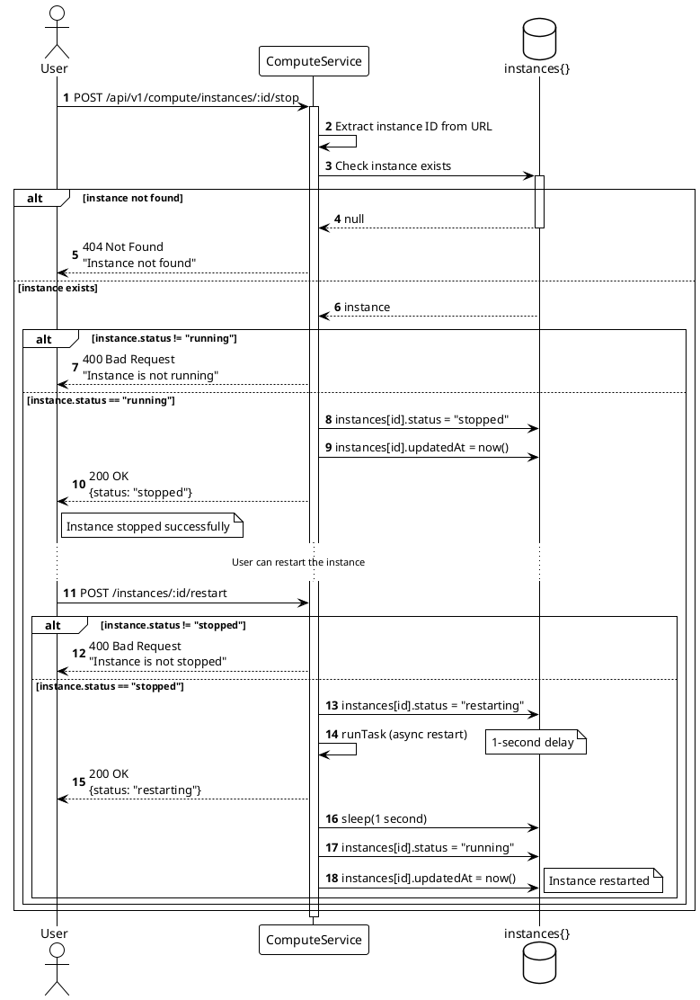
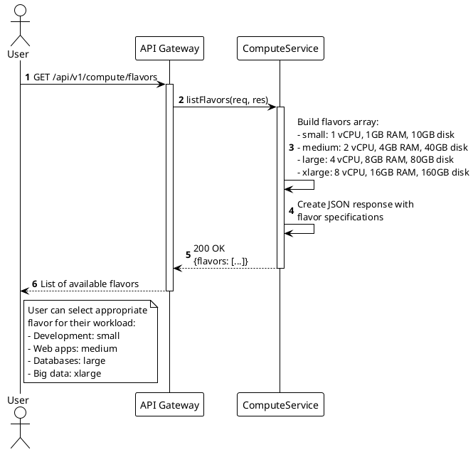
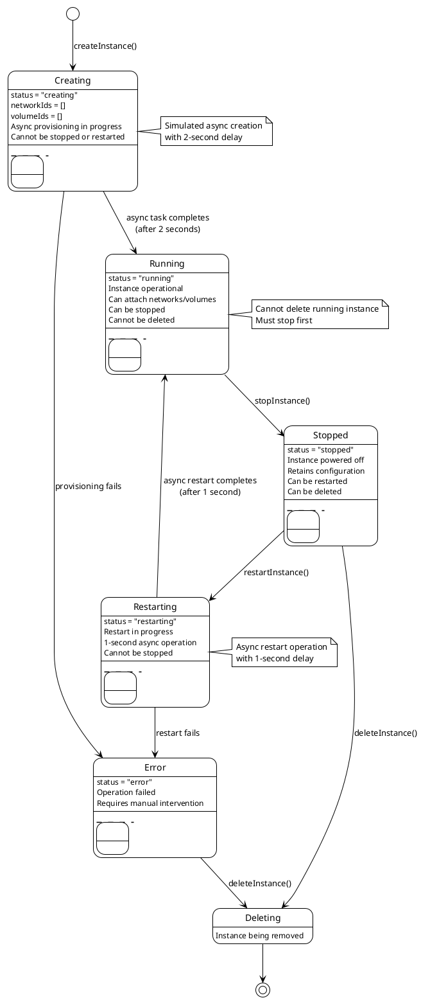
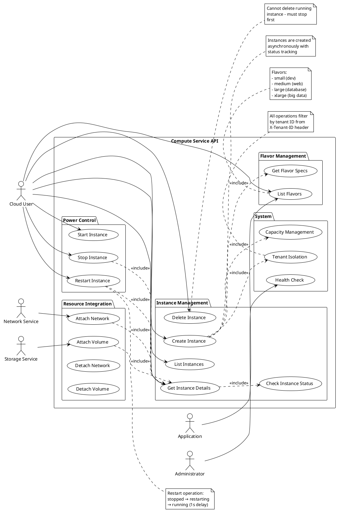
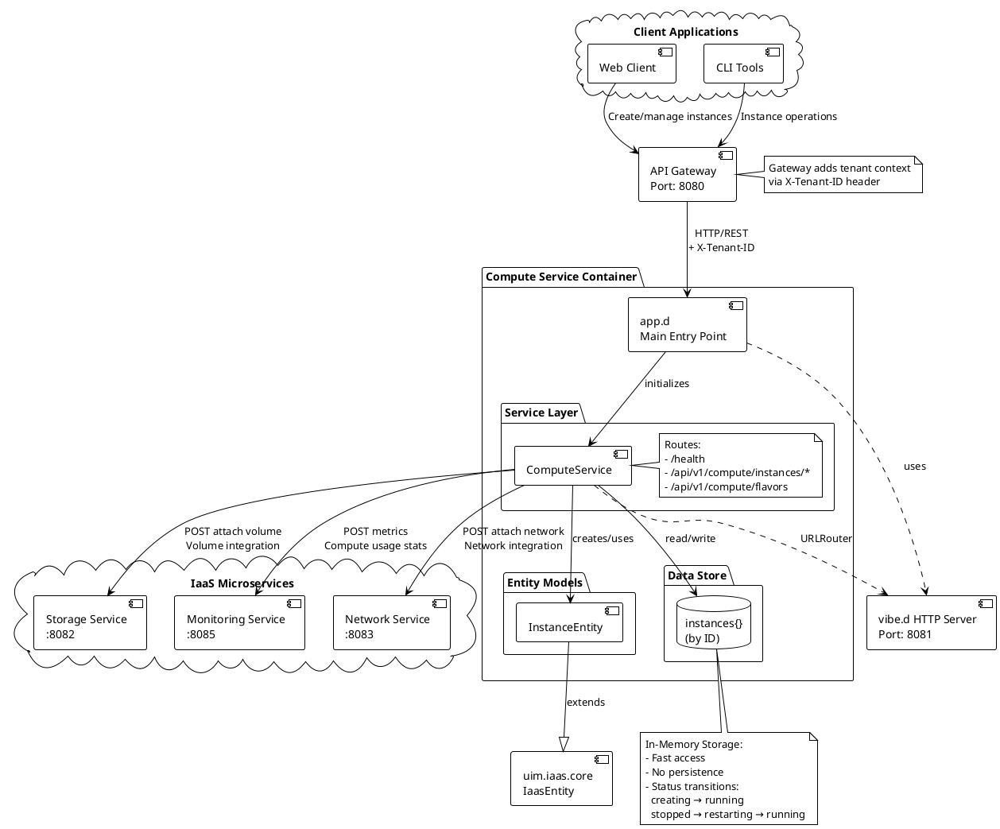
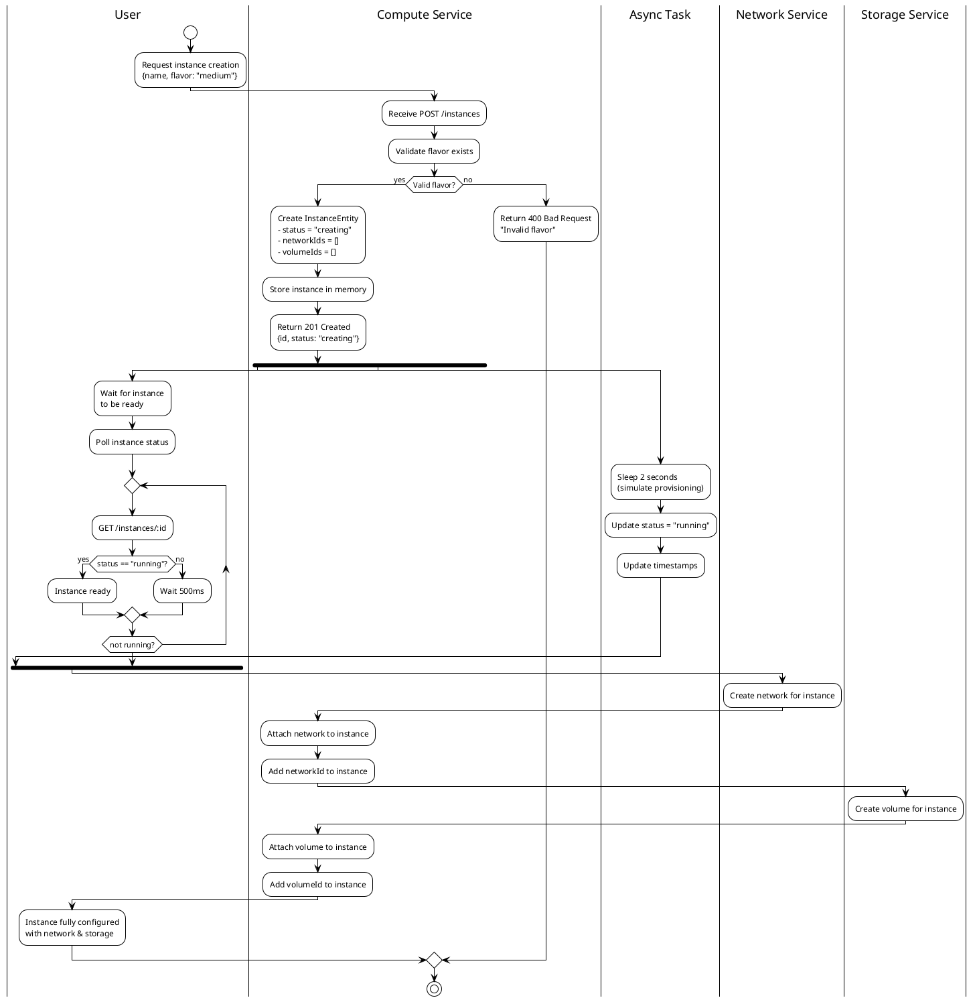
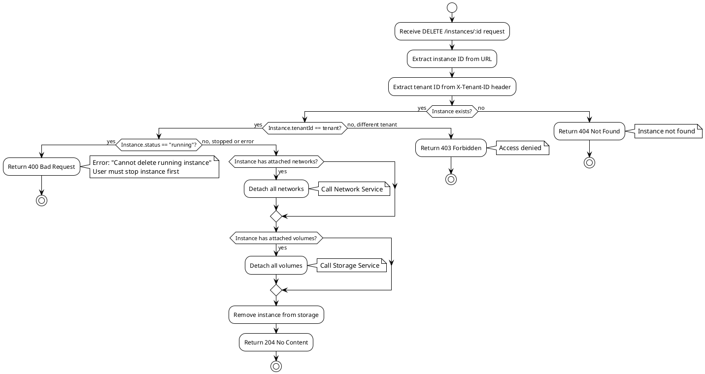

# UIM IaaS Compute Service

## Overview

The **UIM IaaS Compute Service** is a comprehensive multi-tenant compute management platform that provides virtual machine (VM) and container instance provisioning and lifecycle management for cloud infrastructure. Built with the D programming language and vibe.d framework, it enables creation, power management, and orchestration of compute resources with complete tenant isolation.

**Service Name:** `uim-iaas-compute`  
**Default Port:** 8081  
**NAF Version:** v4  
**Version:** 26.1.2 compatible

## Features

- ✅ Virtual machine instance management (create, start, stop, restart, delete)
- ✅ Container instance support
- ✅ Multiple compute flavors (small, medium, large, xlarge)
- ✅ Multi-tenant compute isolation and security
- ✅ Instance power state management (running, stopped, restarting)
- ✅ Instance status tracking (creating, running, stopped, restarting, error)
- ✅ Integration with Network Service (network attachment)
- ✅ Integration with Storage Service (volume attachment)
- ✅ Flavor listing and specifications
- ✅ RESTful API with JSON responses
- ✅ Health check endpoint for monitoring
- ✅ Async instance creation with status updates
- ✅ Async restart operations
- ✅ NAF v4 architecture alignment

## NAF v4 Architecture Alignment

This service adheres to the **NATO Architecture Framework (NAF) Version 4** standards, ensuring structured architecture documentation and operational clarity.

### NAF v4 Views Implemented

#### NOV-1: High-Level Operational Concept
The Compute Service operates as the virtual resource provisioning layer that:
- Provisions virtual machines and container instances
- Manages compute instance lifecycle (create, start, stop, restart, delete)
- Handles instance power state transitions
- Provides compute flavor management (resource templates)
- Ensures compute capacity management and tracking
- Implements tenant-level compute isolation
- Integrates with network and storage services for complete infrastructure

#### NOV-2: Operational Node Connectivity
```
┌────────────────────────────────────────────────────┐
│             Compute Service Core                   │
│  ┌──────────────┐  ┌──────────────┐  ┌─────────┐ │
│  │   Instance   │  │    Flavor    │  │  Power  │ │
│  │  Management  │  │  Management  │  │ Control │ │
│  │  (VM/Ctnr)   │  │ (Templates)  │  │         │ │
│  └──────┬───────┘  └──────┬───────┘  └────┬────┘ │
└─────────┼──────────────────┼───────────────┼──────┘
          │                  │               │
    ┌─────▼──────┐    ┌─────▼──────┐  ┌────▼─────┐
    │  Network   │    │  Storage   │  │Monitoring│
    │  Service   │    │  Service   │  │ Service  │
    └────────────┘    └────────────┘  └──────────┘
```

#### NOV-3: Operational Information Requirements
**Information Exchanged:**
- Instance specifications (name, flavor, type, status)
- Power state information (running, stopped, restarting)
- Network attachment relationships (instance ↔ networks)
- Volume attachment relationships (instance ↔ volumes)
- Flavor definitions (vCPU, RAM, disk specifications)
- Compute capacity and utilization metrics
- Tenant isolation identifiers

#### NSV-1: Systems Interface Description
The Compute Service exposes RESTful HTTP interfaces for:
- Instance lifecycle management (CRUD)
- Power control operations (start, stop, restart)
- Flavor listing and specifications
- Multi-tenant compute isolation

#### NSV-2: Systems Resource Flow
```
┌──────────────┐
│   Client     │
└──────┬───────┘
       │ POST /instances (name, flavor: "medium")
       ▼
┌──────────────────┐
│ Compute Service  │ Creates InstanceEntity (status: creating)
└──────┬───────────┘
       │ Async creation → status: running (2s delay)
       │ Instance ready with network & storage
       │ POST /instances/:id/stop
       ▼
┌──────────────────┐
│Instance Stopped  │ status: stopped, can be restarted
└──────┬───────────┘
       │ POST /instances/:id/restart
       ▼
┌──────────────────┐
│ Instance Running │ Async restart → running (1s delay)
└──────────────────┘
```

#### NSV-4: Systems Functionality Description

**Core Functions:**
1. **Instance Management**: Create, delete, query instances with flavor specifications
2. **Power Control**: Start, stop, restart instances with state transitions
3. **Flavor Management**: List available compute templates with resource specifications
4. **Network Integration**: Attach network interfaces to instances
5. **Storage Integration**: Attach volumes for persistent data
6. **Multi-tenancy**: Complete compute isolation per tenant
7. **Status Tracking**: Monitor instance states (creating, running, stopped, restarting, error)
8. **Capacity Management**: Track compute resource allocation per flavor

## Architecture

### Entity-Service Pattern

The service implements a clean architecture with separation of concerns:

```
┌──────────────────────────────────────────────────────────┐
│                   Compute Service                         │
├──────────────────────────────────────────────────────────┤
│  Entities Layer                                          │
│  ┌──────────────────────────────────────────────────┐   │
│  │              InstanceEntity                      │   │
│  │                                                  │   │
│  │ - id              - imageId                     │   │
│  │ - name            - networkIds[]                │   │
│  │ - tenantId        - volumeIds[]                 │   │
│  │ - type (vm/container)                           │   │
│  │ - flavor (small/medium/large/xlarge)            │   │
│  │ - status (creating/running/stopped/...)         │   │
│  │ - createdAt       - updatedAt                   │   │
│  │ - metadata{}                                    │   │
│  └──────────────────────────────────────────────────┘   │
├──────────────────────────────────────────────────────────┤
│  Service Layer                                           │
│  ┌─────────────────────────────────────────────────────┐│
│  │            ComputeService                           ││
│  │                                                     ││
│  │  Instance Operations:                              ││
│  │  + createInstance()    + listInstances()           ││
│  │  + getInstance()       + deleteInstance()          ││
│  │                                                     ││
│  │  Power Control:                                    ││
│  │  + startInstance()     + stopInstance()            ││
│  │  + restartInstance()                               ││
│  │                                                     ││
│  │  Flavor Operations:                                ││
│  │  + listFlavors()                                   ││
│  └─────────────────────────────────────────────────────┘│
└──────────────────────────────────────────────────────────┘
```

## UML Diagrams

### Class Diagram



### Sequence Diagram: Creating an Instance



### Sequence Diagram: Power Control Operations



### Sequence Diagram: Listing Flavors



### State Diagram: Instance Lifecycle



### Use Case Diagram



### Component Diagram



### Activity Diagram: Instance Creation with Integrations



### Activity Diagram: Instance Deletion Flow



## API Endpoints

### Health Check
```http
GET /health
```
Returns service health status.

Response:
```json
{
  "status": "healthy",
  "service": "compute-service"
}
```

### Instance Management

#### List Instances
```http
GET /api/v1/compute/instances
X-Tenant-ID: your-tenant-id
```

Response: `200 OK`
```json
{
  "instances": [
    {
      "id": "inst-123",
      "name": "web-server",
      "tenantId": "tenant-001",
      "type": "vm",
      "flavor": "medium",
      "status": "running",
      "imageId": "ubuntu-22.04",
      "networkIds": ["net-456"],
      "volumeIds": ["vol-789"],
      "createdAt": 1640995200,
      "updatedAt": 1640995202,
      "metadata": {}
    }
  ]
}
```

#### Get Instance by ID
```http
GET /api/v1/compute/instances/{instance-id}
X-Tenant-ID: your-tenant-id
```

Response: `200 OK`
```json
{
  "id": "inst-123",
  "name": "web-server",
  "tenantId": "tenant-001",
  "type": "vm",
  "flavor": "medium",
  "status": "running",
  "imageId": "ubuntu-22.04",
  "networkIds": ["net-456"],
  "volumeIds": ["vol-789"],
  "createdAt": 1640995200,
  "updatedAt": 1640995202,
  "metadata": {
    "application": "nginx",
    "environment": "production"
  }
}
```

#### Create Instance
```http
POST /api/v1/compute/instances
Content-Type: application/json
X-Tenant-ID: your-tenant-id

{
  "name": "web-server",
  "type": "vm",
  "flavor": "medium",
  "imageId": "ubuntu-22.04",
  "metadata": {
    "application": "nginx",
    "environment": "production"
  }
}
```

Response: `201 Created`
```json
{
  "id": "inst-123",
  "name": "web-server",
  "tenantId": "tenant-001",
  "type": "vm",
  "flavor": "medium",
  "status": "creating",
  "imageId": "ubuntu-22.04",
  "networkIds": [],
  "volumeIds": [],
  "createdAt": 1640995200,
  "updatedAt": 1640995200,
  "metadata": {
    "application": "nginx",
    "environment": "production"
  }
}
```

**Note:** Instance status will change from `creating` to `running` after ~2 seconds (async provisioning).

#### Delete Instance
```http
DELETE /api/v1/compute/instances/{instance-id}
X-Tenant-ID: your-tenant-id
```

Response: `204 No Content`

**Error Cases:**
- `404 Not Found`: Instance doesn't exist
- `403 Forbidden`: Instance belongs to different tenant
- `400 Bad Request`: Instance is currently running (must stop first)

### Power Control Operations

#### Stop Instance
```http
POST /api/v1/compute/instances/{instance-id}/stop
X-Tenant-ID: your-tenant-id
```

Response: `200 OK`
```json
{
  "id": "inst-123",
  "status": "stopped",
  "updatedAt": 1640995300
}
```

**Requirements:**
- Instance must be in `running` state

#### Start Instance
```http
POST /api/v1/compute/instances/{instance-id}/start
X-Tenant-ID: your-tenant-id
```

Response: `200 OK`
```json
{
  "id": "inst-123",
  "status": "running",
  "updatedAt": 1640995400
}
```

**Requirements:**
- Instance must be in `stopped` state

#### Restart Instance
```http
POST /api/v1/compute/instances/{instance-id}/restart
X-Tenant-ID: your-tenant-id
```

Response: `200 OK`
```json
{
  "id": "inst-123",
  "status": "restarting",
  "updatedAt": 1640995500
}
```

**Note:** Instance status will change from `restarting` to `running` after ~1 second (async restart).

**Requirements:**
- Instance must be in `stopped` state

### Flavor Management

#### List Flavors
```http
GET /api/v1/compute/flavors
```

Response: `200 OK`
```json
{
  "flavors": [
    {
      "name": "small",
      "vcpus": 1,
      "ramGB": 1,
      "diskGB": 10,
      "description": "Suitable for development and testing"
    },
    {
      "name": "medium",
      "vcpus": 2,
      "ramGB": 4,
      "diskGB": 40,
      "description": "Suitable for web applications"
    },
    {
      "name": "large",
      "vcpus": 4,
      "ramGB": 8,
      "diskGB": 80,
      "description": "Suitable for databases"
    },
    {
      "name": "xlarge",
      "vcpus": 8,
      "ramGB": 16,
      "diskGB": 160,
      "description": "Suitable for big data and analytics"
    }
  ]
}
```

**Note:** This endpoint does not require authentication (public resource information).

## Multi-Tenancy

The Compute Service implements **complete tenant isolation**:

- **Tenant Identification**: Via `X-Tenant-ID` HTTP header
- **Instance Isolation**: Each tenant has separate compute instances
- **Access Control**: Prevents cross-tenant access to instances
- **Resource Quotas**: Future support for per-tenant compute limits
- **Default Tenant**: Falls back to "default" if no header provided

### Multi-Tenant Example

Tenant A creates their instance:
```bash
curl -X POST http://localhost:8081/api/v1/compute/instances \
  -H "X-Tenant-ID: tenant-a" \
  -H "Content-Type: application/json" \
  -d '{
    "name": "tenant-a-web",
    "type": "vm",
    "flavor": "medium",
    "imageId": "ubuntu-22.04"
  }'
```

Tenant B creates their instance (completely isolated):
```bash
curl -X POST http://localhost:8081/api/v1/compute/instances \
  -H "X-Tenant-ID: tenant-b" \
  -H "Content-Type: application/json" \
  -d '{
    "name": "tenant-b-database",
    "type": "vm",
    "flavor": "large",
    "imageId": "postgresql-15"
  }'
```

Tenants cannot see or access each other's compute instances.

## Data Model

### Instance Entity
- **id**: Unique identifier (UUID)
- **name**: Human-readable instance name
- **tenantId**: Tenant isolation identifier
- **type**: Instance type ("vm" or "container")
- **flavor**: Compute template (small/medium/large/xlarge)
- **status**: Instance state (creating/running/stopped/restarting/error)
- **imageId**: Operating system or container image identifier
- **networkIds**: Array of attached network IDs
- **volumeIds**: Array of attached volume IDs
- **createdAt**: Creation timestamp
- **updatedAt**: Last update timestamp
- **metadata**: Key-value pairs for additional data

### Flavor Specifications

| Flavor | vCPUs | RAM | Disk | Use Case |
|--------|-------|-----|------|----------|
| **small** | 1 | 1 GB | 10 GB | Development, testing, microservices |
| **medium** | 2 | 4 GB | 40 GB | Web applications, small databases |
| **large** | 4 | 8 GB | 80 GB | Databases, application servers |
| **xlarge** | 8 | 16 GB | 160 GB | Big data, analytics, large workloads |

### Instance Status Values

- **creating**: Instance is being provisioned (async operation in progress)
- **running**: Instance is operational and can process workloads
- **stopped**: Instance is powered off but retains configuration
- **restarting**: Instance restart operation in progress
- **error**: An error occurred during provisioning or operation

## Configuration

### Port Configuration
Default port: **8081**

Configured in [app.d](source/app.d):
```d
auto settings = new HTTPServerSettings;
settings.port = 8081;
settings.bindAddresses = ["0.0.0.0"];
```

### Service Settings
| Setting | Default | Description |
|---------|---------|-------------|
| Port | 8081 | HTTP server port |
| Bind Address | 0.0.0.0 | Network interface to bind |
| Async Creation Delay | 2 seconds | Simulated instance provisioning time |
| Async Restart Delay | 1 second | Simulated restart operation time |
| Tenant Header | X-Tenant-ID | HTTP header for tenant identification |

### Compute Constraints
- **Instance Deletion**: Cannot delete running instances (must stop first)
- **Power Operations**: Must match current status (e.g., can't stop a stopped instance)
- **Flavor Validation**: Must use one of the predefined flavors

## Building and Running

### Prerequisites
- D compiler (DMD, LDC, or GDC)
- DUB package manager
- vibe.d framework (automatically installed via DUB)

### Build with DUB
```bash
cd compute
dub build
```

For release build with optimizations:
```bash
dub build --build=release
```

### Run the Service
```bash
./uim-iaas-compute
```

Or directly with DUB:
```bash
dub run
```

The service will start and listen on port 8081:
```
Compute Service starting on port 8081
```

### Run with Docker
Build the Docker image:
```bash
docker build -t uim-iaas-compute:latest .
```

Run the container:
```bash
docker run -p 8081:8081 uim-iaas-compute:latest
```

### Run with Docker Compose
From the project root:
```bash
docker-compose up compute
```

Run in detached mode:
```bash
docker-compose up -d compute
```

View logs:
```bash
docker-compose logs -f compute
```

## Dependencies

Defined in [dub.sdl](dub.sdl):

- **vibe-d**: Web framework and HTTP server
- **uim-iaas-core**: Core entities and utilities

## Integration with Other Services

### Network Service Integration
Instances need network connectivity:

```d
// Compute service creates network for instance
auto networkResponse = requestHTTP("http://network:8083/api/v1/network/networks",
    (scope req) {
        req.method = HTTPMethod.POST;
        req.headers["X-Tenant-ID"] = tenantId;
        req.writeJsonBody([
            "name": "instance-network",
            "cidr": "10.0.1.0/24"
        ]);
    }
);

auto networkId = networkResponse.json["id"].get!string;

// Add network to instance
instance.networkIds ~= networkId;
```

### Storage Service Integration
Instances need persistent storage:

```d
// Compute service creates volume for instance
auto volumeResponse = requestHTTP("http://storage:8082/api/v1/storage/volumes",
    (scope req) {
        req.method = HTTPMethod.POST;
        req.headers["X-Tenant-ID"] = tenantId;
        req.writeJsonBody([
            "name": "instance-disk",
            "sizeGB": 50
        ]);
    }
);

auto volumeId = volumeResponse.json["id"].get!string;

// Wait for volume to be available
// Then attach to instance
requestHTTP("http://storage:8082/api/v1/storage/volumes/" ~ volumeId ~ "/attach",
    (scope req) {
        req.method = HTTPMethod.POST;
        req.headers["X-Tenant-ID"] = tenantId;
        req.writeJsonBody(["instanceId": instanceId]);
    }
);

// Add volume to instance
instance.volumeIds ~= volumeId;
```

### Monitoring Integration
Report compute metrics:

```d
// Report instance creation metric
requestHTTP("http://monitoring:8085/api/v1/monitoring/metrics",
    (scope req) {
        req.method = HTTPMethod.POST;
        req.headers["X-Tenant-ID"] = tenantId;
        req.writeJsonBody([
            "name": "instance_created",
            "type": "counter",
            "value": 1,
            "labels": [
                "service": "compute",
                "type": instance.type,
                "flavor": instance.flavor
            ]
        ]);
    }
);
```

## Compute Best Practices

### Instance Management
1. **Right-Sizing**: Choose appropriate flavors based on workload requirements
2. **Status Monitoring**: Check instance status before operations
3. **Resource Cleanup**: Stop and delete unused instances to free resources
4. **Graceful Shutdown**: Always stop instances before deletion

### Flavor Selection
1. **Development**: Use `small` flavor for testing and development
2. **Web Applications**: Use `medium` flavor for moderate traffic
3. **Databases**: Use `large` flavor for database servers
4. **Analytics**: Use `xlarge` flavor for big data and intensive workloads

### Common Compute Patterns

**Web Server Instance:**
```bash
curl -X POST http://localhost:8081/api/v1/compute/instances \
  -H "X-Tenant-ID: production" \
  -H "Content-Type: application/json" \
  -d '{
    "name": "nginx-web",
    "type": "vm",
    "flavor": "medium",
    "imageId": "nginx-1.24",
    "metadata": {
      "role": "web-server",
      "application": "frontend"
    }
  }'
```

**Database Server Instance:**
```bash
curl -X POST http://localhost:8081/api/v1/compute/instances \
  -H "X-Tenant-ID: production" \
  -H "Content-Type: application/json" \
  -d '{
    "name": "postgres-db",
    "type": "vm",
    "flavor": "large",
    "imageId": "postgresql-15",
    "metadata": {
      "role": "database",
      "database": "postgresql"
    }
  }'
```

**Container Instance:**
```bash
curl -X POST http://localhost:8081/api/v1/compute/instances \
  -H "X-Tenant-ID: development" \
  -H "Content-Type: application/json" \
  -d '{
    "name": "api-service",
    "type": "container",
    "flavor": "small",
    "imageId": "myapp:latest",
    "metadata": {
      "role": "microservice",
      "service": "api"
    }
  }'
```

## Validation and Constraints

### Instance Operations
- **Cannot stop**: Instance must be in "running" status
- **Cannot start**: Instance must be in "stopped" status
- **Cannot restart**: Instance must be in "stopped" status
- **Cannot delete**: Instance must not be in "running" status (must stop first)

### Flavor Validation
- Must use one of: small, medium, large, xlarge
- Invalid flavors return `400 Bad Request`

### Power State Transitions
Valid transitions:
- `creating` → `running` (automatic, 2s delay)
- `running` → `stopped` (via stop operation)
- `stopped` → `restarting` (via restart operation)
- `restarting` → `running` (automatic, 1s delay)

Invalid transitions:
- Cannot stop a stopped instance
- Cannot start a running instance
- Cannot restart a running instance

## Performance Considerations

- **In-Memory Storage**: Fast access but no persistence
- **No Persistence**: Data lost on restart (development mode)
- **Async Creation**: Instance provisioning simulated with 2-second delay
- **Async Restart**: Restart operation simulated with 1-second delay
- **Scalability**: Limited by single-instance memory
- **Future Enhancement**: Database backend for production

## Future Enhancements

1. **Persistent Storage**: PostgreSQL/database integration
2. **Real Provisioning**: Integration with actual hypervisors (KVM, VMware, etc.)
3. **Container Orchestration**: Kubernetes integration for container instances
4. **Live Migration**: Move running instances between hosts
5. **Snapshots**: Create instance snapshots for backup/cloning
6. **Resize**: Change instance flavor without recreation
7. **Console Access**: VNC/SSH console access to instances
8. **Resource Quotas**: Per-tenant compute limits
9. **Auto-Scaling**: Automatic instance scaling based on load
10. **Scheduling**: Advanced instance placement and scheduling
11. **GPU Support**: GPU-enabled instance flavors
12. **Instance Groups**: Manage multiple instances as a group
13. **Load Balancing**: Distribute traffic across instance groups

## Troubleshooting

### Instance Not Running
**Problem**: Instance stuck in "creating" status

**Solutions**:
1. Wait for async creation to complete (~2 seconds)
2. Check service logs for errors
3. Query instance status: `GET /instances/{id}`

### Cannot Stop Instance
**Problem**: Stop operation fails

**Solutions**:
1. Verify instance status is "running":
   ```bash
   curl -H "X-Tenant-ID: tenant" \
     http://localhost:8081/api/v1/compute/instances/{instance-id}
   ```
2. Check if instance exists and belongs to correct tenant
3. Verify instanceId is correct

### Cannot Delete Instance
**Problem**: Delete operation returns 400 Bad Request

**Solutions**:
1. Stop instance first:
   ```bash
   curl -X POST http://localhost:8081/api/v1/compute/instances/{id}/stop \
     -H "X-Tenant-ID: tenant"
   ```
2. Wait for status to change to "stopped"
3. Then delete the instance

### Restart Operation Fails
**Problem**: Restart returns error

**Solutions**:
1. Verify instance status is "stopped":
   ```bash
   curl -H "X-Tenant-ID: tenant" \
     http://localhost:8081/api/v1/compute/instances/{instance-id}
   ```
2. Cannot restart a running instance (must stop first)
3. Check service logs for errors

### Invalid Flavor Error
**Problem**: Instance creation fails with "Invalid flavor"

**Solutions**:
1. List available flavors:
   ```bash
   curl http://localhost:8081/api/v1/compute/flavors
   ```
2. Use one of: small, medium, large, xlarge
3. Check spelling and case (lowercase)

### Service Not Starting
**Problem**: Service fails to start or exits immediately

**Solutions**:
1. Check port availability:
   ```bash
   netstat -tuln | grep 8081
   ```
2. Check dependencies:
   ```bash
   dub describe
   ```
3. View detailed logs:
   ```bash
   dub run --verbose
   ```

## Testing

### Manual Testing with cURL

#### 1. Health Check
```bash
curl http://localhost:8081/health
```

#### 2. List Flavors
```bash
curl http://localhost:8081/api/v1/compute/flavors
```

#### 3. Create an Instance
```bash
INSTANCE_ID=$(curl -X POST http://localhost:8081/api/v1/compute/instances \
  -H "X-Tenant-ID: test-tenant" \
  -H "Content-Type: application/json" \
  -d '{
    "name": "test-vm",
    "type": "vm",
    "flavor": "medium",
    "imageId": "ubuntu-22.04"
  }' | jq -r '.id')

echo "Created instance: $INSTANCE_ID"
```

#### 4. Wait for Instance to be Running
```bash
# Wait 3 seconds for async creation
sleep 3

# Check status
curl -H "X-Tenant-ID: test-tenant" \
  http://localhost:8081/api/v1/compute/instances/$INSTANCE_ID
```

#### 5. Stop Instance
```bash
curl -X POST http://localhost:8081/api/v1/compute/instances/$INSTANCE_ID/stop \
  -H "X-Tenant-ID: test-tenant"
```

#### 6. Restart Instance
```bash
curl -X POST http://localhost:8081/api/v1/compute/instances/$INSTANCE_ID/restart \
  -H "X-Tenant-ID: test-tenant"
```

#### 7. Wait for Restart to Complete
```bash
# Wait 2 seconds for async restart
sleep 2

# Check status (should be "running")
curl -H "X-Tenant-ID: test-tenant" \
  http://localhost:8081/api/v1/compute/instances/$INSTANCE_ID
```

#### 8. Stop and Delete Instance
```bash
# Stop first
curl -X POST http://localhost:8081/api/v1/compute/instances/$INSTANCE_ID/stop \
  -H "X-Tenant-ID: test-tenant"

# Delete
curl -X DELETE http://localhost:8081/api/v1/compute/instances/$INSTANCE_ID \
  -H "X-Tenant-ID: test-tenant"
```

#### 9. List All Instances
```bash
curl -H "X-Tenant-ID: test-tenant" \
  http://localhost:8081/api/v1/compute/instances
```

### Integration Testing

Test with network and storage services:
```bash
# Start all services
docker-compose up -d

# Create instance
INSTANCE_ID=$(curl -X POST http://localhost:8081/api/v1/compute/instances \
  -H "X-Tenant-ID: integration-test" \
  -H "Content-Type: application/json" \
  -d '{"name": "integration-vm", "flavor": "medium", "type": "vm"}' | jq -r '.id')

# Wait for instance to be running
sleep 3

# Create network
NETWORK_ID=$(curl -X POST http://localhost:8083/api/v1/network/networks \
  -H "X-Tenant-ID: integration-test" \
  -H "Content-Type: application/json" \
  -d '{"name": "vm-network", "cidr": "10.0.1.0/24"}' | jq -r '.id')

# Create volume
VOLUME_ID=$(curl -X POST http://localhost:8082/api/v1/storage/volumes \
  -H "X-Tenant-ID: integration-test" \
  -H "Content-Type: application/json" \
  -d '{"name": "vm-disk", "sizeGB": 50}' | jq -r '.id')

# Wait for volume to be available
sleep 2

# Attach volume to instance
curl -X POST http://localhost:8082/api/v1/storage/volumes/$VOLUME_ID/attach \
  -H "X-Tenant-ID: integration-test" \
  -H "Content-Type: application/json" \
  -d "{\"instanceId\": \"$INSTANCE_ID\"}"

# Verify instance has network and volume
curl -H "X-Tenant-ID: integration-test" \
  http://localhost:8081/api/v1/compute/instances/$INSTANCE_ID
```

### Flavor Testing

```bash
# List all flavors
curl http://localhost:8081/api/v1/compute/flavors | jq

# Test each flavor
for flavor in small medium large xlarge; do
  echo "Testing flavor: $flavor"
  INST=$(curl -s -X POST http://localhost:8081/api/v1/compute/instances \
    -H "X-Tenant-ID: flavor-test" \
    -H "Content-Type: application/json" \
    -d "{\"name\":\"test-$flavor\", \"flavor\":\"$flavor\", \"type\":\"vm\"}" | jq -r '.id')
  echo "Created instance $INST with flavor $flavor"
  sleep 3
  curl -X POST http://localhost:8081/api/v1/compute/instances/$INST/stop \
    -H "X-Tenant-ID: flavor-test"
  curl -X DELETE http://localhost:8081/api/v1/compute/instances/$INST \
    -H "X-Tenant-ID: flavor-test"
done
```

### Multi-Tenancy Testing

```bash
# Create instances for different tenants
TENANT_A=$(curl -s -X POST http://localhost:8081/api/v1/compute/instances \
  -H "X-Tenant-ID: tenant-a" \
  -H "Content-Type: application/json" \
  -d '{"name":"tenant-a-vm", "flavor":"small", "type":"vm"}' | jq -r '.id')

TENANT_B=$(curl -s -X POST http://localhost:8081/api/v1/compute/instances \
  -H "X-Tenant-ID: tenant-b" \
  -H "Content-Type: application/json" \
  -d '{"name":"tenant-b-vm", "flavor":"small", "type":"vm"}' | jq -r '.id')

# Verify tenant-a cannot see tenant-b's instance
echo "Tenant A instances:"
curl -H "X-Tenant-ID: tenant-a" http://localhost:8081/api/v1/compute/instances | jq

echo "Tenant B instances:"
curl -H "X-Tenant-ID: tenant-b" http://localhost:8081/api/v1/compute/instances | jq

# Verify tenant-a cannot access tenant-b's instance
echo "Tenant A trying to access Tenant B's instance:"
curl -H "X-Tenant-ID: tenant-a" http://localhost:8081/api/v1/compute/instances/$TENANT_B
```

### Common Error Messages

| Error | Cause | Solution |
|-------|-------|----------|
| `Instance not found` | Invalid instance ID | Check instance ID and tenant |
| `Cannot delete running instance` | Trying to delete running instance | Stop instance first, then delete |
| `Invalid flavor` | Unknown flavor name | Use small/medium/large/xlarge |
| `Instance is not running` | Trying to stop non-running instance | Check instance status |
| `Instance is not stopped` | Trying to restart non-stopped instance | Stop instance first |
| `Address already in use` | Port 8081 occupied | Stop conflicting service |

## License

See [LICENSE](LICENSE) file for details.

## Related Documentation

- [Project Architecture](../docs/ARCHITECTURE.md)
- [Multi-Tenancy Guide](../docs/MULTI_TENANCY.md)
- [API Examples](../docs/API_EXAMPLES.md)
- [Quick Start Guide](../docs/QUICKSTART.md)

## Contact

For issues and contributions, please refer to the main project repository.

---

**Compute Service Version**: 1.0.0  
**NAF Version**: v4  
**Last Updated**: January 2026
