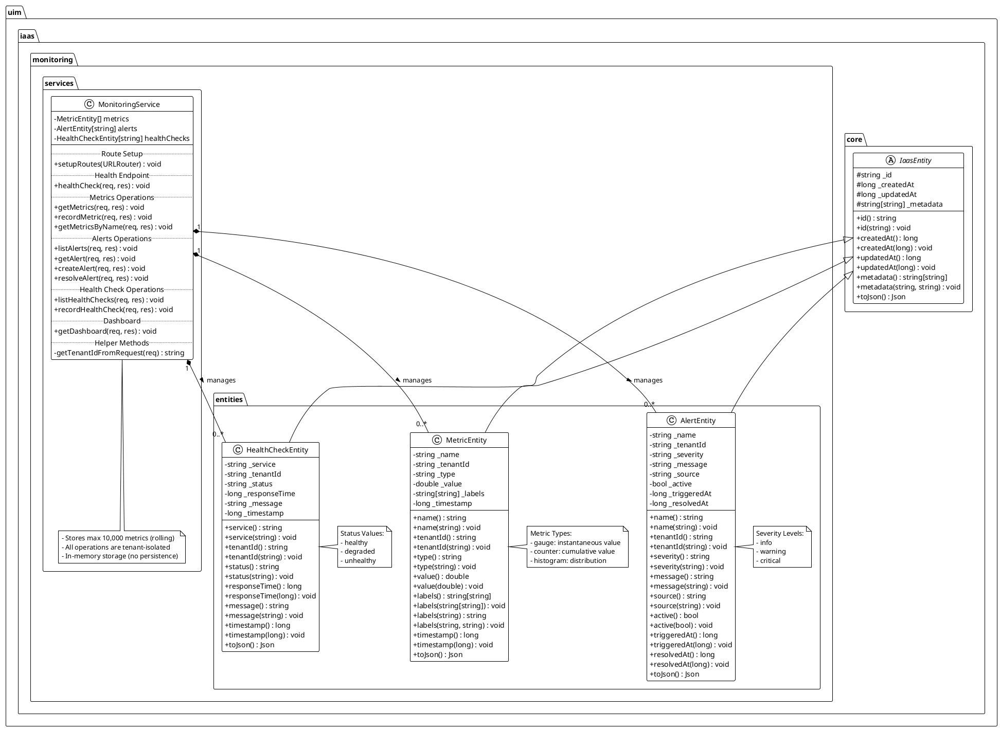
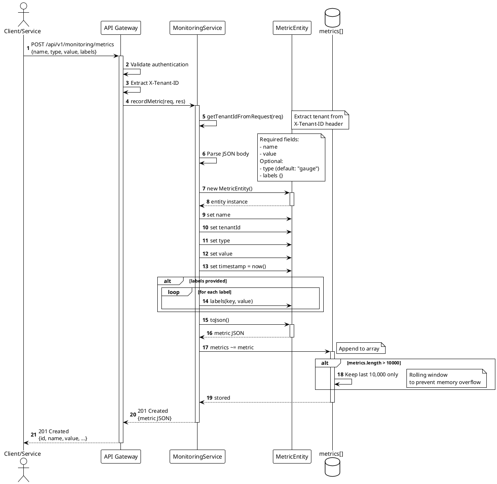
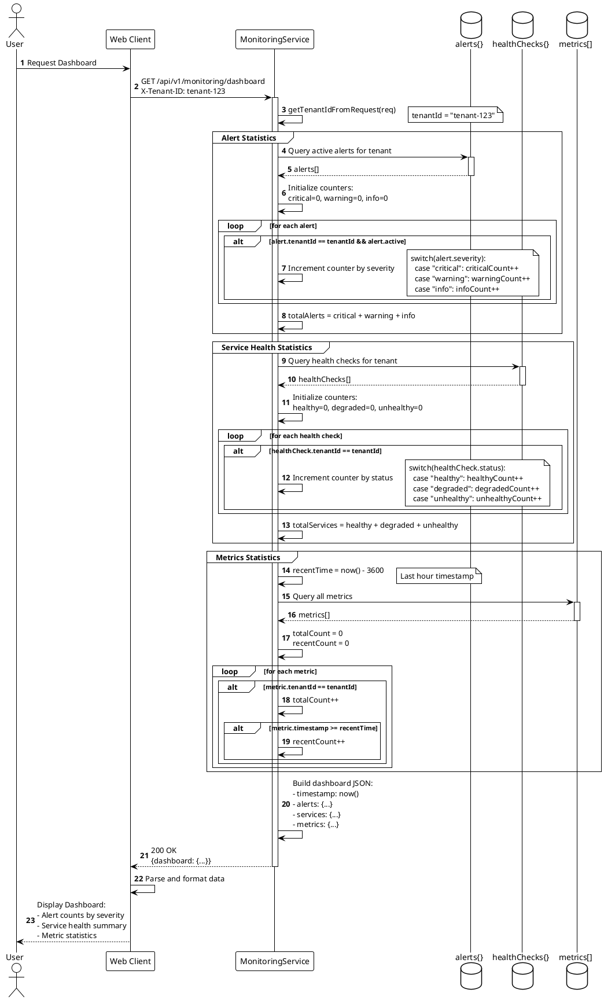
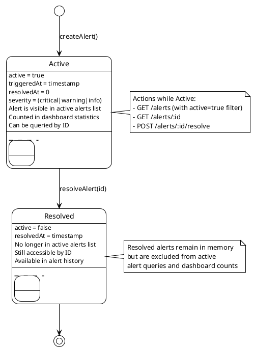
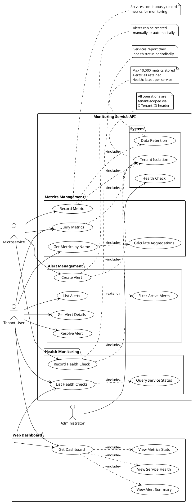
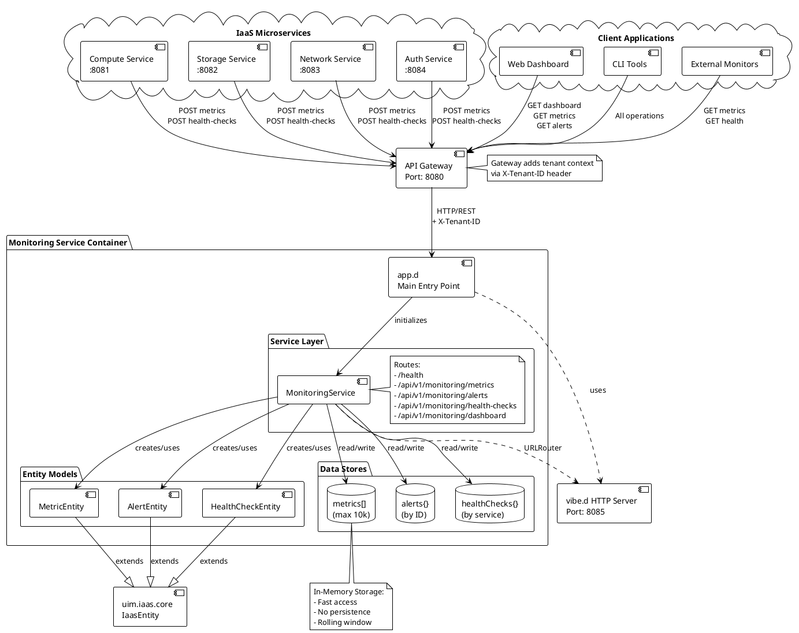
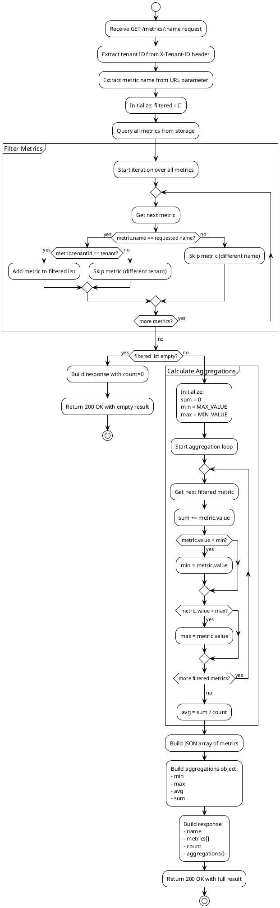
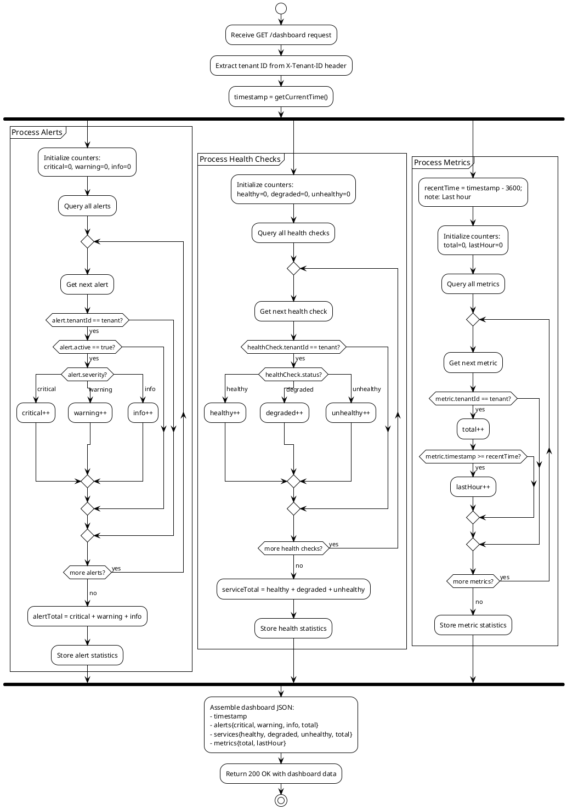

# UIM IaaS Monitoring Service

## Overview

The **UIM IaaS Monitoring Service** is a comprehensive multi-tenant monitoring and observability platform designed to collect, store, and analyze metrics, alerts, and health checks across distributed infrastructure services. Built with the D programming language and the vibe.d framework, it provides real-time insights into system health and performance.

## NAF v4 Architecture Alignment

This service follows the **NATO Architecture Framework (NAF) Version 4** principles, ensuring standardized architecture documentation and interoperability.

### NAF v4 Views Implemented

#### NOV-1: High-Level Operational Concept
The Monitoring Service operates as a centralized observability hub that:
- Collects metrics from distributed IaaS services (compute, storage, network, auth)
- Manages alerting based on configurable thresholds
- Tracks service health across the entire infrastructure
- Provides a unified dashboard for operational visibility

#### NOV-2: Operational Node Connectivity
```
┌─────────────┐     ┌─────────────┐     ┌─────────────┐
│   Auth      │────▶│ Monitoring  │◀────│  Compute    │
│  Service    │     │   Service   │     │  Service    │
└─────────────┘     └──────┬──────┘     └─────────────┘
                           │
                    ┌──────┴──────┐
                    │             │
              ┌─────▼─────┐  ┌───▼────┐
              │  Storage  │  │ Network│
              │  Service  │  │ Service│
              └───────────┘  └────────┘
```

#### NSV-1: Systems Interface Description
The Monitoring Service exposes RESTful HTTP interfaces for:
- Metrics ingestion and retrieval
- Alert management
- Health check recording
- Dashboard aggregation

#### NSV-4: Systems Functionality Description

**Core Functions:**
1. **Metric Collection**: Time-series data ingestion with labels and metadata
2. **Alert Management**: Creation, tracking, and resolution of system alerts
3. **Health Monitoring**: Service availability and performance tracking
4. **Aggregation**: Statistical analysis (min, max, avg, sum) of metrics
5. **Multi-tenancy**: Isolated data per tenant with secure access control

## Architecture

### Entity-Service Pattern

The service follows a clean separation between data models (entities) and business logic (services):

```
┌─────────────────────────────────────────────────────┐
│                  Monitoring Service                 │
├─────────────────────────────────────────────────────┤
│  Entities Layer                                     │
│  ┌──────────────┐  ┌──────────────┐  ┌──────────┐ │
│  │ MetricEntity │  │ AlertEntity  │  │ HealthCh │ │
│  │              │  │              │  │ eckEntity│ │
│  │ - name       │  │ - severity   │  │          │ │
│  │ - value      │  │ - message    │  │ - status │ │
│  │ - tenantId   │  │ - active     │  │ - service│ │
│  │ - timestamp  │  │ - source     │  │          │ │
│  │ - labels     │  │              │  │          │ │
│  └──────────────┘  └──────────────┘  └──────────┘ │
├─────────────────────────────────────────────────────┤
│  Service Layer                                      │
│  ┌────────────────────────────────────────────────┐│
│  │         MonitoringService                      ││
│  │                                                ││
│  │  + recordMetric()                             ││
│  │  + getMetrics()                               ││
│  │  + getMetricsByName()                         ││
│  │  + createAlert()                              ││
│  │  + resolveAlert()                             ││
│  │  + recordHealthCheck()                        ││
│  │  + getDashboard()                             ││
│  └────────────────────────────────────────────────┘│
└─────────────────────────────────────────────────────┘
```

## UML Diagrams

### Class Diagram



### Sequence Diagram: Recording a Metric



### Sequence Diagram: Dashboard Retrieval



### State Diagram: Alert Lifecycle



### Use Case Diagram



### Component Diagram



### Activity Diagram: Query Metrics with Aggregations



### Activity Diagram: Dashboard Generation



## API Endpoints

### Health Check
```http
GET /health
```
Returns service health status.

### Metrics

#### Record a Metric
```http
POST /api/v1/monitoring/metrics
Content-Type: application/json
X-Tenant-ID: your-tenant-id

{
  "name": "cpu_usage",
  "type": "gauge",
  "value": 75.5,
  "labels": {
    "host": "server-01",
    "region": "us-east"
  }
}
```

#### Get All Metrics
```http
GET /api/v1/monitoring/metrics?start=1640995200&end=1641081600
X-Tenant-ID: your-tenant-id
```

#### Get Metrics by Name (with Aggregations)
```http
GET /api/v1/monitoring/metrics/cpu_usage
X-Tenant-ID: your-tenant-id
```

Response includes min, max, avg, and sum:
```json
{
  "name": "cpu_usage",
  "metrics": [...],
  "count": 100,
  "aggregations": {
    "min": 45.2,
    "max": 95.8,
    "avg": 72.3,
    "sum": 7230.0
  }
}
```

### Alerts

#### Create an Alert
```http
POST /api/v1/monitoring/alerts
Content-Type: application/json
X-Tenant-ID: your-tenant-id

{
  "name": "High CPU Alert",
  "severity": "critical",
  "message": "CPU usage exceeded 90%",
  "source": "compute-service"
}
```

#### List Alerts
```http
GET /api/v1/monitoring/alerts?active=true
X-Tenant-ID: your-tenant-id
```

#### Get Alert by ID
```http
GET /api/v1/monitoring/alerts/{alert-id}
X-Tenant-ID: your-tenant-id
```

#### Resolve an Alert
```http
POST /api/v1/monitoring/alerts/{alert-id}/resolve
X-Tenant-ID: your-tenant-id
```

### Health Checks

#### Record a Health Check
```http
POST /api/v1/monitoring/health-checks
Content-Type: application/json
X-Tenant-ID: your-tenant-id

{
  "service": "compute-service",
  "status": "healthy",
  "responseTime": 120,
  "message": "All systems operational"
}
```

#### List Health Checks
```http
GET /api/v1/monitoring/health-checks
X-Tenant-ID: your-tenant-id
```

### Dashboard

#### Get Dashboard
```http
GET /api/v1/monitoring/dashboard
X-Tenant-ID: your-tenant-id
```

Returns aggregated dashboard data:
```json
{
  "dashboard": {
    "timestamp": 1640995200,
    "alerts": {
      "critical": 2,
      "warning": 5,
      "info": 3,
      "total": 10
    },
    "services": {
      "healthy": 4,
      "degraded": 1,
      "unhealthy": 0,
      "total": 5
    },
    "metrics": {
      "total": 10000,
      "lastHour": 1543
    }
  }
}
```

## Multi-Tenancy

The Monitoring Service implements **tenant isolation** to ensure data segregation:

- **Tenant Identification**: Via `X-Tenant-ID` HTTP header
- **Data Filtering**: All queries filter by tenant ID automatically
- **Default Tenant**: Falls back to "default" if no header provided
- **Isolation Guarantee**: Metrics, alerts, and health checks are scoped per tenant

### Example Multi-Tenant Usage

Tenant A:
```bash
curl -X POST http://localhost:8085/api/v1/monitoring/metrics \
  -H "X-Tenant-ID: tenant-a" \
  -H "Content-Type: application/json" \
  -d '{"name": "cpu_usage", "value": 80.0}'
```

Tenant B:
```bash
curl -X POST http://localhost:8085/api/v1/monitoring/metrics \
  -H "X-Tenant-ID: tenant-b" \
  -H "Content-Type: application/json" \
  -d '{"name": "cpu_usage", "value": 45.0}'
```

Each tenant sees only their own metrics.

## Data Model

### Metric Types

1. **Gauge**: Instantaneous measurement (e.g., CPU usage, memory usage)
2. **Counter**: Cumulative value that increases (e.g., request count)
3. **Histogram**: Distribution of values (e.g., response times)

### Alert Severity Levels

- **info**: Informational alerts
- **warning**: Warning alerts requiring attention
- **critical**: Critical alerts requiring immediate action

### Health Check Statuses

- **healthy**: Service operating normally
- **degraded**: Service operational but experiencing issues
- **unhealthy**: Service not operational

## Key Features

### Metrics Collection
- **Time-Series Data**: Store metrics with timestamps for historical analysis
- **Labels Support**: Add dimensional metadata to metrics (host, region, environment)
- **Metric Types**: Support for gauge, counter, and histogram metrics
- **Aggregations**: Automatic min, max, avg, sum calculations
- **Filtering**: Query metrics by name and time range

### Alert Management
- **Severity Levels**: info, warning, critical
- **Alert States**: Active and resolved states
- **Source Tracking**: Identify which service triggered the alert
- **Alert Resolution**: Mark alerts as resolved with timestamps
- **Alert Filtering**: Query active alerts or all alerts

### Health Monitoring
- **Service Status**: Track healthy, degraded, and unhealthy states
- **Response Time**: Measure service response times
- **Per-Service Tracking**: Monitor each microservice independently
- **Latest Status**: Always shows the most recent health check per service

### Dashboard
- **Unified View**: Single endpoint for all monitoring data
- **Alert Summary**: Count of critical, warning, and info alerts
- **Service Health**: Overview of all service statuses
- **Metric Statistics**: Total metrics and recent activity
- **Real-Time**: Dashboard data updated in real-time

## Configuration

### Port Configuration
Default port: **8085**

Configured in [app.d](source/app.d):
```d
auto settings = new HTTPServerSettings;
settings.port = 8085;
settings.bindAddresses = ["0.0.0.0"];
```

### Service Settings
| Setting | Default | Description |
|---------|---------|-------------|
| Port | 8085 | HTTP server port |
| Bind Address | 0.0.0.0 | Network interface to bind |
| Max Metrics | 10,000 | Maximum metrics stored in memory |
| Tenant Header | X-Tenant-ID | HTTP header for tenant identification |

### Data Retention
- **Metrics**: Last 10,000 metrics retained (rolling window)
- **Alerts**: All alerts retained (active and resolved)
- **Health Checks**: Latest check per service retained

### Storage Model
- **In-Memory**: All data stored in RAM for fast access
- **Ephemeral**: Data cleared on service restart
- **Production Note**: For production use, implement persistent storage backend

## Building and Running

### Prerequisites
- D compiler (DMD, LDC, or GDC)
- DUB package manager
- vibe.d framework (automatically installed via DUB)

### Build with DUB
```bash
cd monitoring
dub build
```

For release build with optimizations:
```bash
dub build --build=release
```

### Run the Service
```bash
./uim-iaas-monitoring
```

Or directly with DUB:
```bash
dub run
```

The service will start and listen on port 8085:
```
Monitoring Service starting on port 8085
```

### Run with Docker
Build the Docker image:
```bash
docker build -t uim-iaas-monitoring:latest .
```

Run the container:
```bash
docker run -p 8085:8085 uim-iaas-monitoring:latest
```

With custom port:
```bash
docker run -p 9090:8085 \
  -e SERVICE_PORT=8085 \
  uim-iaas-monitoring:latest
```

### Run with Docker Compose
From the project root:
```bash
docker-compose up monitoring
```

Run in detached mode:
```bash
docker-compose up -d monitoring
```

View logs:
```bash
docker-compose logs -f monitoring
```

## Dependencies

Defined in [dub.sdl](dub.sdl):

- **vibe-d**: Web framework and HTTP server
- **uim-iaas-core**: Core entities and utilities

## Integration with Other Services

### Service Registration
Other services should register themselves and report metrics:

```d
// Compute Service example
auto client = new HTTPClient();
client.post("http://monitoring:8085/api/v1/monitoring/metrics", Json({
    "name": "vm_created",
    "type": "counter",
    "value": 1,
    "labels": {
        "service": "compute"
    }
}), ["X-Tenant-ID": tenantId]);
```

### Health Check Reporting
Services should periodically report health:

```d
// Every 30 seconds
setTimer(30.seconds, true, {
    client.post("http://monitoring:8085/api/v1/monitoring/health-checks", Json({
        "service": "compute-service",
        "status": "healthy",
        "responseTime": responseTime
    }), ["X-Tenant-ID": tenantId]);
});
```

## Observability Best Practices

### Metric Naming Convention
Use hierarchical naming with underscores:
- `service_request_count`
- `vm_cpu_usage_percent`
- `storage_disk_bytes_free`

### Label Usage
Use labels for dimensional data:
```json
{
  "name": "request_duration_ms",
  "value": 150,
  "labels": {
    "method": "POST",
    "endpoint": "/api/v1/vms",
    "status": "200"
  }
}
```

### Alert Design
- Set clear severity levels
- Include actionable messages
- Reference the source service
- Resolve alerts when conditions clear

## Monitoring the Monitor

The monitoring service itself exposes health status:
```bash
curl http://localhost:8085/health
```

Response:
```json
{
  "status": "healthy",
  "service": "monitoring-service"
}
```

## Performance Considerations

- **In-Memory Storage**: Fast but limited to 10,000 metrics
- **No Persistence**: Data lost on restart (suitable for development)
- **Future Enhancement**: Add persistent storage (database/time-series DB)

## Future Enhancements

1. **Persistent Storage**: PostgreSQL/TimescaleDB integration
2. **Metric Retention Policies**: Configurable retention periods
3. **Alerting Rules Engine**: Automated alert triggering based on thresholds
4. **Webhook Notifications**: Alert delivery to external systems
5. **Grafana Integration**: Export metrics in Prometheus format
6. **Query Language**: Advanced metric querying (PromQL-like)
7. **Metric Downsampling**: Automatic aggregation for older data

## Quick Start Guide

### 1. Clone and Build
```bash
# Clone the repository
git clone https://github.com/UIMSolutions/uim-iaas.git
cd uim-iaas/monitoring

# Build the service
dub build

# Run the service
dub run
```

### 2. Verify Service is Running
```bash
curl http://localhost:8085/health
```

### 3. Record Your First Metric
```bash
curl -X POST http://localhost:8085/api/v1/monitoring/metrics \
  -H "X-Tenant-ID: my-tenant" \
  -H "Content-Type: application/json" \
  -d '{
    "name": "test_metric",
    "type": "gauge",
    "value": 100,
    "labels": {
      "environment": "development"
    }
  }'
```

### 4. View Your Metrics
```bash
curl -H "X-Tenant-ID: my-tenant" \
  http://localhost:8085/api/v1/monitoring/metrics
```

### 5. Create an Alert
```bash
curl -X POST http://localhost:8085/api/v1/monitoring/alerts \
  -H "X-Tenant-ID: my-tenant" \
  -H "Content-Type: application/json" \
  -d '{
    "name": "Test Alert",
    "severity": "info",
    "message": "This is a test alert",
    "source": "test"
  }'
```

### 6. View Dashboard
```bash
curl -H "X-Tenant-ID: my-tenant" \
  http://localhost:8085/api/v1/monitoring/dashboard
```

## Troubleshooting

### Service Not Starting

**Problem**: Service fails to start or exits immediately

**Solutions**:

1. **Check Port Availability**
   ```bash
   netstat -tuln | grep 8085
   # or
   lsof -i :8085
   ```
   
   If port is in use, stop the conflicting process or change the port in `source/app.d`

2. **Check Dependencies**
   ```bash
   dub describe
   ```
   
   Ensure all dependencies are resolved

3. **View Detailed Logs**
   ```bash
   dub run --verbose
   ```

### No Metrics Visible

**Problem**: Metrics are recorded but not appearing in queries

**Solutions**:

1. **Verify Tenant ID**
   ```bash
   # Make sure you're using the same tenant ID for recording and querying
   curl -H "X-Tenant-ID: your-tenant" \
     http://localhost:8085/api/v1/monitoring/metrics
   ```

2. **Check Time Range**
   ```bash
   # Query without time filters first
   curl -H "X-Tenant-ID: your-tenant" \
     "http://localhost:8085/api/v1/monitoring/metrics"
   ```

3. **Verify Metric Was Recorded**
   Check the response status when recording:
   ```bash
   curl -v -X POST http://localhost:8085/api/v1/monitoring/metrics \
     -H "X-Tenant-ID: your-tenant" \
     -H "Content-Type: application/json" \
     -d '{"name": "test", "type": "gauge", "value": 1}'
   ```
   
   Should return `201 Created`

### High Memory Usage

**Problem**: Service consuming excessive memory

**Solutions**:

1. **Check Metric Count**
   The service stores up to 10,000 metrics in memory
   ```bash
   curl -H "X-Tenant-ID: your-tenant" \
     http://localhost:8085/api/v1/monitoring/dashboard
   ```

2. **Restart Service**
   ```bash
   # Docker
   docker-compose restart monitoring
   
   # Direct
   pkill uim-iaas-monitoring
   dub run
   ```

3. **Reduce Metric Ingestion Rate**
   Consider sampling metrics less frequently or implementing metric downsampling

### Alerts Not Appearing

**Problem**: Created alerts don't show in list

**Solutions**:

1. **Check Alert Status Filter**
   ```bash
   # List all alerts (not just active)
   curl -H "X-Tenant-ID: your-tenant" \
     "http://localhost:8085/api/v1/monitoring/alerts"
   ```

2. **Verify Tenant ID Matches**
   Alerts are tenant-scoped

3. **Check Alert Creation Response**
   Ensure alert was created successfully (201 Created)

### Connection Refused

**Problem**: Cannot connect to monitoring service

**Solutions**:

1. **Verify Service is Running**
   ```bash
   ps aux | grep uim-iaas-monitoring
   # or
   docker ps | grep monitoring
   ```

2. **Check Firewall Rules**
   ```bash
   sudo ufw status
   # or
   sudo iptables -L -n
   ```

3. **Verify Network Configuration**
   ```bash
   # Check if service is listening
   netstat -tuln | grep 8085
   ```

### JSON Parse Errors

**Problem**: Service returns 400 Bad Request with JSON errors

**Solutions**:

1. **Validate JSON**
   ```bash
   # Use jq to validate JSON
   echo '{"name": "test", "value": 100}' | jq .
   ```

2. **Check Content-Type Header**
   ```bash
   curl -X POST http://localhost:8085/api/v1/monitoring/metrics \
     -H "Content-Type: application/json" \  # Required!
     -H "X-Tenant-ID: tenant" \
     -d '{"name": "test", "type": "gauge", "value": 100}'
   ```

3. **Verify Required Fields**
   - Metrics: `name`, `value` required
   - Alerts: `name`, `message` required
   - Health Checks: `service`, `status` required

### Service Performance Issues

**Problem**: Slow response times or high latency

**Solutions**:

1. **Check Metric Count**
   Large metric collections can slow queries
   ```bash
   curl -H "X-Tenant-ID: your-tenant" \
     http://localhost:8085/api/v1/monitoring/dashboard
   ```

2. **Use Time Range Filters**
   ```bash
   # Query specific time range instead of all metrics
   START=$(date -d '1 hour ago' +%s)
   END=$(date +%s)
   curl -H "X-Tenant-ID: your-tenant" \
     "http://localhost:8085/api/v1/monitoring/metrics?start=$START&end=$END"
   ```

3. **Monitor System Resources**
   ```bash
   # CPU and memory usage
   top -p $(pgrep uim-iaas-monitoring)
   ```

### Docker Issues

**Problem**: Container won't start or keeps restarting

**Solutions**:

1. **Check Container Logs**
   ```bash
   docker-compose logs monitoring
   # or
   docker logs <container-id>
   ```

2. **Verify Docker Image**
   ```bash
   docker images | grep uim-iaas-monitoring
   ```

3. **Rebuild Image**
   ```bash
   docker-compose build --no-cache monitoring
   docker-compose up monitoring
   ```

## Troubleshooting

### Service Not Starting
Check port availability:
```bash
netstat -tuln | grep 8085
```

### No Metrics Visible
Verify tenant ID is set:
```bash
curl -H "X-Tenant-ID: your-tenant" http://localhost:8085/api/v1/monitoring/metrics
```

### High Memory Usage
Metrics buffer may be full. Restart service to clear:
```bash
docker-compose restart monitoring
```

## Testing

### Manual Testing with cURL

#### 1. Health Check
```bash
curl http://localhost:8085/health
```

Expected response:
```json
{
  "status": "healthy",
  "service": "monitoring-service"
}
```

#### 2. Record a Metric
```bash
curl -X POST http://localhost:8085/api/v1/monitoring/metrics \
  -H "X-Tenant-ID: test-tenant" \
  -H "Content-Type: application/json" \
  -d '{
    "name": "cpu_usage",
    "type": "gauge",
    "value": 75.5,
    "labels": {
      "host": "server-01",
      "region": "us-east"
    }
  }'
```

#### 3. Retrieve All Metrics
```bash
curl -H "X-Tenant-ID: test-tenant" \
  http://localhost:8085/api/v1/monitoring/metrics
```

#### 4. Get Metrics by Name with Aggregations
```bash
curl -H "X-Tenant-ID: test-tenant" \
  http://localhost:8085/api/v1/monitoring/metrics/cpu_usage
```

#### 5. Create an Alert
```bash
curl -X POST http://localhost:8085/api/v1/monitoring/alerts \
  -H "X-Tenant-ID: test-tenant" \
  -H "Content-Type: application/json" \
  -d '{
    "name": "High CPU Alert",
    "severity": "critical",
    "message": "CPU usage exceeded 90%",
    "source": "compute-service"
  }'
```

#### 6. List Active Alerts
```bash
curl -H "X-Tenant-ID: test-tenant" \
  "http://localhost:8085/api/v1/monitoring/alerts?active=true"
```

#### 7. Record Health Check
```bash
curl -X POST http://localhost:8085/api/v1/monitoring/health-checks \
  -H "X-Tenant-ID: test-tenant" \
  -H "Content-Type: application/json" \
  -d '{
    "service": "compute-service",
    "status": "healthy",
    "responseTime": 120,
    "message": "All systems operational"
  }'
```

#### 8. Get Dashboard
```bash
curl -H "X-Tenant-ID: test-tenant" \
  http://localhost:8085/api/v1/monitoring/dashboard
```

### Automated Testing

#### Run DUB Tests
```bash
dub test
```

#### Multi-Tenancy Testing
Use the provided test script:
```bash
bash ../scripts/test-multitenancy.sh
```

### Performance Testing

Test metric ingestion rate:
```bash
# Record 100 metrics
for i in {1..100}; do
  curl -X POST http://localhost:8085/api/v1/monitoring/metrics \
    -H "X-Tenant-ID: perf-test" \
    -H "Content-Type: application/json" \
    -d "{\"name\": \"test_metric_$i\", \"type\": \"gauge\", \"value\": $i}" &
done
wait
```

### Integration Testing

Test with other services:
```bash
# Start all services
docker-compose up -d

# Test monitoring from compute service
curl -X POST http://localhost:8085/api/v1/monitoring/metrics \
  -H "X-Tenant-ID: integration-test" \
  -H "Content-Type: application/json" \
  -d '{
    "name": "vm_created",
    "type": "counter",
    "value": 1,
    "labels": {
      "service": "compute",
      "operation": "create"
    }
  }'

# Verify metric was recorded
curl -H "X-Tenant-ID: integration-test" \
  http://localhost:8085/api/v1/monitoring/metrics/vm_created
```

### Common Error Messages

| Error | Cause | Solution |
|-------|-------|----------|
| `Address already in use` | Port 8085 is occupied | Change port or stop conflicting service |
| `Failed to load package` | Missing dependencies | Run `dub fetch` and `dub build` |
| `Tenant not found` | Missing X-Tenant-ID header | Add header to request |
| `404 Not Found` | Invalid endpoint | Check API documentation for correct path |
| `500 Internal Server Error` | Server-side issue | Check logs with `dub run --verbose` |

### Getting Help

If you continue to experience issues:

1. Check the [project issues](https://github.com/UIMSolutions/uim-iaas/issues)
2. Review the [project documentation](../docs/)
3. Enable verbose logging: `dub run --verbose`
4. Collect diagnostic information:
   ```bash
   curl http://localhost:8085/health
   dub --version
   dmd --version
   ```

## License

See [LICENSE](LICENSE) file for details.

## Related Documentation

- [Project Architecture](../docs/ARCHITECTURE.md)
- [Multi-Tenancy Guide](../docs/MULTI_TENANCY.md)
- [API Examples](../docs/API_EXAMPLES.md)
- [Quick Start Guide](../docs/QUICKSTART.md)

## Contact

For issues and contributions, please refer to the main project repository.

---

**Monitoring Service Version**: 1.0.0  
**NAF Version**: v4  
**Last Updated**: January 2026
