# UIM IaaS Network Service

## Overview

The **UIM IaaS Network Service** is a sophisticated multi-tenant virtual networking platform that provides Software-Defined Networking (SDN) capabilities for cloud infrastructure. Built with the D programming language and vibe.d framework, it enables creation and management of virtual networks, subnets, and security groups with comprehensive isolation and access control.

**Service Name:** `uim-iaas-network`  
**Default Port:** 8083  
**NAF Version:** v4  
**Version:** 26.1.2 compatible

## Features

- ✅ Virtual network (VPC) management with CIDR-based addressing
- ✅ Subnet creation and management within networks
- ✅ Security group management with firewall rules (ingress/egress)
- ✅ Multi-tenant network isolation and security
- ✅ DHCP configuration for dynamic IP allocation
- ✅ DNS server configuration per subnet
- ✅ Rule-based access control (protocol, port range, CIDR)
- ✅ RESTful API with JSON responses
- ✅ Health check endpoint for monitoring
- ✅ Dependency validation (prevent deletion of networks with subnets)
- ✅ NAF v4 architecture alignment

## NAF v4 Architecture Alignment

This service adheres to the **NATO Architecture Framework (NAF) Version 4** standards, ensuring structured architecture documentation and operational clarity.

### NAF v4 Views Implemented

#### NOV-1: High-Level Operational Concept
The Network Service operates as the networking fabric layer that:
- Provisions isolated virtual networks with CIDR-based addressing
- Creates and manages subnets within virtual networks
- Implements security groups with rule-based access control
- Provides network segmentation and traffic isolation per tenant
- Enables secure communication between compute, storage, and other services

#### NOV-2: Operational Node Connectivity
```
┌────────────────────────────────────────────────────┐
│               Network Service Core                 │
│  ┌──────────────┐  ┌──────────────┐  ┌─────────┐ │
│  │   Virtual    │  │    Subnet    │  │Security │ │
│  │   Networks   │  │  Management  │  │ Groups  │ │
│  └──────┬───────┘  └──────┬───────┘  └────┬────┘ │
└─────────┼──────────────────┼───────────────┼──────┘
          │                  │               │
    ┌─────▼──────┐    ┌─────▼──────┐  ┌────▼─────┐
    │  Compute   │    │  Storage   │  │   Auth   │
    │  Service   │    │  Service   │  │ Service  │
    └────────────┘    └────────────┘  └──────────┘
```

#### NOV-3: Operational Information Requirements
**Information Exchanged:**
- Network topology and CIDR allocations
- Subnet configuration and gateway information
- Security group rules (ingress/egress)
- Tenant isolation metadata
- DNS server configurations

#### NSV-1: Systems Interface Description
The Network Service exposes RESTful HTTP interfaces for:
- Virtual network lifecycle management (CRUD)
- Subnet provisioning and configuration
- Security group creation and rule management
- Multi-tenant network isolation

#### NSV-2: Systems Resource Flow
```
┌──────────────┐
│   Client     │
└──────┬───────┘
       │ POST /networks (CIDR: 10.0.0.0/16)
       ▼
┌──────────────────┐
│ Network Service  │ Creates NetworkEntity
└──────┬───────────┘
       │ Network ID: net-123
       │ POST /subnets (CIDR: 10.0.1.0/24, networkId: net-123)
       ▼
┌──────────────────┐
│ Subnet Created   │ Gateway: 10.0.1.1, DHCP: enabled
└──────┬───────────┘
       │ Subnet ID: subnet-456
       │ POST /security-groups (name: web-sg)
       ▼
┌──────────────────┐
│ Security Group   │ Add rules (TCP 80, 443)
└──────────────────┘
```

#### NSV-4: Systems Functionality Description

**Core Functions:**
1. **Virtual Network Management**: CIDR-based network provisioning with status tracking
2. **Subnet Segmentation**: Network subdivision with gateway and DHCP configuration
3. **Security Group Control**: Rule-based firewall management (ingress/egress)
4. **Multi-tenancy**: Complete network isolation per tenant
5. **DNS Configuration**: Configurable DNS servers per subnet
6. **Network Validation**: Prevents deletion of networks with active subnets

### A1 - Meta Data Definitions

**Architecture Product Information:**
- **Name:** Network Service Architecture
- **Version:** 1.0
- **Date:** January 2026
- **Classification:** Unclassified
- **Framework:** NATO Architecture Framework v4
- **Purpose:** Define the architecture of the software-defined networking service

### C1 - Capability Taxonomy

**Primary Capabilities:**
- **Virtual Network Management**: Create and manage isolated network spaces (VPCs)
- **Subnet Management**: Subdivide networks into logical segments
- **IP Address Management (IPAM)**: Manage CIDR blocks and IP allocation
- **Security Group Management**: Define and manage virtual firewall policies
- **Network Access Control**: Control traffic with ingress/egress rules
- **DHCP Management**: Configure dynamic IP address allocation
- **DNS Configuration**: Manage DNS server settings for subnets
- **Network Isolation**: Ensure tenant network separation

### C2 - Enterprise Vision

**Operational Concept:**
The Network Service provides software-defined networking (SDN) capabilities enabling tenants to create isolated virtual networks with customizable network topologies, IP addressing, and security policies. It supports cloud-native networking patterns while maintaining strong multi-tenant isolation.

**Strategic Goals:**
- Enable self-service network provisioning
- Provide flexible and scalable network architecture
- Ensure tenant network isolation and security
- Support standard networking concepts (VPC, subnets, security groups)
- Integrate with compute resources for complete IaaS functionality
- Simplify network security policy management

### L2 - Logical Scenario

**Service Interactions:**
1. **Tenant → API Gateway → Network Service**: Create/manage virtual networks
2. **Compute Service → Network Service**: Attach instances to networks/subnets
3. **Compute Service → Network Service**: Apply security groups to instances
4. **Network Service → Storage Service**: Network-attached storage connectivity
5. **Network Service → Monitoring Service**: Network metrics and traffic data

### L4 - Logical Activities

**Key Activities:**
- **Network Provisioning**: Validate CIDR → Create network → Allocate IP space → Return network ID
- **Subnet Creation**: Validate CIDR overlap → Check parent network → Create subnet → Configure DHCP/DNS
- **Security Group Creation**: Create group → Initialize empty rule set → Return group ID
- **Rule Management**: Validate rule parameters → Add/remove rules → Update security group
- **Network Deletion**: Check for dependencies (subnets) → Verify no attachments → Delete network
- **Resource Enumeration**: Filter by tenant → Query resources → Return filtered list

### Lr - Logical Resources

**Resource Types:**
- **NetworkEntity**: Virtual private network (VPC)
  - Attributes: id, name, tenantId, cidr, status, createdAt, updatedAt, metadata
  - States: active, deleting
- **SubnetEntity**: Network subdivision
  - Attributes: id, name, tenantId, networkId, cidr, gateway, dhcpEnabled, dnsServers[], createdAt, metadata
- **SecurityGroupEntity**: Virtual firewall
  - Attributes: id, name, tenantId, description, rules[], createdAt, updatedAt
- **RuleEntity**: Firewall rule
  - Attributes: id, direction, protocol, portMin, portMax, cidr, createdAt, updatedAt
  - Direction: ingress (inbound), egress (outbound)
  - Protocol: tcp, udp, icmp, all

### P1 - Resource Types

**Service Component:**
- **Type:** Application Service (Network Infrastructure)
- **Runtime:** D Language (vibe.d framework)
- **Deployment:** Container/Executable
- **Interfaces:** REST/HTTP
- **Data Format:** JSON

**Resource Classes:**
- **Network Resource**: Virtual isolated network space with CIDR block
- **Subnet Resource**: IP address range within a network
- **Security Resource**: Firewall policies and rules
- **Connectivity Resource**: Network attachment points for compute instances

### P2 - Resource Structure

**Service Architecture:**
```
┌─────────────────────────────────────────────────────────────┐
│                 Network Service                             │
│               (uim-iaas-network)                           │
├─────────────────────────────────────────────────────────────┤
│                                                             │
│  ┌──────────────────────────────────────────────────────┐  │
│  │           HTTP Server (vibe.d)                       │  │
│  │              Port: 8083                              │  │
│  └───────────────────┬──────────────────────────────────┘  │
│                      │                                      │
│  ┌───────────────────▼──────────────────────────────────┐  │
│  │         NetworkService                               │  │
│  │  ┌────────────────────────────────────────────────┐  │  │
│  │  │  Network Management                            │  │  │
│  │  │  - createNetwork()                             │  │  │
│  │  │  - deleteNetwork()                             │  │  │
│  │  │  - listNetworks()                              │  │  │
│  │  │  - getNetwork()                                │  │  │
│  │  │                                                │  │  │
│  │  │  Subnet Management                             │  │  │
│  │  │  - createSubnet()                              │  │  │
│  │  │  - deleteSubnet()                              │  │  │
│  │  │  - listSubnets()                               │  │  │
│  │  │  - getSubnet()                                 │  │  │
│  │  │                                                │  │  │
│  │  │  Security Group Management                     │  │  │
│  │  │  - createSecurityGroup()                       │  │  │
│  │  │  - deleteSecurityGroup()                       │  │  │
│  │  │  - listSecurityGroups()                        │  │  │
│  │  │  - getSecurityGroup()                          │  │  │
│  │  │  - addSecurityRule()                           │  │  │
│  │  │  - removeSecurityRule()                        │  │  │
│  │  │                                                │  │  │
│  │  │  Utility Functions                             │  │  │
│  │  │  - getTenantIdFromRequest()                    │  │  │
│  │  │  - serializeNetwork()                          │  │  │
│  │  │  - serializeSubnet()                           │  │  │
│  │  │  - serializeSecurityGroup()                    │  │  │
│  │  └────────────────────────────────────────────────┘  │  │
│  │                      │                                │  │
│  │                      │ manages                        │  │
│  │                      ▼                                │  │
│  │  ┌────────────────────────────────────────────────┐  │  │
│  │  │  Data Stores (In-Memory)                       │  │  │
│  │  │  - networks: NetworkEntity[string]             │  │  │
│  │  │  - subnets: SubnetEntity[string]               │  │  │
│  │  │  - securityGroups: SecurityGroupEntity[string] │  │  │
│  │  └────────────────────────────────────────────────┘  │  │
│  └──────────────────────────────────────────────────────┘  │
│                      │                                      │
│                      │ uses                                 │
│                      ▼                                      │
│  ┌───────────────────────────────────────────────────────┐ │
│  │         Entity Models                                 │ │
│  │  NetworkEntity                                        │ │
│  │  SubnetEntity                                         │ │
│  │  SecurityGroupEntity                                  │ │
│  │  RuleEntity                                           │ │
│  └───────────────────────────────────────────────────────┘ │
│                                                             │
└─────────────────────────────────────────────────────────────┘
```

### P4 - Resource Functions

**Functional Capabilities:**

**Network Functions:**
- **createNetwork()**: Provision new virtual network with CIDR
- **getNetwork()**: Retrieve network details
- **listNetworks()**: Enumerate tenant networks
- **deleteNetwork()**: Remove network (with dependency check)

**Subnet Functions:**
- **createSubnet()**: Create subnet within network
- **getSubnet()**: Retrieve subnet details
- **listSubnets()**: Enumerate tenant subnets
- **deleteSubnet()**: Remove subnet

**Security Group Functions:**
- **createSecurityGroup()**: Create new security group
- **getSecurityGroup()**: Retrieve security group with rules
- **listSecurityGroups()**: Enumerate tenant security groups
- **deleteSecurityGroup()**: Remove security group
- **addSecurityRule()**: Add firewall rule to group
- **removeSecurityRule()**: Remove firewall rule from group

**Utility Functions:**
- **getTenantIdFromRequest()**: Extract tenant context
- **serializeNetwork()**: Convert network to JSON
- **serializeSubnet()**: Convert subnet to JSON
- **serializeSecurityGroup()**: Convert security group to JSON
- **healthCheck()**: Service health monitoring

### P8 - Resource Interactions

**Interface Specifications:**

**Provided Interface:**
- **Protocol:** HTTP/REST
- **Port:** 8083
- **Encoding:** JSON
- **Authentication:** X-Tenant-ID header (from API Gateway)
- **API Version:** v1

**Required Interfaces:**
- **None** (Network Service is foundation service for networking)

**Integration Points:**
- **Compute Service**: Consumes network, subnet, and security group resources
- **Storage Service**: May use network connectivity for storage attachment
- **API Gateway**: Validates requests and adds tenant context

### S4 - Service Functions

**Service Characteristics:**
- **Service Type:** Stateful (manages network configurations)
- **Availability:** High (compute instances depend on it)
- **Data Persistence:** In-memory (production should use database)
- **Resource Model:** Hierarchical (Network → Subnet → Instances)
- **Dependency Checking**: Enforces resource dependencies (e.g., network must have no subnets before deletion)

**Service Operations:**
- **CRUD Operations**: Full create, read, delete for networks, subnets, security groups
- **Rule Management**: Dynamic firewall rule addition/removal
- **Tenant Isolation**: Network resources are tenant-scoped
- **Validation**: CIDR validation, overlap detection, dependency checking

### Sv - Service Interfaces

**REST API Interface:**
```
Service: network-service
Base Path: /api/v1/network
Methods: GET, POST, DELETE
Content-Type: application/json
Headers:
  - X-Tenant-ID (required for tenant operations)
  - Content-Type: application/json
```

**Endpoints:**

**Network Endpoints:**
- `GET /health` - Health check (no auth)
- `GET /api/v1/network/networks` - List networks
- `POST /api/v1/network/networks` - Create network
- `GET /api/v1/network/networks/:id` - Get network
- `DELETE /api/v1/network/networks/:id` - Delete network

**Subnet Endpoints:**
- `GET /api/v1/network/subnets` - List subnets
- `POST /api/v1/network/subnets` - Create subnet
- `GET /api/v1/network/subnets/:id` - Get subnet
- `DELETE /api/v1/network/subnets/:id` - Delete subnet

**Security Group Endpoints:**
- `GET /api/v1/network/security-groups` - List security groups
- `POST /api/v1/network/security-groups` - Create security group
- `GET /api/v1/network/security-groups/:id` - Get security group
- `DELETE /api/v1/network/security-groups/:id` - Delete security group
- `POST /api/v1/network/security-groups/:id/rules` - Add rule
- `DELETE /api/v1/network/security-groups/:id/rules/:ruleId` - Remove rule

### SOV-1 - Service Orchestration

**Service Dependencies:**
- **None** (Network Service is foundation service)

**Dependent Services:**
- **Compute Service** (primary): Attaches instances to networks and applies security groups
- **Storage Service**: Network-attached storage connectivity
- **Monitoring Service**: Network traffic and performance metrics

**Orchestration Patterns:**
- **Synchronous**: All network operations return immediately
- **Hierarchical Resources**: Network → Subnet → Instance attachment
- **Dependency Enforcement**: Parent resources cannot be deleted with active children

**Resource Lifecycle:**
1. Tenant → Create Network (CIDR: 10.0.0.0/16)
2. Tenant → Create Subnet (CIDR: 10.0.1.0/24, within network)
3. Tenant → Create Security Group (with rules)
4. Compute Service → Attach instance to subnet
5. Compute Service → Apply security group to instance
6. Compute Service → Detach instance
7. Tenant → Delete subnet
8. Tenant → Delete network

### Capability to Services Mapping

| Capability | Service Function | NAF View |
|------------|-----------------|----------|
| Virtual Network Management | create/delete/listNetworks() | S4, P4 |
| Subnet Management | create/delete/listSubnets() | S4, P4 |
| IP Address Management | CIDR validation, overlap detection | P4, Lr |
| Security Group Management | create/delete/listSecurityGroups() | S4, P4 |
| Network Access Control | add/removeSecurityRule() | S4, P4, Lr |
| DHCP Management | Subnet.dhcpEnabled configuration | Lr, P4 |
| DNS Configuration | Subnet.dnsServers configuration | Lr, P4 |
| Network Isolation | Tenant-based filtering | P4, Sv |

## UML Diagrams

### Component Diagram

```
┌─────────────────────────────────────────────────────────────┐
│                 Network Service                             │
│               (uim-iaas-network)                           │
├─────────────────────────────────────────────────────────────┤
│                                                             │
│  ┌──────────────────────────────────────────────────────┐  │
│  │           HTTP Server (vibe.d)                       │  │
│  │              Port: 8083                              │  │
│  └───────────────────┬──────────────────────────────────┘  │
│                      │                                      │
│  ┌───────────────────▼──────────────────────────────────┐  │
│  │         NetworkService                               │  │
│  │  ┌────────────────────────────────────────────────┐  │  │
│  │  │  Network Management API                        │  │  │
│  │  │    createNetwork()                             │  │  │
│  │  │    deleteNetwork()                             │  │  │
│  │  │    listNetworks()                              │  │  │
│  │  │    getNetwork()                                │  │  │
│  │  │                                                │  │  │
│  │  │  Subnet Management API                         │  │  │
│  │  │    createSubnet()                              │  │  │
│  │  │    deleteSubnet()                              │  │  │
│  │  │    listSubnets()                               │  │  │
│  │  │    getSubnet()                                 │  │  │
│  │  │                                                │  │  │
│  │  │  Security Group API                            │  │  │
│  │  │    createSecurityGroup()                       │  │  │
│  │  │    deleteSecurityGroup()                       │  │  │
│  │  │    listSecurityGroups()                        │  │  │
│  │  │    getSecurityGroup()                          │  │  │
│  │  │    addSecurityRule()                           │  │  │
│  │  │    removeSecurityRule()                        │  │  │
│  │  │                                                │  │  │
│  │  │  Utility Functions                             │  │  │
│  │  │    getTenantIdFromRequest()                    │  │  │
│  │  │    serializeNetwork()                          │  │  │
│  │  │    serializeSubnet()                           │  │  │
│  │  │    serializeSecurityGroup()                    │  │  │
│  │  └────────────────────────────────────────────────┘  │  │
│  │                      │                                │  │
│  │                      │ manages                        │  │
│  │                      ▼                                │  │
│  │  ┌────────────────────────────────────────────────┐  │  │
│  │  │  In-Memory Data Stores                         │  │  │
│  │  │    networks: NetworkEntity[string]             │  │  │
│  │  │    subnets: SubnetEntity[string]               │  │  │
│  │  │    securityGroups: SecurityGroupEntity[string] │  │  │
│  │  └────────────────────────────────────────────────┘  │  │
│  └──────────────────────────────────────────────────────┘  │
│                      │                                      │
│                      │ uses                                 │
│                      ▼                                      │
│  ┌───────────────────────────────────────────────────────┐ │
│  │         Entity Models                                 │ │
│  │    NetworkEntity                                      │ │
│  │    SubnetEntity                                       │ │
│  │    SecurityGroupEntity                                │ │
│  │    RuleEntity                                         │ │
│  └───────────────────────────────────────────────────────┘ │
│                                                             │
└─────────────────────────────────────────────────────────────┘
```

### Class Diagram

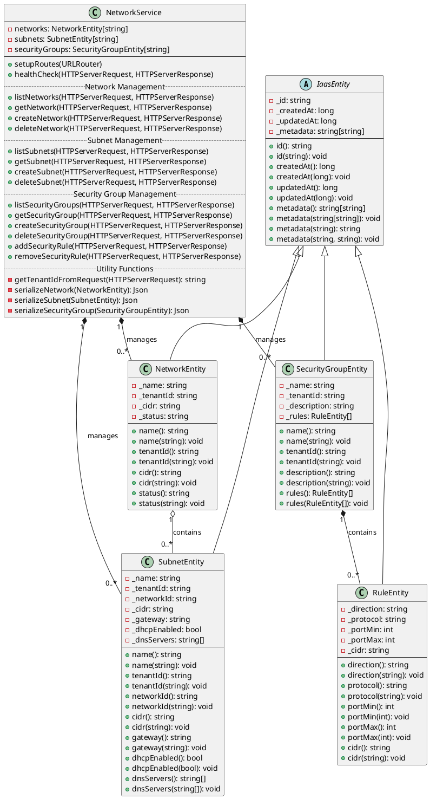

### Sequence Diagram - Create Network

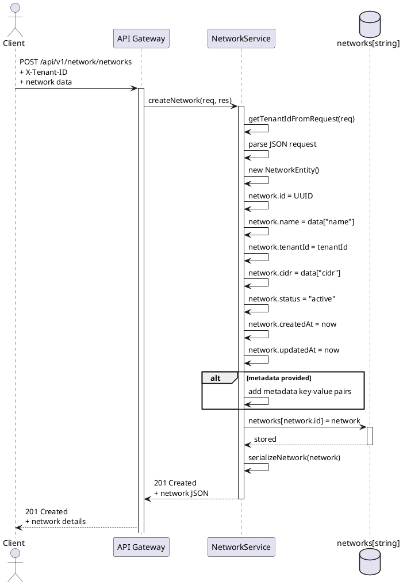

### Sequence Diagram - Create Subnet

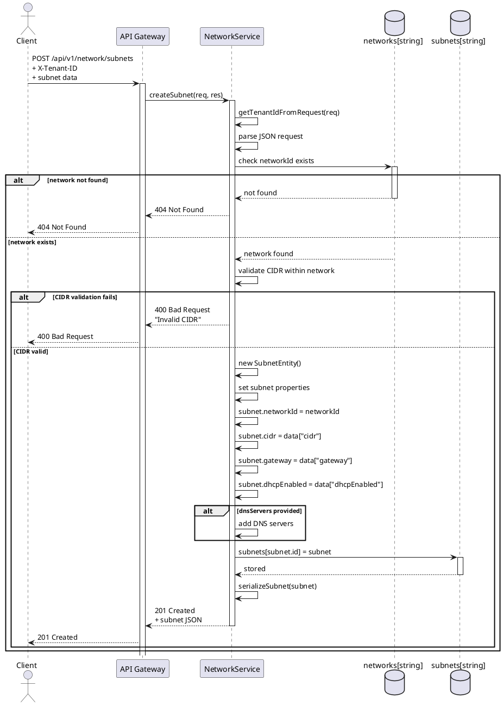

### Sequence Diagram - Add Security Rule

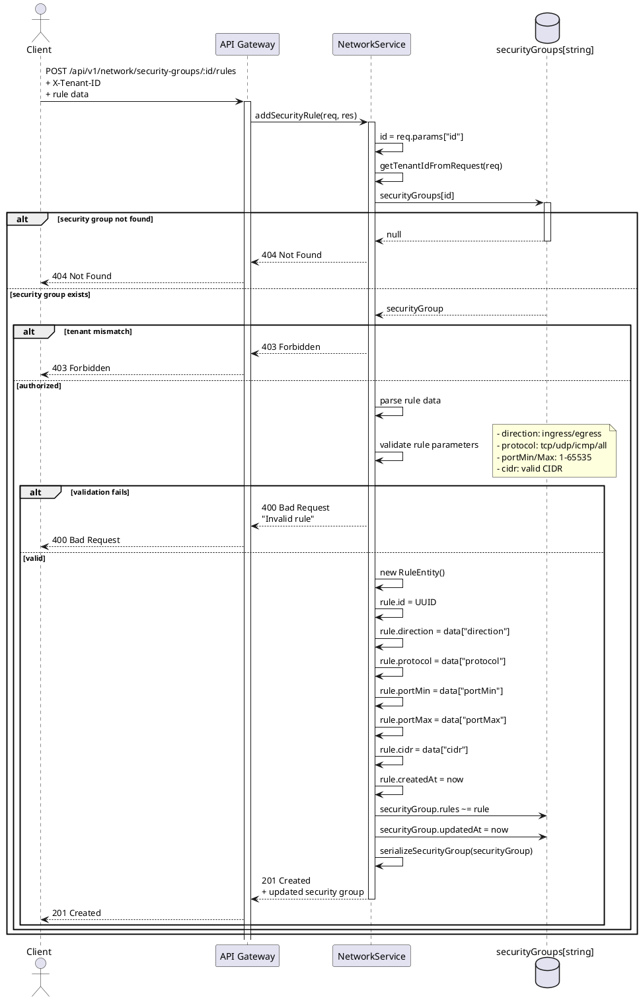

### Sequence Diagram - Delete Network

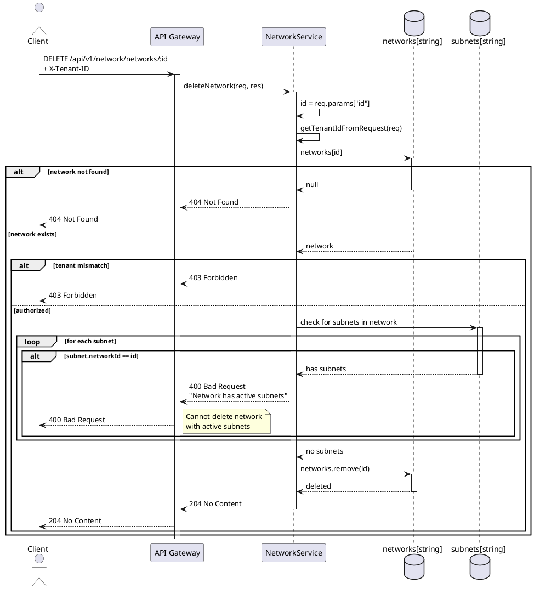

### State Diagram - Network Lifecycle

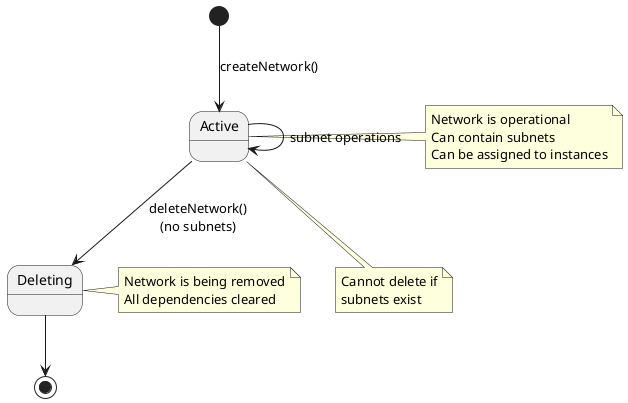

### State Diagram - Security Rule

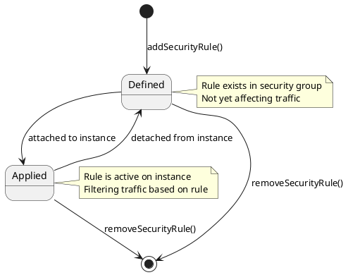

### Deployment Diagram

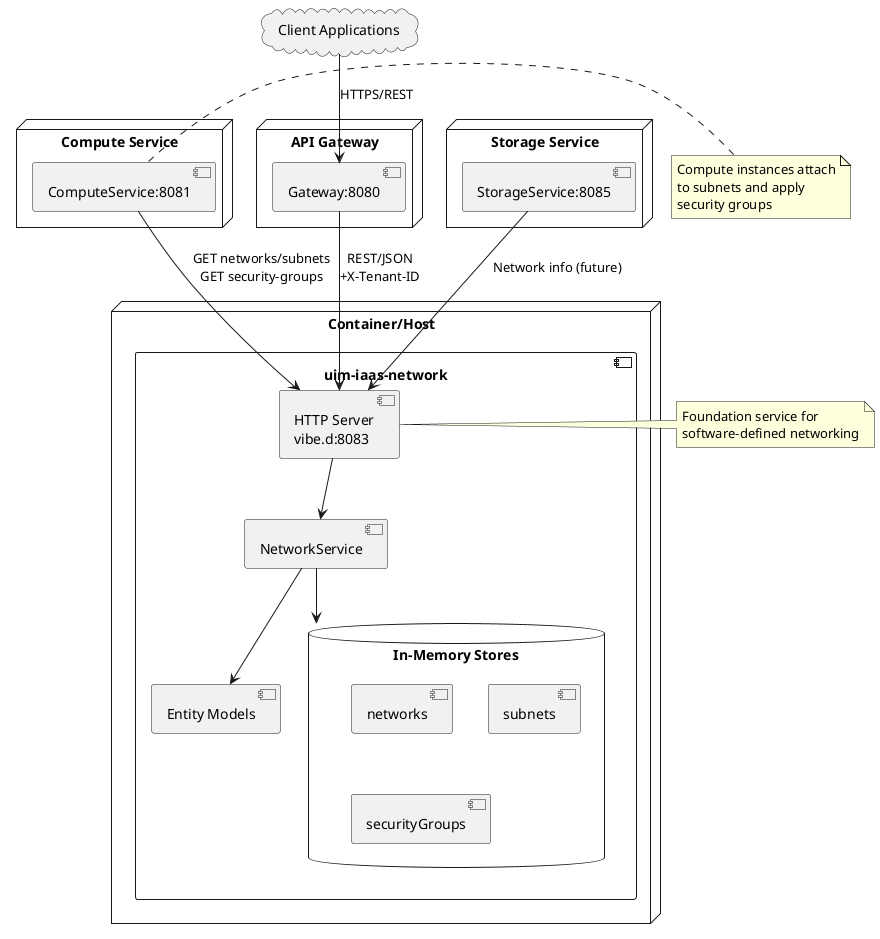

### Use Case Diagram

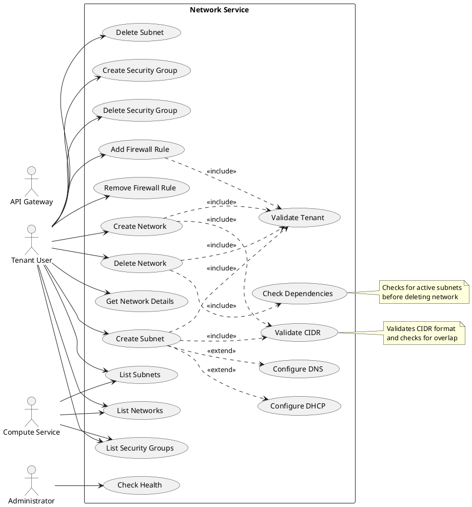

### Activity Diagram - Create Network Flow

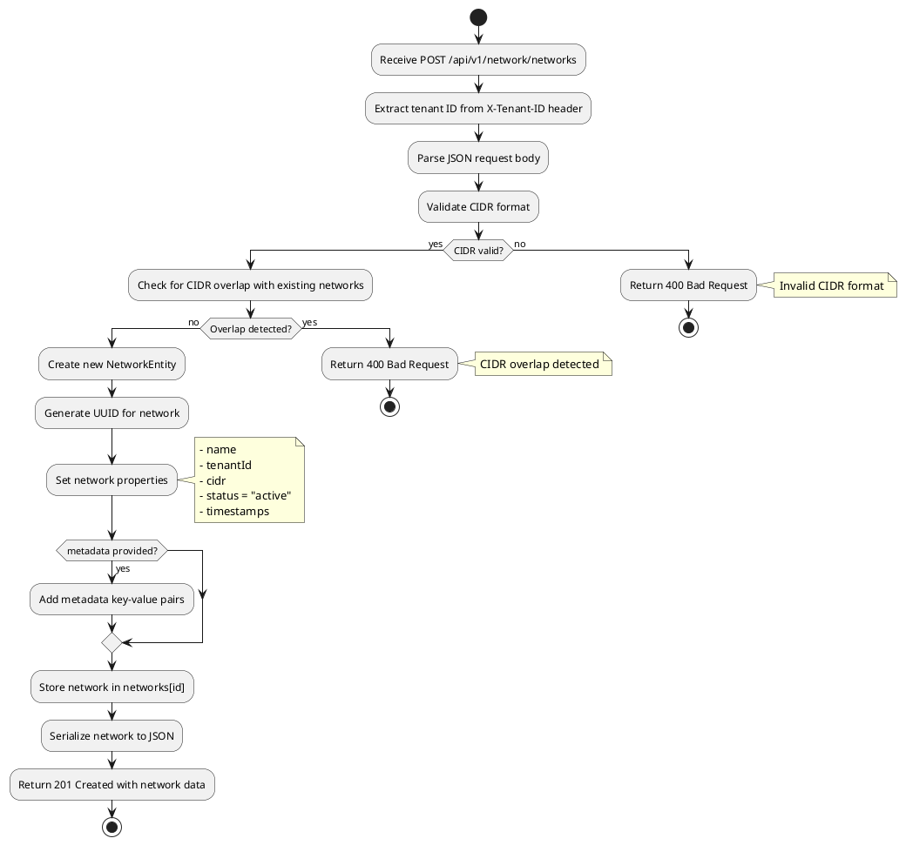

### Activity Diagram - Add Security Rule Flow

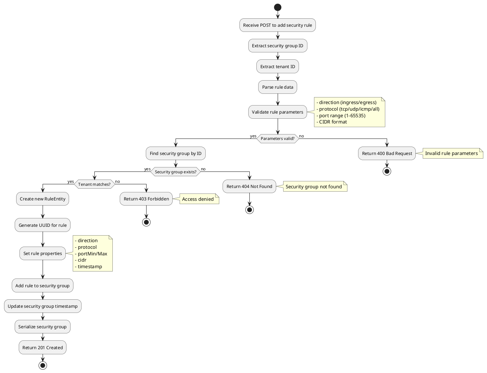

## API Endpoints

### Health Check
```
GET /health
```
Returns the service health status.

**Response:**
```json
{
  "status": "healthy",
  "service": "network-service"
}
```

### Network Management

#### List Networks
```
GET /api/v1/network/networks
```
Returns all virtual networks for the authenticated tenant.

**Headers:**
- `X-Tenant-ID`: Tenant identifier (set by API Gateway)

**Response:** 200 OK
```json
{
  "networks": [
    {
      "id": "net-uuid",
      "name": "production-network",
      "tenantId": "tenant-uuid",
      "cidr": "10.0.0.0/16",
      "status": "active",
      "createdAt": 1706745600,
      "updatedAt": 1706745600,
      "metadata": {}
    }
  ]
}
```

#### Get Network
```
GET /api/v1/network/networks/:id
```
Returns details of a specific network.

**Parameters:**
- `id`: Network ID

**Response:** 200 OK

#### Create Network
```
POST /api/v1/network/networks
```
Creates a new virtual network.

**Request Body:**
```json
{
  "name": "production-network",
  "cidr": "10.0.0.0/16",
  "metadata": {
    "environment": "production",
    "region": "us-east-1"
  }
}
```

**Response:** 201 Created

#### Delete Network
```
DELETE /api/v1/network/networks/:id
```
Deletes a virtual network.

**Parameters:**
- `id`: Network ID

**Response:** 204 No Content

**Note:** Network must not have active subnets.

### Subnet Management

#### List Subnets
```
GET /api/v1/network/subnets
```
Returns all subnets for the authenticated tenant.

**Headers:**
- `X-Tenant-ID`: Tenant identifier

**Response:** 200 OK
```json
{
  "subnets": [
    {
      "id": "subnet-uuid",
      "name": "web-subnet",
      "tenantId": "tenant-uuid",
      "networkId": "net-uuid",
      "cidr": "10.0.1.0/24",
      "gateway": "10.0.1.1",
      "dhcpEnabled": true,
      "dnsServers": ["8.8.8.8", "8.8.4.4"],
      "createdAt": 1706745600,
      "metadata": {}
    }
  ]
}
```

#### Get Subnet
```
GET /api/v1/network/subnets/:id
```
Returns details of a specific subnet.

**Parameters:**
- `id`: Subnet ID

**Response:** 200 OK

#### Create Subnet
```
POST /api/v1/network/subnets
```
Creates a new subnet within a virtual network.

**Request Body:**
```json
{
  "name": "web-subnet",
  "networkId": "net-uuid",
  "cidr": "10.0.1.0/24",
  "gateway": "10.0.1.1",
  "dhcpEnabled": true,
  "dnsServers": ["8.8.8.8", "8.8.4.4"],
  "metadata": {
    "tier": "frontend"
  }
}
```

**Response:** 201 Created

**Validation:**
- CIDR must be within the parent network's CIDR range
- CIDR must not overlap with existing subnets

#### Delete Subnet
```
DELETE /api/v1/network/subnets/:id
```
Deletes a subnet.

**Parameters:**
- `id`: Subnet ID

**Response:** 204 No Content

### Security Group Management

#### List Security Groups
```
GET /api/v1/network/security-groups
```
Returns all security groups for the authenticated tenant.

**Headers:**
- `X-Tenant-ID`: Tenant identifier

**Response:** 200 OK
```json
{
  "securityGroups": [
    {
      "id": "sg-uuid",
      "name": "web-servers",
      "tenantId": "tenant-uuid",
      "description": "Security group for web servers",
      "rules": [
        {
          "id": "rule-uuid",
          "direction": "ingress",
          "protocol": "tcp",
          "portMin": 80,
          "portMax": 80,
          "cidr": "0.0.0.0/0"
        }
      ],
      "createdAt": 1706745600,
      "updatedAt": 1706745600
    }
  ]
}
```

#### Get Security Group
```
GET /api/v1/network/security-groups/:id
```
Returns details of a specific security group.

**Parameters:**
- `id`: Security group ID

**Response:** 200 OK

#### Create Security Group
```
POST /api/v1/network/security-groups
```
Creates a new security group.

**Request Body:**
```json
{
  "name": "web-servers",
  "description": "Security group for web servers"
}
```

**Response:** 201 Created

#### Delete Security Group
```
DELETE /api/v1/network/security-groups/:id
```
Deletes a security group.

**Parameters:**
- `id`: Security group ID

**Response:** 204 No Content

#### Add Security Rule
```
POST /api/v1/network/security-groups/:id/rules
```
Adds a firewall rule to a security group.

**Parameters:**
- `id`: Security group ID

**Request Body:**
```json
{
  "direction": "ingress",
  "protocol": "tcp",
  "portMin": 443,
  "portMax": 443,
  "cidr": "0.0.0.0/0"
}
```

**Response:** 201 Created

**Rule Fields:**
- `direction`: `ingress` (inbound) or `egress` (outbound)
- `protocol`: `tcp`, `udp`, `icmp`, or `all`
- `portMin`: Minimum port number (1-65535)
- `portMax`: Maximum port number (1-65535)
- `cidr`: Source/destination CIDR block

#### Remove Security Rule
```
DELETE /api/v1/network/security-groups/:id/rules/:ruleId
```
Removes a firewall rule from a security group.

**Parameters:**
- `id`: Security group ID
- `ruleId`: Rule ID

**Response:** 204 No Content

## Network Concepts

### Virtual Network (VPC)
- Isolated virtual network space
- Defined by CIDR block (e.g., 10.0.0.0/16)
- Contains one or more subnets
- Tenant-isolated

### Subnet
- Subdivision of a virtual network
- Has its own CIDR block within the parent network
- Can have DHCP enabled/disabled
- Can specify DNS servers
- Can have a gateway IP

### Security Group
- Virtual firewall for controlling traffic
- Contains ingress and egress rules
- Can be attached to compute instances
- Rules define allowed protocols, ports, and source/destination IPs

### Security Rule
- Defines allowed network traffic
- Specifies direction (ingress/egress)
- Specifies protocol (tcp/udp/icmp/all)
- Specifies port range
- Specifies source/destination CIDR

## Common CIDR Blocks

### Private IPv4 Ranges
- `10.0.0.0/8` - Class A (16,777,216 addresses)
- `172.16.0.0/12` - Class B (1,048,576 addresses)
- `192.168.0.0/16` - Class C (65,536 addresses)

### Typical Network Sizes
- `/16` - 65,536 addresses (large VPC)
- `/24` - 256 addresses (typical subnet)
- `/28` - 16 addresses (small subnet)
- `/32` - 1 address (single host)

## Building

Build the service using DUB:
```bash
dub build
```

For release build:
```bash
dub build --build=release
```

## Running

Start the service:
```bash
dub run
```

The service will start on port **8083** by default.

## Testing

Run tests:
```bash
dub test
```

## Docker

Build the Docker image:
```bash
docker build -t uim-iaas-network:latest .
```

Run the container:
```bash
docker run -p 8083:8083 uim-iaas-network:latest
```

With environment variables:
```bash
docker run -p 8083:8083 \
  -e SERVICE_PORT=8083 \
  -e LOG_LEVEL=info \
  uim-iaas-network:latest
```

## Configuration

### Port Configuration
- Default port: **8083**
- Bind address: `0.0.0.0` (all interfaces)

### Environment Variables
- `SERVICE_PORT`: Port to listen on (default: 8083)
- `LOG_LEVEL`: Logging level (debug, info, warn, error)

## Dependencies

This service requires the following dependencies (managed by DUB):

- **vibe-d** ~>0.10.3: Web framework and HTTP server
- **uim-iaas:core**: Shared utilities and base classes (local path dependency)

All dependencies are automatically resolved during build.

## Development

### Project Structure
```
network/
├── source/
│   ├── app.d                    # Main application entry point
│   └── uim/
│       └── iaas/
│           └── network/
│               ├── package.d    # Module exports
│               ├── entities/    # Data models
│               │   ├── network.d
│               │   ├── subnet.d
│               │   ├── securitygroup.d
│               │   ├── rule.d
│               │   └── package.d
│               └── services/    # Business logic
│                   ├── network.d
│                   └── package.d
├── Dockerfile
├── dub.sdl                      # DUB package configuration
├── LICENSE
└── README.md
```

### Data Models

#### NetworkEntity
- id, name, tenantId
- cidr, status
- createdAt, updatedAt
- metadata (key-value pairs)

#### SubnetEntity
- id, name, tenantId, networkId
- cidr, gateway
- dhcpEnabled, dnsServers[]
- createdAt, metadata

#### SecurityGroupEntity
- id, name, tenantId
- description, rules[]
- createdAt, updatedAt

#### RuleEntity
- id, direction, protocol
- portMin, portMax, cidr
- createdAt, updatedAt

## Example Usage

### Create a virtual network
```bash
curl -X POST http://localhost:8083/api/v1/network/networks \
  -H "Content-Type: application/json" \
  -H "X-Tenant-ID: tenant-123" \
  -d '{
    "name": "production-vpc",
    "cidr": "10.0.0.0/16",
    "metadata": {
      "environment": "production"
    }
  }'
```

### Create a subnet
```bash
curl -X POST http://localhost:8083/api/v1/network/subnets \
  -H "Content-Type: application/json" \
  -H "X-Tenant-ID: tenant-123" \
  -d '{
    "name": "web-subnet",
    "networkId": "net-uuid",
    "cidr": "10.0.1.0/24",
    "gateway": "10.0.1.1",
    "dhcpEnabled": true,
    "dnsServers": ["8.8.8.8", "8.8.4.4"]
  }'
```

### Create a security group
```bash
curl -X POST http://localhost:8083/api/v1/network/security-groups \
  -H "Content-Type: application/json" \
  -H "X-Tenant-ID: tenant-123" \
  -d '{
    "name": "web-servers",
    "description": "Allow HTTP and HTTPS traffic"
  }'
```

### Add a security rule (allow HTTP)
```bash
curl -X POST http://localhost:8083/api/v1/network/security-groups/sg-uuid/rules \
  -H "Content-Type: application/json" \
  -H "X-Tenant-ID: tenant-123" \
  -d '{
    "direction": "ingress",
    "protocol": "tcp",
    "portMin": 80,
    "portMax": 80,
    "cidr": "0.0.0.0/0"
  }'
```

### Add a security rule (allow HTTPS)
```bash
curl -X POST http://localhost:8083/api/v1/network/security-groups/sg-uuid/rules \
  -H "Content-Type: application/json" \
  -H "X-Tenant-ID: tenant-123" \
  -d '{
    "direction": "ingress",
    "protocol": "tcp",
    "portMin": 443,
    "portMax": 443,
    "cidr": "0.0.0.0/0"
  }'
```

### List all networks
```bash
curl http://localhost:8083/api/v1/network/networks \
  -H "X-Tenant-ID: tenant-123"
```

### Get network details
```bash
curl http://localhost:8083/api/v1/network/networks/net-uuid \
  -H "X-Tenant-ID: tenant-123"
```

### Check service health
```bash
curl http://localhost:8083/health
```

## Integration with Other Services

The Network Service integrates with:

1. **Compute Service**: Compute instances attach to subnets and security groups
2. **API Gateway**: Validates requests and adds tenant context
3. **Auth Service**: Provides tenant and user authentication

## Best Practices

### Network Design
- Use private CIDR blocks (10.0.0.0/8, 172.16.0.0/12, 192.168.0.0/16)
- Plan your CIDR blocks to avoid overlap
- Leave room for growth (don't use all available subnets)
- Use /16 for networks, /24 for subnets

### Subnet Design
- Create separate subnets for different tiers (web, app, database)
- Use smaller subnets (/28) for management/bastion hosts
- Enable DHCP unless static IPs are required
- Configure appropriate DNS servers

### Security Groups
- Follow the principle of least privilege
- Create separate security groups for different roles
- Use descriptive names and descriptions
- Regularly audit and remove unused rules
- Be specific with CIDR blocks (avoid 0.0.0.0/0 when possible)

### Common Security Rules
```
SSH Access: tcp/22 from admin CIDR
HTTP: tcp/80 from 0.0.0.0/0
HTTPS: tcp/443 from 0.0.0.0/0
MySQL: tcp/3306 from app subnet
PostgreSQL: tcp/5432 from app subnet
Redis: tcp/6379 from app subnet
```

## Troubleshooting

### Network creation fails
- Verify CIDR block is valid
- Check for CIDR overlap with existing networks
- Ensure you're authenticated

### Subnet creation fails
- Verify subnet CIDR is within parent network CIDR
- Check for overlap with existing subnets
- Ensure network exists

### Cannot delete network
- Verify network has no active subnets
- Delete all subnets first

### Security rules not working
- Verify direction (ingress vs egress)
- Check port ranges are correct
- Verify protocol matches traffic type
- Ensure CIDR block includes source/destination

## License

Copyright © 2026, UI Manufaktur  
Licensed under the Apache License 2.0

See the LICENSE file in the project root for details.

## Author

Ozan Nurettin Süel

## Related Services

This service is part of the UIM IaaS platform:
- **API Gateway**: Routes and authenticates requests
- **Auth Service**: Manages authentication and tenant data
- **Compute Service**: Manages compute instances (uses networks)
- **Storage Service**: Manages volumes and storage
- **Monitoring Service**: Collects metrics and logs
