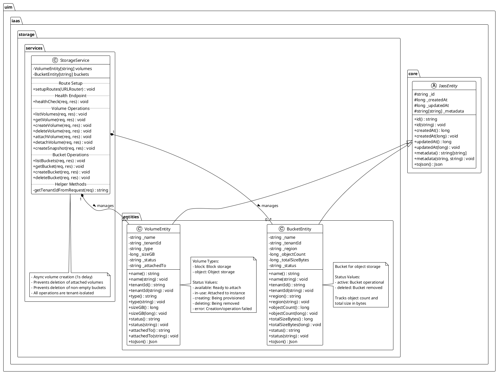
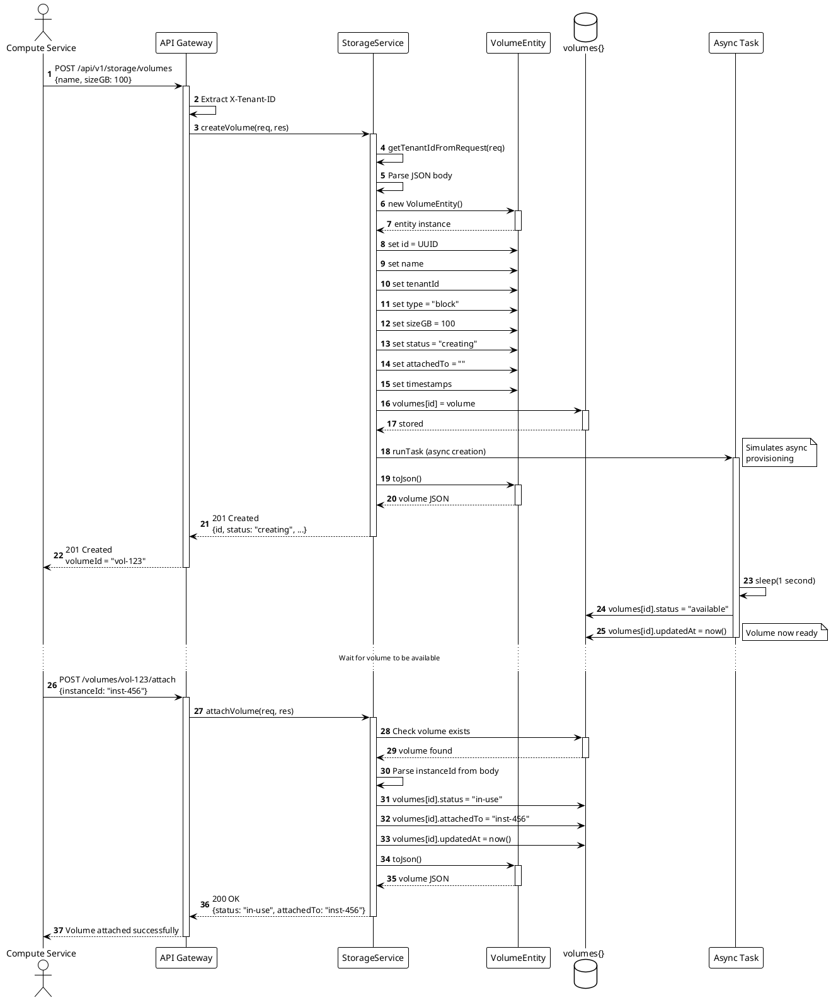
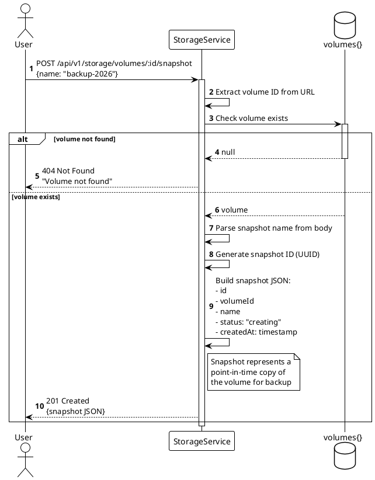
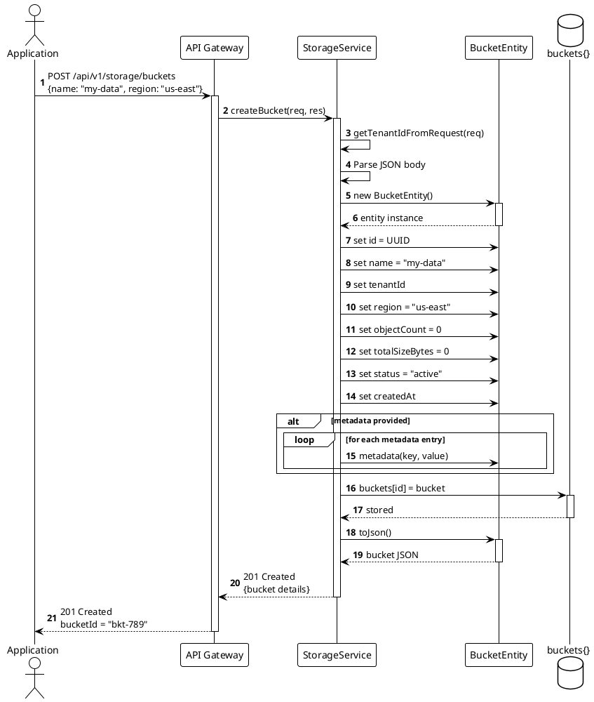
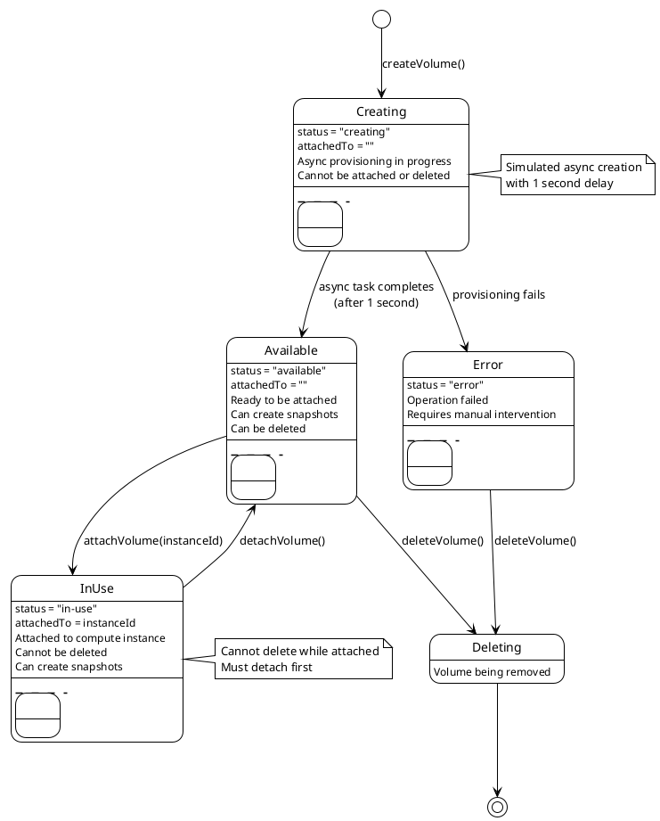
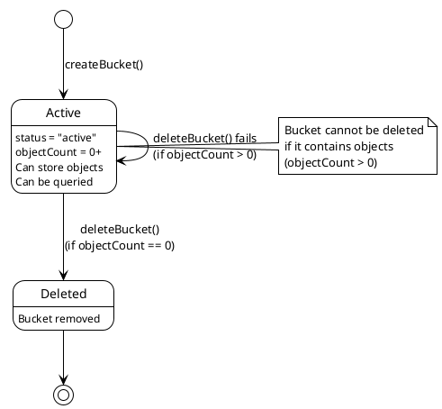
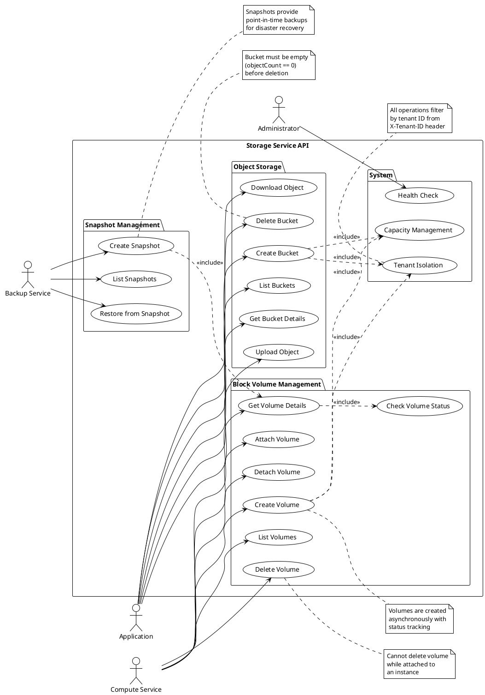
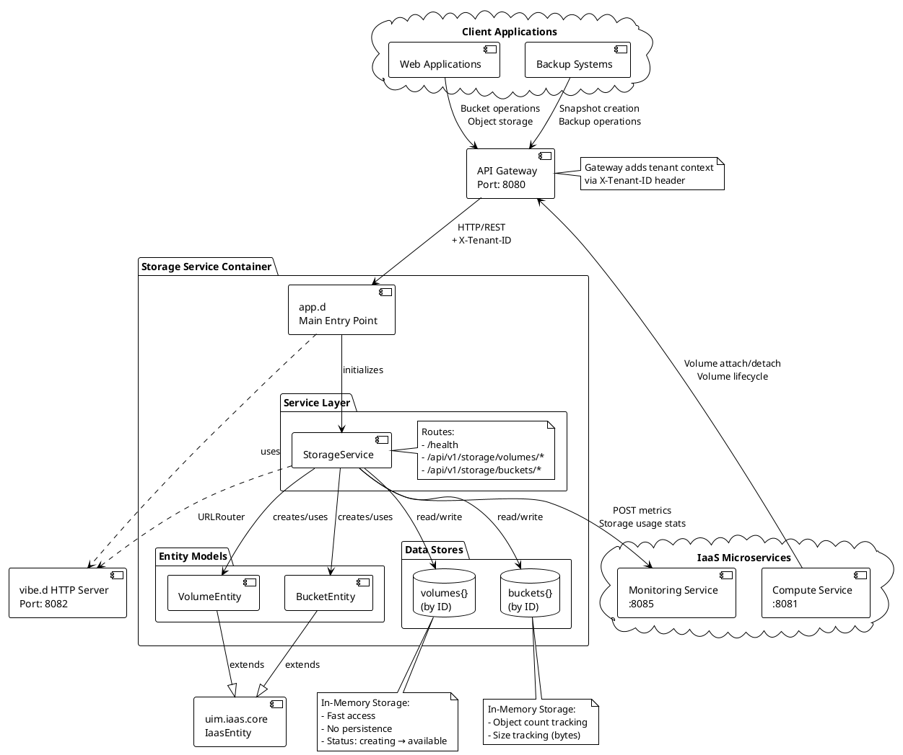
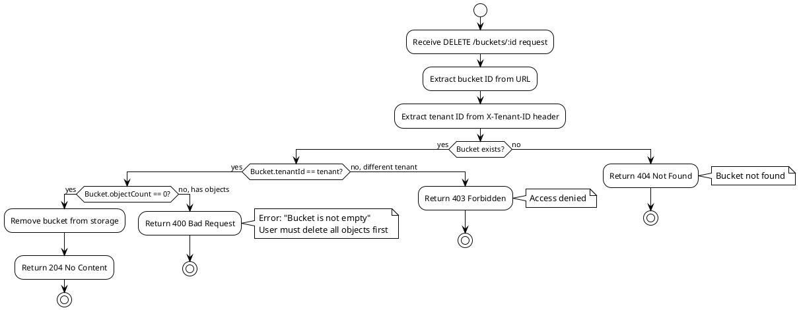

# UIM IaaS Storage Service

## Overview

The **UIM IaaS Storage Service** is a comprehensive multi-tenant storage management platform that provides both block storage (volumes) and object storage (buckets) capabilities for cloud infrastructure. Built with the D programming language and vibe.d framework, it enables creation, attachment, and management of persistent storage resources with complete tenant isolation.

**Service Name:** `uim-iaas-storage`  
**Default Port:** 8082  
**NAF Version:** v4  
**Version:** 26.1.2 compatible

## Features

- ✅ Block storage volume management (create, attach, detach, delete)
- ✅ Object storage bucket management
- ✅ Volume snapshots for backup and recovery
- ✅ Multi-tenant storage isolation and security
- ✅ Volume attachment to compute instances
- ✅ Storage status tracking (available, in-use, creating, deleting)
- ✅ Regional bucket placement
- ✅ Size-based storage management (GB for volumes, bytes for objects)
- ✅ RESTful API with JSON responses
- ✅ Health check endpoint for monitoring
- ✅ Async volume creation with status updates
- ✅ NAF v4 architecture alignment

## NAF v4 Architecture Alignment

This service adheres to the **NATO Architecture Framework (NAF) Version 4** standards, ensuring structured architecture documentation and operational clarity.

### NAF v4 Views Implemented

#### NOV-1: High-Level Operational Concept
The Storage Service operates as the persistent data layer that:
- Provisions block storage volumes for compute instances
- Manages object storage buckets for unstructured data
- Handles volume lifecycle (create, attach, detach, snapshot, delete)
- Provides storage capacity management and tracking
- Ensures data persistence and availability across infrastructure
- Implements tenant-level storage isolation

#### NOV-2: Operational Node Connectivity
```
┌────────────────────────────────────────────────────┐
│               Storage Service Core                 │
│  ┌──────────────┐  ┌──────────────┐  ┌─────────┐ │
│  │    Block     │  │    Object    │  │Snapshot │ │
│  │   Storage    │  │   Storage    │  │ Manager │ │
│  │  (Volumes)   │  │  (Buckets)   │  │         │ │
│  └──────┬───────┘  └──────┬───────┘  └────┬────┘ │
└─────────┼──────────────────┼───────────────┼──────┘
          │                  │               │
    ┌─────▼──────┐    ┌─────▼──────┐  ┌────▼─────┐
    │  Compute   │    │Application │  │ Backup   │
    │  Instances │    │  Services  │  │ Service  │
    └────────────┘    └────────────┘  └──────────┘
```

#### NOV-3: Operational Information Requirements
**Information Exchanged:**
- Volume specifications (size, type, status)
- Attachment relationships (volume ↔ instance)
- Bucket configurations and regions
- Storage capacity and utilization metrics
- Snapshot metadata and creation status
- Tenant isolation identifiers

#### NSV-1: Systems Interface Description
The Storage Service exposes RESTful HTTP interfaces for:
- Block volume lifecycle management (CRUD)
- Volume attachment/detachment operations
- Snapshot creation and management
- Object storage bucket provisioning
- Multi-tenant storage isolation

#### NSV-2: Systems Resource Flow
```
┌──────────────┐
│   Client     │
└──────┬───────┘
       │ POST /volumes (name, sizeGB: 100)
       ▼
┌──────────────────┐
│ Storage Service  │ Creates VolumeEntity (status: creating)
└──────┬───────────┘
       │ Async creation → status: available
       │ POST /volumes/:id/attach (instanceId)
       ▼
┌──────────────────┐
│Volume Attached   │ status: in-use, attachedTo: instance-id
└──────┬───────────┘
       │ Compute uses volume for data
       │ POST /volumes/:id/snapshot
       ▼
┌──────────────────┐
│ Snapshot Created │ Backup for recovery
└──────────────────┘
```

#### NSV-4: Systems Functionality Description

**Core Functions:**
1. **Block Volume Management**: Create, delete, query volumes with size specifications
2. **Volume Attachment**: Attach/detach volumes to/from compute instances
3. **Snapshot Management**: Create point-in-time backups of volumes
4. **Object Storage**: Bucket creation and management for unstructured data
5. **Multi-tenancy**: Complete storage isolation per tenant
6. **Status Tracking**: Monitor volume states (available, in-use, creating, deleting, error)
7. **Capacity Management**: Track storage size and utilization

## Architecture

### Entity-Service Pattern

The service implements a clean architecture with separation of concerns:

```
┌──────────────────────────────────────────────────────────┐
│                   Storage Service                         │
├──────────────────────────────────────────────────────────┤
│  Entities Layer                                          │
│  ┌──────────────┐  ┌──────────────┐                     │
│  │ VolumeEntity │  │ BucketEntity │                     │
│  │              │  │              │                     │
│  │ - name       │  │ - name       │                     │
│  │ - tenantId   │  │ - tenantId   │                     │
│  │ - type       │  │ - region     │                     │
│  │ - sizeGB     │  │ - objectCount│                     │
│  │ - status     │  │ - sizeBytes  │                     │
│  │ - attachedTo │  │ - status     │                     │
│  └──────────────┘  └──────────────┘                     │
├──────────────────────────────────────────────────────────┤
│  Service Layer                                           │
│  ┌─────────────────────────────────────────────────────┐│
│  │            StorageService                           ││
│  │                                                     ││
│  │  Volume Operations:                                ││
│  │  + createVolume()    + listVolumes()               ││
│  │  + getVolume()       + deleteVolume()              ││
│  │  + attachVolume()    + detachVolume()              ││
│  │  + createSnapshot()                                ││
│  │                                                     ││
│  │  Bucket Operations:                                ││
│  │  + createBucket()    + listBuckets()               ││
│  │  + getBucket()       + deleteBucket()              ││
│  └─────────────────────────────────────────────────────┘│
└──────────────────────────────────────────────────────────┘
```

## UML Diagrams

### Class Diagram



### Sequence Diagram: Creating and Attaching a Volume



### Sequence Diagram: Creating a Snapshot



### Sequence Diagram: Creating Object Storage Bucket



### State Diagram: Volume Lifecycle



### State Diagram: Bucket Lifecycle



### Use Case Diagram



### Component Diagram



### Activity Diagram: Volume Attach/Detach Flow

```plantuml
@startuml
!theme plain

|Compute Service|
start
:Request volume attachment;

|Storage Service|
:Receive POST /volumes/:id/attach\nwith instanceId;

:Extract volume ID from URL;

:Extract instanceId from body;

if (Volume exists?) then (yes)
    if (Volume status == "available"?) then (yes)
        :Update volume:\n- status = "in-use"\n- attachedTo = instanceId\n- updatedAt = now();
        
        :Return 200 OK with volume data;
        
        |Compute Service|
        :Mount volume to instance;
        :Volume ready for use;
        
        ...Instance uses volume for data storage...
        
        :Request volume detachment;
        
        |Storage Service|
        :Receive POST /volumes/:id/detach;
        
        if (Volume exists?) then (yes)
            :Update volume:\n- status = "available"\n- attachedTo = ""\n- updatedAt = now();
            
            :Return 200 OK;
            
            |Compute Service|
            :Unmount volume from instance;
            :Volume detached successfully;
            
        else (no)
            :Return 404 Not Found;
        endif
        
    else (no, in-use or other)
        :Return 400 Bad Request\n"Volume not available";
    endif
else (no)
    :Return 404 Not Found\n"Volume not found";
endif

stop

@enduml
```

### Activity Diagram: Bucket Deletion Flow



## API Endpoints

### Health Check
```http
GET /health
```
Returns service health status.

Response:
```json
{
  "status": "healthy",
  "service": "storage-service"
}
```

### Block Volume Management

#### List Volumes
```http
GET /api/v1/storage/volumes
X-Tenant-ID: your-tenant-id
```

Response: `200 OK`
```json
{
  "volumes": [
    {
      "id": "vol-123",
      "name": "data-volume",
      "tenantId": "tenant-001",
      "type": "block",
      "sizeGB": 100,
      "status": "available",
      "attachedTo": "",
      "createdAt": 1640995200,
      "updatedAt": 1640995200,
      "metadata": {}
    }
  ]
}
```

#### Get Volume by ID
```http
GET /api/v1/storage/volumes/{volume-id}
X-Tenant-ID: your-tenant-id
```

#### Create Volume
```http
POST /api/v1/storage/volumes
Content-Type: application/json
X-Tenant-ID: your-tenant-id

{
  "name": "data-volume",
  "type": "block",
  "sizeGB": 100,
  "metadata": {
    "purpose": "database",
    "tier": "performance"
  }
}
```

Response: `201 Created`
```json
{
  "id": "vol-123",
  "name": "data-volume",
  "tenantId": "tenant-001",
  "type": "block",
  "sizeGB": 100,
  "status": "creating",
  "attachedTo": "",
  "createdAt": 1640995200,
  "updatedAt": 1640995200,
  "metadata": {
    "purpose": "database",
    "tier": "performance"
  }
}
```

**Note:** Volume status will change from `creating` to `available` after ~1 second (async provisioning).

#### Delete Volume
```http
DELETE /api/v1/storage/volumes/{volume-id}
X-Tenant-ID: your-tenant-id
```

Response: `204 No Content`

**Error Cases:**
- `404 Not Found`: Volume doesn't exist
- `403 Forbidden`: Volume belongs to different tenant
- `400 Bad Request`: Volume is currently attached (status: "in-use")

#### Attach Volume to Instance
```http
POST /api/v1/storage/volumes/{volume-id}/attach
Content-Type: application/json
X-Tenant-ID: your-tenant-id

{
  "instanceId": "inst-456"
}
```

Response: `200 OK`
```json
{
  "id": "vol-123",
  "status": "in-use",
  "attachedTo": "inst-456",
  "updatedAt": 1640995300
}
```

#### Detach Volume from Instance
```http
POST /api/v1/storage/volumes/{volume-id}/detach
X-Tenant-ID: your-tenant-id
```

Response: `200 OK`
```json
{
  "id": "vol-123",
  "status": "available",
  "attachedTo": "",
  "updatedAt": 1640995400
}
```

#### Create Volume Snapshot
```http
POST /api/v1/storage/volumes/{volume-id}/snapshot
Content-Type: application/json
X-Tenant-ID: your-tenant-id

{
  "name": "daily-backup-2026-01-23"
}
```

Response: `201 Created`
```json
{
  "id": "snap-789",
  "volumeId": "vol-123",
  "name": "daily-backup-2026-01-23",
  "status": "creating",
  "createdAt": 1640995500
}
```

### Object Storage (Buckets)

#### List Buckets
```http
GET /api/v1/storage/buckets
X-Tenant-ID: your-tenant-id
```

Response: `200 OK`
```json
{
  "buckets": [
    {
      "id": "bkt-456",
      "name": "my-data-bucket",
      "tenantId": "tenant-001",
      "region": "us-east",
      "objectCount": 0,
      "totalSizeBytes": 0,
      "status": "active",
      "createdAt": 1640995200,
      "metadata": {}
    }
  ]
}
```

#### Get Bucket by ID
```http
GET /api/v1/storage/buckets/{bucket-id}
X-Tenant-ID: your-tenant-id
```

#### Create Bucket
```http
POST /api/v1/storage/buckets
Content-Type: application/json
X-Tenant-ID: your-tenant-id

{
  "name": "my-data-bucket",
  "region": "us-east",
  "metadata": {
    "project": "analytics",
    "department": "engineering"
  }
}
```

Response: `201 Created`
```json
{
  "id": "bkt-456",
  "name": "my-data-bucket",
  "tenantId": "tenant-001",
  "region": "us-east",
  "objectCount": 0,
  "totalSizeBytes": 0,
  "status": "active",
  "createdAt": 1640995200,
  "metadata": {
    "project": "analytics",
    "department": "engineering"
  }
}
```

#### Delete Bucket
```http
DELETE /api/v1/storage/buckets/{bucket-id}
X-Tenant-ID: your-tenant-id
```

Response: `204 No Content`

**Error Cases:**
- `404 Not Found`: Bucket doesn't exist
- `400 Bad Request`: Bucket is not empty (objectCount > 0)

## Multi-Tenancy

The Storage Service implements **complete tenant isolation**:

- **Tenant Identification**: Via `X-Tenant-ID` HTTP header
- **Volume Isolation**: Each tenant has separate volumes
- **Bucket Isolation**: Object storage buckets are scoped per tenant
- **Access Control**: Prevents cross-tenant access to storage resources
- **Default Tenant**: Falls back to "default" if no header provided

### Multi-Tenant Example

Tenant A creates their volume:
```bash
curl -X POST http://localhost:8082/api/v1/storage/volumes \
  -H "X-Tenant-ID: tenant-a" \
  -H "Content-Type: application/json" \
  -d '{
    "name": "tenant-a-volume",
    "sizeGB": 50
  }'
```

Tenant B creates their volume (completely isolated):
```bash
curl -X POST http://localhost:8082/api/v1/storage/volumes \
  -H "X-Tenant-ID: tenant-b" \
  -H "Content-Type: application/json" \
  -d '{
    "name": "tenant-b-volume",
    "sizeGB": 100
  }'
```

Tenants cannot see or access each other's storage resources.

## Data Model

### Volume Entity
- **id**: Unique identifier (UUID)
- **name**: Human-readable volume name
- **tenantId**: Tenant isolation identifier
- **type**: Storage type ("block" or "object")
- **sizeGB**: Volume size in gigabytes
- **status**: Volume state (available, in-use, creating, deleting, error)
- **attachedTo**: Instance ID if attached, empty string otherwise
- **createdAt**: Creation timestamp
- **updatedAt**: Last update timestamp
- **metadata**: Key-value pairs for additional data

### Bucket Entity
- **id**: Unique identifier (UUID)
- **name**: Bucket name
- **tenantId**: Tenant identifier
- **region**: Geographic region (e.g., "us-east", "eu-west")
- **objectCount**: Number of objects in bucket
- **totalSizeBytes**: Total size of all objects in bytes
- **status**: Bucket status (active, deleted)
- **createdAt**: Creation timestamp
- **metadata**: Additional metadata

### Volume Status Values

- **creating**: Volume is being provisioned (async operation in progress)
- **available**: Volume is ready to be attached to an instance
- **in-use**: Volume is attached to a compute instance
- **deleting**: Volume is being removed
- **error**: An error occurred during provisioning or operation

## Configuration

### Port Configuration
Default port: **8082**

Configured in [app.d](source/app.d):
```d
auto settings = new HTTPServerSettings;
settings.port = 8082;
settings.bindAddresses = ["0.0.0.0"];
```

### Service Settings
| Setting | Default | Description |
|---------|---------|-------------|
| Port | 8082 | HTTP server port |
| Bind Address | 0.0.0.0 | Network interface to bind |
| Async Creation Delay | 1 second | Simulated volume provisioning time |
| Tenant Header | X-Tenant-ID | HTTP header for tenant identification |

### Storage Constraints
- **Volume Attachment**: Only one instance per volume
- **Volume Deletion**: Cannot delete attached volumes (status must not be "in-use")
- **Bucket Deletion**: Cannot delete non-empty buckets (objectCount must be 0)

## Building and Running

### Prerequisites
- D compiler (DMD, LDC, or GDC)
- DUB package manager
- vibe.d framework (automatically installed via DUB)

### Build with DUB
```bash
cd storage
dub build
```

For release build with optimizations:
```bash
dub build --build=release
```

### Run the Service
```bash
./uim-iaas-storage
```

Or directly with DUB:
```bash
dub run
```

The service will start and listen on port 8082:
```
Storage Service starting on port 8082
```

### Run with Docker
Build the Docker image:
```bash
docker build -t uim-iaas-storage:latest .
```

Run the container:
```bash
docker run -p 8082:8082 uim-iaas-storage:latest
```

### Run with Docker Compose
From the project root:
```bash
docker-compose up storage
```

Run in detached mode:
```bash
docker-compose up -d storage
```

View logs:
```bash
docker-compose logs -f storage
```

## Dependencies

Defined in [dub.sdl](dub.sdl):

- **vibe-d**: Web framework and HTTP server
- **uim-iaas-core**: Core entities and utilities

## Integration with Other Services

### Compute Service Integration
Virtual machines need storage volumes:

```d
// Compute service creates and attaches volume
auto volumeResponse = requestHTTP("http://storage:8082/api/v1/storage/volumes",
    (scope req) {
        req.method = HTTPMethod.POST;
        req.headers["X-Tenant-ID"] = tenantId;
        req.writeJsonBody([
            "name": "vm-root-disk",
            "sizeGB": 50
        ]);
    }
);

auto volumeId = volumeResponse.json["id"].get!string;

// Wait for volume to be available (status: "creating" -> "available")
// Then attach to instance
requestHTTP("http://storage:8082/api/v1/storage/volumes/" ~ volumeId ~ "/attach",
    (scope req) {
        req.method = HTTPMethod.POST;
        req.headers["X-Tenant-ID"] = tenantId;
        req.writeJsonBody(["instanceId": instanceId]);
    }
);
```

### Backup Service Integration
Create snapshots for disaster recovery:

```d
// Backup service creates snapshot
auto snapshotResponse = requestHTTP(
    "http://storage:8082/api/v1/storage/volumes/" ~ volumeId ~ "/snapshot",
    (scope req) {
        req.method = HTTPMethod.POST;
        req.headers["X-Tenant-ID"] = tenantId;
        req.writeJsonBody([
            "name": "daily-backup-" ~ getCurrentDate()
        ]);
    }
);
```

### Monitoring Integration
Report storage metrics:

```d
// Report volume creation metric
requestHTTP("http://monitoring:8085/api/v1/monitoring/metrics",
    (scope req) {
        req.method = HTTPMethod.POST;
        req.headers["X-Tenant-ID"] = tenantId;
        req.writeJsonBody([
            "name": "volume_created",
            "type": "counter",
            "value": 1,
            "labels": [
                "service": "storage",
                "type": "block",
                "sizeGB": sizeGB.to!string
            ]
        ]);
    }
);
```

## Storage Best Practices

### Volume Management
1. **Right-Sizing**: Choose appropriate volume sizes based on workload
2. **Status Monitoring**: Check volume status before operations
3. **Cleanup**: Detach and delete unused volumes to free resources
4. **Snapshots**: Regular snapshots for data protection

### Bucket Management
1. **Empty Before Delete**: Remove all objects before deleting buckets
2. **Regional Placement**: Choose regions close to your applications
3. **Naming Conventions**: Use descriptive, consistent bucket names
4. **Capacity Planning**: Monitor object count and total size

### Common Storage Patterns

**Database Volume:**
```bash
curl -X POST http://localhost:8082/api/v1/storage/volumes \
  -H "X-Tenant-ID: production" \
  -H "Content-Type: application/json" \
  -d '{
    "name": "postgres-data",
    "type": "block",
    "sizeGB": 200,
    "metadata": {
      "purpose": "database",
      "database": "postgresql"
    }
  }'
```

**Application Data Bucket:**
```bash
curl -X POST http://localhost:8082/api/v1/storage/buckets \
  -H "X-Tenant-ID: production" \
  -H "Content-Type: application/json" \
  -d '{
    "name": "app-uploads",
    "region": "us-east",
    "metadata": {
      "application": "web-app",
      "content-type": "user-uploads"
    }
  }'
```

## Validation and Constraints

### Volume Operations
- **Cannot attach**: Volume must be in "available" status
- **Cannot delete**: Volume must not be in "in-use" status (must detach first)
- **Cannot detach**: Only applicable if volume is attached

### Bucket Operations
- **Cannot delete**: Bucket must be empty (objectCount == 0)
- **Name uniqueness**: Bucket names should be unique per tenant

## Performance Considerations

- **In-Memory Storage**: Fast access but no persistence
- **No Persistence**: Data lost on restart (development mode)
- **Async Creation**: Volume provisioning simulated with 1-second delay
- **Scalability**: Limited by single-instance memory
- **Future Enhancement**: Database backend for production

## Future Enhancements

1. **Persistent Storage**: PostgreSQL/database integration
2. **Volume Encryption**: At-rest and in-transit encryption
3. **Volume Replication**: Multi-region volume replication
4. **Object Operations**: Full object upload/download/delete APIs
5. **Bucket Policies**: Fine-grained access control
6. **Storage Quotas**: Per-tenant storage limits
7. **Volume Resizing**: Expand volume capacity
8. **Snapshot Management**: List, restore, and delete snapshots
9. **Storage Classes**: Performance vs. capacity tiers
10. **Lifecycle Policies**: Automatic archival and deletion
11. **Volume Cloning**: Create volume from existing volume
12. **Multi-Attach**: Shared volumes for multiple instances

## Troubleshooting

### Volume Not Available
**Problem**: Volume stuck in "creating" status

**Solutions**:
1. Wait for async creation to complete (~1 second)
2. Check service logs for errors
3. Query volume status: `GET /volumes/{id}`

### Cannot Attach Volume
**Problem**: Attach operation fails

**Solutions**:
1. Verify volume status is "available":
   ```bash
   curl -H "X-Tenant-ID: tenant" \
     http://localhost:8082/api/v1/storage/volumes/{volume-id}
   ```
2. Check if volume is already attached to another instance
3. Verify instanceId is correct

### Cannot Delete Volume
**Problem**: Delete operation returns 400 Bad Request

**Solutions**:
1. Detach volume first:
   ```bash
   curl -X POST http://localhost:8082/api/v1/storage/volumes/{id}/detach \
     -H "X-Tenant-ID: tenant"
   ```
2. Wait for status to change to "available"
3. Then delete the volume

### Cannot Delete Bucket
**Problem**: Bucket deletion fails with "Bucket is not empty"

**Solutions**:
1. Check object count:
   ```bash
   curl -H "X-Tenant-ID: tenant" \
     http://localhost:8082/api/v1/storage/buckets/{bucket-id}
   ```
2. Delete all objects in the bucket first
3. Verify objectCount is 0
4. Then delete the bucket

### Service Not Starting
**Problem**: Service fails to start or exits immediately

**Solutions**:
1. Check port availability:
   ```bash
   netstat -tuln | grep 8082
   ```
2. Check dependencies:
   ```bash
   dub describe
   ```
3. View detailed logs:
   ```bash
   dub run --verbose
   ```

## Testing

### Manual Testing with cURL

#### 1. Health Check
```bash
curl http://localhost:8082/health
```

#### 2. Create a Volume
```bash
VOLUME_ID=$(curl -X POST http://localhost:8082/api/v1/storage/volumes \
  -H "X-Tenant-ID: test-tenant" \
  -H "Content-Type: application/json" \
  -d '{
    "name": "test-volume",
    "type": "block",
    "sizeGB": 50
  }' | jq -r '.id')

echo "Created volume: $VOLUME_ID"
```

#### 3. Wait for Volume to be Available
```bash
# Wait 2 seconds for async creation
sleep 2

# Check status
curl -H "X-Tenant-ID: test-tenant" \
  http://localhost:8082/api/v1/storage/volumes/$VOLUME_ID
```

#### 4. Attach Volume
```bash
curl -X POST http://localhost:8082/api/v1/storage/volumes/$VOLUME_ID/attach \
  -H "X-Tenant-ID: test-tenant" \
  -H "Content-Type: application/json" \
  -d '{"instanceId": "inst-test-123"}'
```

#### 5. Create Snapshot
```bash
curl -X POST http://localhost:8082/api/v1/storage/volumes/$VOLUME_ID/snapshot \
  -H "X-Tenant-ID: test-tenant" \
  -H "Content-Type: application/json" \
  -d '{"name": "test-snapshot"}'
```

#### 6. Detach Volume
```bash
curl -X POST http://localhost:8082/api/v1/storage/volumes/$VOLUME_ID/detach \
  -H "X-Tenant-ID: test-tenant"
```

#### 7. Delete Volume
```bash
curl -X DELETE http://localhost:8082/api/v1/storage/volumes/$VOLUME_ID \
  -H "X-Tenant-ID: test-tenant"
```

#### 8. Test Object Storage
```bash
# Create bucket
BUCKET_ID=$(curl -X POST http://localhost:8082/api/v1/storage/buckets \
  -H "X-Tenant-ID: test-tenant" \
  -H "Content-Type: application/json" \
  -d '{
    "name": "test-bucket",
    "region": "us-east"
  }' | jq -r '.id')

echo "Created bucket: $BUCKET_ID"

# List buckets
curl -H "X-Tenant-ID: test-tenant" \
  http://localhost:8082/api/v1/storage/buckets

# Delete bucket
curl -X DELETE http://localhost:8082/api/v1/storage/buckets/$BUCKET_ID \
  -H "X-Tenant-ID: test-tenant"
```

### Integration Testing

Test with compute service:
```bash
# Start all services
docker-compose up -d

# Create volume via storage service
VOLUME_ID=$(curl -X POST http://localhost:8082/api/v1/storage/volumes \
  -H "X-Tenant-ID: integration-test" \
  -H "Content-Type: application/json" \
  -d '{"name": "integration-volume", "sizeGB": 50}' | jq -r '.id')

# Wait for availability
sleep 2

# Create compute instance
INSTANCE_ID=$(curl -X POST http://localhost:8081/api/v1/compute/instances \
  -H "X-Tenant-ID: integration-test" \
  -H "Content-Type: application/json" \
  -d '{"name": "test-vm", "flavor": "small"}' | jq -r '.id')

# Attach volume to instance
curl -X POST http://localhost:8082/api/v1/storage/volumes/$VOLUME_ID/attach \
  -H "X-Tenant-ID: integration-test" \
  -H "Content-Type: application/json" \
  -d "{\"instanceId\": \"$INSTANCE_ID\"}"
```

### Common Error Messages

| Error | Cause | Solution |
|-------|-------|----------|
| `Volume not found` | Invalid volume ID | Check volume ID and tenant |
| `Volume is currently attached` | Trying to delete attached volume | Detach first, then delete |
| `Bucket is not empty` | Bucket has objects | Delete all objects first |
| `Access denied` | Wrong tenant ID | Use correct X-Tenant-ID header |
| `Address already in use` | Port 8082 occupied | Stop conflicting service |

## License

See [LICENSE](LICENSE) file for details.

## Related Documentation

- [Project Architecture](../docs/ARCHITECTURE.md)
- [Multi-Tenancy Guide](../docs/MULTI_TENANCY.md)
- [API Examples](../docs/API_EXAMPLES.md)
- [Quick Start Guide](../docs/QUICKSTART.md)

## Contact

For issues and contributions, please refer to the main project repository.

---

**Storage Service Version**: 1.0.0  
**NAF Version**: v4  
**Last Updated**: January 2026
